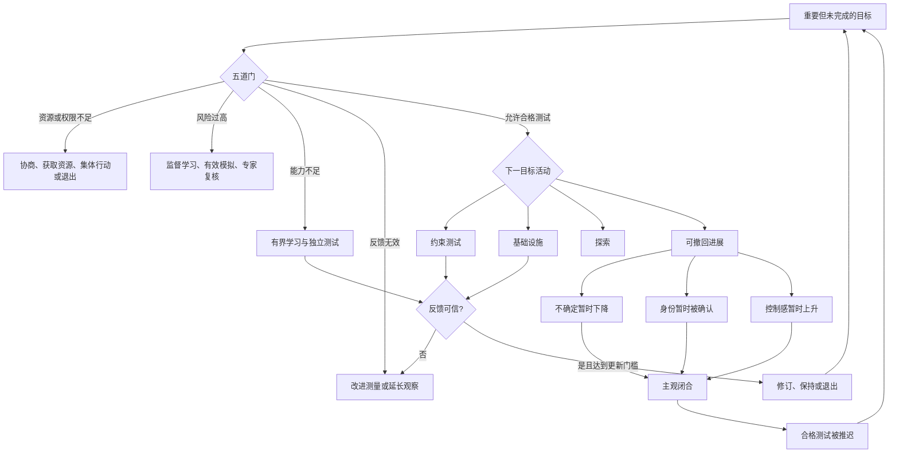

# 可撤回进展循环

副标题：一个关于“准备何时替代约束测试”的待验证操作模型。  
理论身份：N-of-1 自我审查框架与可证伪假设族，不是已获学界验证的独立构念。

## 最终定义

当目标重要、存在可行且安全的下一次测试时，一个人仍反复把目标时间投入到容易重写或放弃、没有预先声明结果空间、主要增加主观确定而不增加决策相关证据的活动中，这组活动构成“可撤回进展”；它是否会降低后续表现，是本模型要检验的结果，不是定义里预设的结论。

可撤回不等于虚假。一本书、一份计划、一次模拟和一套工具都可能是必要工作。分类取决于它此刻解决哪个瓶颈、是否有退出条件、能否产生有效信息，而不取决于活动看起来像学习还是行动。

## 先过五道门

任何心理解释之前，按顺序检查：

1. **目标价值**：若没有观众、打卡和身份标签，用户仍愿意承担目标成本吗？若否，允许修改或删除目标。
2. **资源与权限**：是否有时间、资金、场地、安全、组织权限和决策权？若否，转向获取资源、协商、集体行动或退出，不能归因为回避。
3. **风险与伦理**：最大可逆损失是什么，是否影响第三方，是否需要监督、模拟、资质或专家复核？
4. **知识与能力**：不是问“感觉懂不懂”，而是看独立提取、迁移题、监督模拟、worked example 或安全测验。
5. **反馈有效性**：可获得的结果是否与决定相关，测量是否有效，能否归因，需要几次重复才能更新？

只有五道门允许至少一个合格测试时，才检查可撤回进展。这个顺序把贫困、疾病、组织权力、新手学习和高风险任务挡在生产力诊断之外。

## 五类目标活动

同一种形式可以在不同目标阶段属于不同类别。

| 类别 | 判别条件 | 合法结束点 | 例子 |
| --- | --- | --- | --- |
| 有界学习 | 补足明确能力缺口，有测试日期和退出条件 | 独立提取、迁移、监督模拟或安全测验 | 学会急救流程后通过现场考核 |
| 探索 | 目的就是理解、审美、好奇或发现方向 | 获得认知价值，不冒充承诺目标进展 | 阅读一部小说或探索新领域 |
| 基础设施 | 降低摩擦或改善测量，维护成本可见 | 后续表现或测量质量改善 | 配置自动记录，而不是反复换模板 |
| 约束测试 | 事前声明结果空间，结果能影响决定 | 有时间戳、目标相似约束和可读结果 | 给 5 位目标用户看演示并记录具体反应 |
| 可撤回进展 | 目标相关但无能力缺口、无测试接口或退出日期，主要增加主观确定 | 只有新摘要、计划、分类或身份确认 | 已知要发送报价，却又重做知识库 |

探索无需证据义务，但不得在复盘中冒充已经发生的行为改变。有界学习的义务按一个学习周期设置，不要求每条信息立刻变现。

## 竞争路径，而非单一心理发动机

初版把多个过程串成单一因果链，最终版改为竞争路径。一次准备选择可能由其中一条或多条路径主导，也可能完全由资源或习惯解释。



“不确定缓解、身份确认、控制感”是候选心理路径，不是默认共同存在。若随机操纵这些状态不改变选择，心理发动机应删除，模型退回行为分类。

## 状态向量

复杂行为不按单向成熟阶梯前进。每个目标用八个可跳转、可回退的状态描述：

```text
X = (K, A, P, R, E, F, Q, H)
```

- `K`：知识与能力准备度，可由任务特定测试观察。
- `A`：下一动作是否明确到情境、动作和完成证据。
- `P`：资源、机会和权限是否存在。
- `R`：风险、伦理和最大可逆损失是否过关。
- `E`：是否完成预先声明的约束测试。
- `F`：结果是否决策相关、有效、可归因且达到必要重复。
- `Q`：目标表现质量是否达到当前基准。
- `H`：行为在目标情境下是否可靠发生并能从中断恢复。

每项只记“未知、暂不足、当前足够”，不合成总分。反馈可能暴露新知识缺口，稳定执行也可能固化错误动作；因此 `E→K`、`F→A`、`Q→有界学习`、`H→重新定义环境` 和 `更新→退出目标` 都是合法路径。身份是可能结果，不是终点条件。

## 风险与信号路由

|  | 反馈信号较强 | 反馈信号较弱 |
| --- | --- | --- |
| 低风险 | 小规模直接测试 | 多次可逆探针，聚合后再判断 |
| 高风险 | 监督模拟、受保护试点、专家在场 | 先学习、专家审查、参考类预测；不鼓励直接暴露 |

产品、科研和创作探索可以用信息增益、选项价值和退出规则计进展。组织依赖任务先检查权限与信息路由。一次市场拒绝、一天体重变化或一句读者评价都不足以自动改策略。

## 一张证据合同

当五道门允许测试时，使用一张短合同：

1. **目标决定**：这次证据准备帮助我决定什么？
2. **当前瓶颈**：K、A、P、R、E、F、Q、H 中是哪一项？
3. **活动类别**：有界学习、探索、基础设施、约束测试或可撤回进展。
4. **结果空间**：可能观察到哪几种结果，每种结果会改变什么？
5. **时间与机会**：何时发生，存在几次真实机会？
6. **风险上限**：最大损失、第三方影响、停止条件和支持者。
7. **更新门槛**：一次结果够不够，需要重复或外部评审吗？

合同的目的不是逼人行动，而是在行动前固定解释规则，避免结果出来后任意改写成功标准。

## 只在实验期使用的指标

不设综合分、排行榜、连续打卡或统一健康阈值。

1. **到期测试完成率** `ECR = 按期完成的预注册合格测试 / 已到期测试`。测试粒度事前锁定，同时报告真实机会数，避免拆分刷量和 `0/0`。
2. **决策信息延迟** `EL*`：只追踪事前声明“会改变某个决定”的信息，从计划使用日到合格测试的时间；未使用项按右删失保留，不当失败。
3. **维护时间**：分别记录非工具性重构 `M0` 与测量/反馈基础设施 `MF` 的绝对分钟，再观察滞后表现，不预设哪一类必然有害。
4. **适当更新**：达到预设门槛时正确修改，未达到时正确保持。最终看预测误差或目标表现是否改善，不看修改次数。
5. **质量与稳定双轴**：单独报告表现质量 `Q` 和可靠执行 `H`；低质量重复不能用高稳定掩盖。

指标每多一项都会增加维护成本。个人实验只选择能改变决定的一至两项，测量本身开始挤压目标活动时立即删减。

## 修订后的可证伪预测

### P1｜信息剂量与证据接口存在交互

- **预期观察**：在知识足够、低风险、有机会的任务中，高资源剂量加等时中性计划可能降低或不提高外部评分行为；if–then 加预声明证据接口应优于中性计划。增量来自证据接口，而非写得更长。
- **替代解释**：选择过载、一般实施意图或监测效应。
- **验证**：资源剂量 × 接口的随机设计，主结果由盲评者评价；控制任务复杂度和一般拖延。
- **失败**：接口相对等时 if–then 的差异在至少两类任务中稳定落入预设等效区间，而实施意图效应仍存在。

### P2｜公开对象而非公开本身决定后续行为

- **预期观察**：完成同一基线动作后，公开身份陈述者的下一次行为不高于中性组，公开该动作的可核验证据者更可能完成下一次行为。
- **替代解释**：观众、问责和反馈不同。
- **验证**：基线后随机分组，统一观众、反馈和问责强度。
- **失败**：两类公开在匹配条件后等效，或身份陈述稳定优于证据公开。

### P3｜固定剂量学习受准备度调节

- **预期观察**：独立迁移测验低者从固定剂量阅读加提取中获益；准备度已足够者从直接分级练习中获得更多行为或质量收益。
- **替代解释**：兴趣、材料质量、一般能力。
- **验证**：事前迁移测验分层，随机分配阅读、阅读加提取、直接练习。
- **失败**：准备度不调节条件效果，或固定追加阅读在所有层级都稳定占优。

### P4｜两类维护的滞后作用不同

- **预期观察**：控制任务难度后，非工具性重构 `M0` 不改善后续表现；能提高测量或反馈质量的 `MF` 在适当成本下改善表现。
- **替代解释**：困难任务需要更多工具，产生反向因果。
- **验证**：活动前编码并随机限制维护窗口或工具配置，观察下一窗口的行为与质量。
- **失败**：M0 与 MF 的滞后关系一致，或分类者无法可靠区分二者。

### P5｜反馈可读性与有效性必须同时存在

- **预期观察**：清楚但无效的反馈会增加错误更新；清楚且有效的反馈才提高相对真实原因的适当决策和后续表现。
- **替代解释**：情绪强度和结果正负性。
- **验证**：可读性 × 有效性的随机设计，控制情绪，以适当决策为主结果。
- **失败**：有效性不调节反馈作用，或清楚无效反馈与清楚有效反馈等效。

### P6｜心理发动机必须有因果增量

- **预期观察**：分别操纵不确定缓解、身份承认和控制感，在操纵成功时至少有预先指定的一条路径改变可撤回活动选择，且客观行为日志同步变化。
- **替代解释**：资源、界面线索或一般情绪修复。
- **验证**：分别随机操纵，预定主路径并校正多重检验。
- **失败**：主观状态变化成功，但活动选择和后续表现均为等效零效应；资源操纵却稳定有效。届时删除心理发动机。

### P7｜工作标签必须证明增量效度

- **预期观察**：盲评者能可靠编码活动的可撤回性；该编码在控制拖延、完美主义担忧、知识缺口、任务难度和机会约束后，仍预测下一窗口的行为或表现。
- **替代解释**：编码只是拖延或低努力的另一种说法。
- **验证**：多编码者前瞻日志研究，事前定义活动单位和结果窗口。
- **失败**：编码一致性不足，或增量预测稳定落在等效区间内。此时撤销独立理论身份，只保留通用诊断流程。

## 适用边界

- 医学、精神健康、神经发育、成瘾、慢性疼痛和睡眠问题可能造成执行困难；工具不做诊断，也不替代专业支持。
- 资源不足、贫困、照护责任、工时、歧视、组织权限和信息路由必须先处理。
- 新手和高风险专业任务需要知识积累、监督练习、模拟、资质和专家复核。
- 长篇阅读、基础研究、审美与好奇有独立价值，不需要全部转成短期产出。
- 科研、创作和复杂产品的反馈可能慢且噪声大；“证据不足”是合法结果。
- 快速行动可能伤害第三方或固化错误；风险门与质量轴优先于接触频率。
- 目标本身不重要时，退出不是失败。
- 本模型尚未在目标人群中前瞻验证，不能用来给人贴“逃避型学习者”等人格标签。

## 与近邻理论的最终关系

本模型不宣称发现全新人类动机。它把拖延、象征性自我完成、流畅性、计划闭合、信息价值、反馈和习惯放进一个可操作路由，并提出一个需要独立验证的问题：在其他条件相同后，活动的可撤回结构和证据接口是否仍有增量预测力？

如果答案是否定的，“可撤回进展循环”这个名称就应被放弃。若答案是肯定的，它的价值也不是替代已有理论，而是帮助人们分清：此刻需要继续学习、争取资源、降低风险、改进测量，还是终于让一个判断接受约束。
