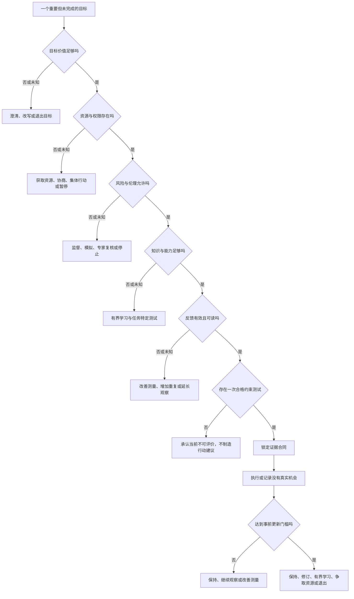
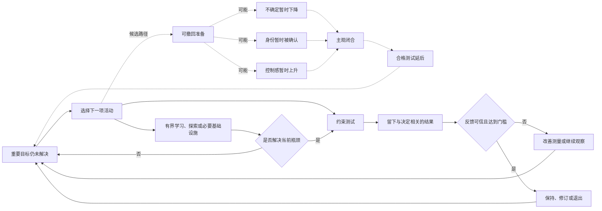
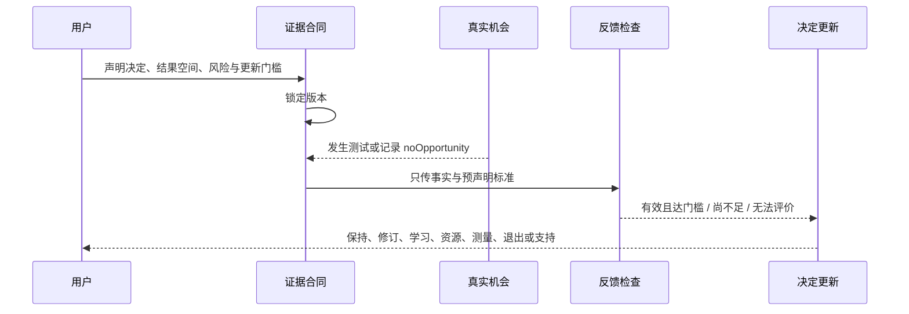

# 因果图与决策路由器

本文件把 `04-final-model.md` 的文字压成可检查的系统表达。它不是新增理论，也不把箭头当作已证实因果。实线表示操作顺序，虚线表示尚待实验验证的候选路径。

## 图一：先路由，再解释



这个顺序有一项硬约束：`V/P/R/K/F` 任一门未过，诊断不得跳到情绪回避或完美主义。表面上的“不行动”可能来自价值、处境、安全、能力或测量，不能先被心理化。

## 图二：待验证的循环不是唯一发动机



虚线链只是一组竞争假设。不确定缓解、身份确认和控制感都不是必经节点。若操纵这些状态只改变主观感受，却不改变下一项活动和后续表现，应从模型中删除心理发动机。

## 状态与观察

每个目标只记录状态，不合成总分：

```text
X = (K, A, P, R, E, F, Q, H)
```

| 状态 | 可观察问题 | 合格证据示例 | 不能用什么替代 |
| --- | --- | --- | --- |
| `K` 知识/能力 | 能否无提示提取、迁移或通过监督模拟 | 闭卷解释、迁移题、资质检查 | “看答案时觉得会” |
| `A` 动作定义 | 情境、动作、完成证据是否明确 | `晚饭后，在旧稿写100字并保存` | “这周多写一点” |
| `P` 资源/权限 | 是否真的有时间、场地、资金和决策权 | 排期、访问权、审批记录 | 把争取权限算拖延 |
| `R` 风险/伦理 | 最大损失、第三方影响、停止条件是否可接受 | 监督者、回滚、受保护试点 | 用“勇敢”覆盖风险 |
| `E` 证据接触 | 合同锁定后是否在真实机会中完成测试 | 时间戳、作品、身体或对方回应 | 目标相关忙碌时长 |
| `F` 反馈有效 | 结果是否相关、有效、可归因且达到重复数 | 预设测量、外部评审、重复结果 | 一次噪声或礼貌反馈 |
| `Q` 表现质量 | 当前结果是否达到任务特定基准 | 盲评、正确率、功能结果 | 完成次数 |
| `H` 稳定执行 | 目标情境中能否可靠发生并从中断恢复 | 多次真实机会与恢复记录 | 连续打卡天数 |

## 最小操作规则

设五道门为 `G = (V, P, R, K, F)`，每项只能取 `未知 / 当前不足 / 当前足够`。只有：

```text
EligibleTest = (V=足够) AND (P=足够) AND (R=足够)
               AND (K=足够) AND (F=足够)
```

时，系统才允许建议直接约束测试。否则返回第一项可处理瓶颈，并保留其他并存结果。`未知` 不按“足够”处理。

一次活动是否属于可撤回进展，不看媒介，而看四个事前字段：

```text
RVP = 目标相关
      AND 当前不存在待补能力缺口
      AND 没有预声明结果空间或退出日期
      AND 活动结束后没有新增决策相关证据
```

这只是活动编码规则，不是心理诊断。编码结果必须由不知道后续表现的人完成，后续结果另行测量，避免用“没有进展”同时定义构念并证明构念。

## 合同到更新的事件序列



锁定后不能原地改结果空间。需要修改时创建新版本，旧版本保留为 `superseded`。`noOpportunity=true` 不进入完成率分母，也不显示为失败。

## 会让这张图失效的证据

1. 不知后续结果的编码者无法可靠区分可撤回准备、基础设施、有界学习和约束测试。
2. 控制一般拖延、完美主义担忧、知识缺口、任务难度与机会约束后，活动编码没有增量预测力。
3. 在两类以上任务中，预声明证据接口相对等时 if-then 计划的增量效应稳定落入预设等效区间。
4. 心理状态操纵成功，活动选择和表现却都是等效零效应；此时删除虚线心理路径。
5. 产品使用主要增加记录时间，没有改善适当决策、表现或合法退出；此时停止产品，而不是指责用户。

前三项失败会撤销“可撤回进展循环”的独立名称。诊断路由仍可作为通用检查表保留，但不能再称为新理论。
