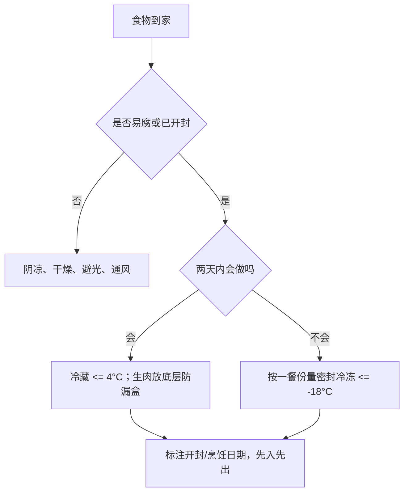

# 健康电煮锅营养餐与食品安全手册

> 版本：v0.1（2026-07-30）  
> 状态：待实践、待人工确认的知识缓冲稿  
> 适用：普通健康成人；家中有常规冰箱/冷冻室；主要使用可蒸、煎、炒的电煮锅  
> 优先顺序：食品安全与厨房安全 > 营养完整 > 美味 > 速度  
> 不适用：婴幼儿、孕期、老年衰弱、免疫功能低下，或有食物过敏、吞咽困难、糖尿病、慢性肾病、痛风等需要个体化饮食的人。上述情况应按医生或注册营养师建议调整。

## 0. 先记住这一页

### 一餐公式

每顿正餐尽量同时出现四类东西：

1. **半盘非淀粉蔬菜**：菠菜、西蓝花、白菜、番茄、彩椒、菌菇、冷冻混合蔬菜。
2. **四分之一盘蛋白质**：鸡蛋、豆腐、鱼虾、鸡肉、无糖奶或酸奶。
3. **四分之一盘主食**：土豆、红薯、紫薯、燕麦、糙米、玉米或杂豆。
4. **少量油和调味**：牛油果油或橄榄油，加葱姜蒜、醋、胡椒、香草和少量盐。

这是方便配餐的执行模型，不是精确处方。土豆、红薯和紫薯属于**薯类主食**，不能同时当作“蔬菜不限量”。

### 五条食安底线

- 手和台面要清洁。
- 生食、熟食及即食食物要分开。
- 肉、蛋、鱼和剩菜要彻底加热；颜色和气味不能代替温度计。
- 易腐食物在室温累计不超过 2 小时；环境高于 32°C 时不超过 1 小时。
- 冰箱冷藏室保持在 4°C 或以下；不知道放了多久、温度失控或可疑时，直接丢弃，不试吃。

### 最值得先买的六件工具

1. 探针式食品温度计。
2. 冰箱温度计。
3. 两块容易清洗的砧板：一块处理生肉，一块处理蔬果和熟食。
4. 带盖浅餐盒，便于快速降温和分装。
5. 隔热手套或干燥锅垫。
6. 食品级硅胶铲或木铲，保护电煮锅内胆。

## 1. 这套饮食为什么这样设计

### 1.1 官方营养基线

中国营养学会发布的《中国居民膳食指南（2022）》强调：食物多样、合理搭配；多吃蔬果、奶类、全谷和大豆；适量吃鱼、禽、蛋和瘦肉；少盐少油、控糖限酒。

对 1600–2400 kcal 能量需要范围内的一般成年人，平衡膳食宝塔给出的**人群参考值**包括：

| 类别 | 每日参考 | 如何理解 |
|---|---:|---|
| 谷类 | 200–300 g | 其中全谷物和杂豆 50–150 g |
| 薯类 | 50–100 g | 可替代部分米面主食，不是额外无限添加 |
| 蔬菜 | 至少 300 g | 深色蔬菜占一半以上 |
| 水果 | 200–350 g | 完整水果优先，果汁不能等量替代 |
| 鱼、禽、肉、蛋 | 合计 120–200 g | 多种蛋白质轮换，而不是只吃鸡蛋 |
| 奶及奶制品 | 相当于鲜奶至少 300 g | 乳糖不耐者需换用合适替代方案 |
| 大豆和坚果 | 25–35 g | 豆制品按大豆量折算 |
| 烹调油 | 不超过 25–30 g | 是全天总量，不是一顿的量 |
| 食盐 | 不超过 5 g | 酱油、蚝油、腌菜等也贡献钠 |

这些数字用于观察一段时间内的膳食结构，不要求每顿称到完全一致。体型、活动量、体重目标和疾病状态不同，需要调整总量。

### 1.2 更实用的优先级

日常做饭先解决“缺什么”，不要先追求完美菜谱：

1. 餐里没有明确蛋白质：先加蛋、豆腐、鱼、鸡肉或奶。
2. 只有土豆或红薯，没有非淀粉蔬菜：加菠菜、菌菇或冷冻蔬菜。
3. 油盐过多：先用量勺控制，再用醋、柠檬、胡椒、蒜和香草补味。
4. 每天食材重复：每周轮换至少 3 种蔬菜、2 种蛋白质和 2 种主食。
5. 忙时总点外卖：保留鸡蛋、豆腐、冷冻蔬菜和燕麦作为“十分钟兜底”。

## 2. 应纳入备菜的健康、好吃、方便食材

### 2.1 核心库存

| 角色 | 推荐食材 | 便利性 | 选择重点 | 电煮锅用法 |
|---|---|---|---|---|
| 蛋白质 | 鸡蛋 | 很高 | 蛋壳完整、无渗漏；看生产和保质信息 | 蒸、煮、炒、蛋羹 |
| 蛋白质 | 北豆腐、冻豆腐、无糖豆浆 | 高 | 冷链完整、包装不鼓包 | 煎、炒、煮 |
| 蛋白质 | 冷冻鱼片、虾仁 | 高 | 包装完整、少冰霜结块、配料简单 | 蒸、煮、快炒 |
| 蛋白质 | 去皮鸡腿或鸡胸 | 中 | 冷链完整、无异味、无黏液 | 煎、炒、焖 |
| 奶类 | 巴氏奶、纯牛奶、无糖酸奶 | 很高 | 优先无额外添加糖；按标签冷藏 | 直接饮用或低火煮燕麦 |
| 主食 | 土豆、红薯、紫薯 | 很高 | 坚实、无霉、无腐烂、无明显发绿 | 蒸、煮、先蒸后煎 |
| 主食 | 燕麦、玉米、糙米或杂粮饭 | 高 | 配料简单、全谷优先 | 煮粥、蒸 |
| 蔬菜 | 菠菜、小白菜、上海青 | 高 | 叶片挺、无黏液、无大面积黄烂 | 快炒、蒸、焯 |
| 蔬菜 | 西蓝花、胡萝卜、彩椒、番茄 | 高 | 颜色正常、无软烂霉斑 | 蒸、炒、焖 |
| 蔬菜 | 菌菇 | 高 | 干爽、无黏液、无异常气味 | 煎、炒、煮 |
| 蔬菜 | 无调味冷冻混合蔬菜 | 很高 | 包装完整、无反复解冻的大冰块 | 直接蒸或炒 |
| 风味 | 葱、姜、蒜、柠檬、醋、胡椒 | 高 | 少量常备，不依赖重油重盐 | 起香、收尾提味 |

### 2.2 你常吃的食材，怎样搭配才完整

| 食材 | 优点 | 常见误区 | 更好的搭配 |
|---|---|---|---|
| 鸡蛋 | 蛋白质完整、方便 | 一餐只吃蛋，没有蔬菜和主食；半熟蛋忽略风险 | 鸡蛋 + 菠菜/番茄 + 一份薯类 |
| 土豆 | 提供碳水、钾和一定纤维 | 把炸土豆当蔬菜；煎得焦黑 | 先蒸熟再少油煎，搭配蛋白质和绿叶菜 |
| 红薯/紫薯 | 方便、饱腹、颜色和口感丰富 | 因“健康”而无限加量 | 作为主食份额，配蛋、奶、豆腐或鱼 |
| 菠菜 | 深色蔬菜、熟得快 | 只吃菠菜，不轮换其他蔬菜 | 与白菜、西蓝花、彩椒、菌菇轮换 |
| 牛奶 | 蛋白质和钙来源，开袋即用 | 用含糖乳饮料替代纯奶；开封后长期放置 | 纯奶或无糖酸奶，按标签冷藏和食用 |

有草酸钙结石史、肾病或需要限制钾的人，不应照本手册大量增加菠菜、土豆和薯类，应个体化咨询。

### 2.3 一人七顿正餐的便利采购示例

这是库存示例，不是全天营养处方：

- 鸡蛋 8–10 个。
- 豆腐 2 盒。
- 冷冻鱼片 2 份，或鱼 1 份加鸡肉 1 份。
- 牛奶或无糖酸奶按个人耐受准备。
- 土豆、红薯、紫薯合计约 1–1.5 kg。
- 绿叶菜 2–3 把；西蓝花、番茄、菌菇等 3 种。
- 无调味冷冻混合蔬菜 1 袋，作为兜底。
- 燕麦或其他全谷物 1 包。
- 葱姜蒜、醋、黑胡椒、低钠需求下可控量使用的酱油。

先买三天的新鲜叶菜；鱼肉若两天内不做，按份冷冻。这样比一次囤满一周更不容易腐败。

## 3. 购买、入库和保存

### 3.1 采购顺序

1. 先买常温干货和蔬果。
2. 再拿冷藏奶、豆腐、蛋和肉。
3. 最后拿冷冻食品。
4. 结账后直接回家；炎热天气或路程长时使用保冷袋。
5. 到家先处理冷冻和冷藏，再整理常温食材。

拒绝购买包装鼓胀、渗漏、封口破损、冷冻品明显反复融化结大冰块、蛋壳破裂或已腐败的食物。

### 3.2 家庭储存分区

冰箱分区建议：

- **上层/中层**：熟食、即食食物、牛奶、酸奶。
- **下层防漏盒**：生肉、生鱼，避免汁液滴到其他食物。
- **蔬果抽屉**：干燥的蔬菜水果；生肉不能放这里。
- **冰箱门**：温度波动较大，放调味品；鸡蛋和奶优先放内层而非门架。
- **冷冻室**：按一餐份量装袋，压平、标日期，避免反复解冻。

### 3.3 常用食材保存速查

| 食物 | 推荐位置 | 实用期限或判断 | 关键风险 |
|---|---|---|---|
| 带壳生鸡蛋 | 冰箱内层，原包装 | 持续冷藏条件下可参考 3–5 周，但不得超过包装标示；有裂缝即弃 | 沙门氏菌、温度波动 |
| 熟鸡蛋 | 冷藏、带盖 | 1 周内 | 去壳后更易污染 |
| 巴氏奶/开封常温奶 | 冷藏、密封 | 严格按标签；开封后尽快喝完 | 不能只凭气味判断安全 |
| 生菠菜和叶菜 | 蔬果抽屉，保持干爽 | 以 3–5 天内吃完为便利目标；黏滑、霉烂即弃 | 潮湿会加速腐败 |
| 未切土豆 | 阴凉、干燥、避光、通风 | 无统一安全天数；定期检查 | 发绿、明显发苦、腐烂或大量发芽时丢弃 |
| 未切红薯/紫薯 | 阴凉、干燥、通风 | 无统一安全天数；变软渗液、霉烂即弃 | 不要密闭积潮 |
| 切开的薯类 | 密封冷藏 | 尽快烹饪，最好当天 | 切面污染和褐变 |
| 熟土豆/薯类 | 浅盒冷藏 | 3–4 天 | 做好后 2 小时内冷藏 |
| 生鱼、虾、禽肉 | 冷藏底层防漏盒 | 1–2 天内烹调；否则冷冻 | 汁液交叉污染 |
| 生整块猪牛羊肉 | 冷藏底层防漏盒 | 通常 3–5 天；绞肉按 1–2 天 | 品种、包装与标签优先 |
| 开封豆腐 | 密封冷藏 | 按标签并尽快使用；鼓包、黏滑、酸败即弃 | 开封后易被污染 |
| 熟饭、熟菜、剩菜 | 浅盒冷藏 | 3–4 天；吃不完尽早冷冻 | 蜡样芽孢杆菌等不会靠闻味发现 |
| 冷冻蔬菜、肉和鱼 | -18°C 或以下 | 包装期限主要是品质参考；解冻失控则不能只看日期 | 反复解冻、冷冻灼伤影响品质 |

表中期限以冰箱实际达到 4°C 或以下、包装完好、操作卫生为前提。包装标签比通用表更具体时，以标签为准。

### 3.4 解冻只用这几种方式

- **冰箱解冻**：最稳妥，提前一晚放在底层防漏容器中。
- **密封冷水解冻**：食物装在不漏袋中浸冷水，约每 30 分钟换水；解冻后立即烹调。
- **微波解冻**：解冻后立即烹调。
- **直接从冷冻状态烹调**：仅适合说明书或食谱允许的薄小食材，需要延长时间并测中心温度。

不要放在台面上慢慢解冻，也不要用温水泡数小时。

## 4. 微生物防治：目标是切断传播链，不是把厨房变成无菌室

家庭厨房不可能“彻底灭菌”。可靠做法是同时建立四道屏障：减少带入、阻止交叉污染、彻底加热、控制时间和温度。

### 4.1 洗手

在以下时点，用流动水和肥皂搓洗至少 20 秒并擦干：

- 开始做饭前。
- 接触生肉、生鱼、生蛋及其包装后。
- 如厕、咳嗽、擤鼻、摸手机、垃圾、宠物后。
- 戴手套前后；手套不能代替洗手。
- 从生食步骤切换到熟食或装盘前。

### 4.2 食材清洗

- 蔬果在食用或切配前用流动水冲洗并轻轻摩擦；不用洗洁精、肥皂或消毒液洗食物。
- 标注“开袋即食/已清洗”的蔬菜按标签处理；重复清洗可能在脏水槽中重新污染。
- **不要清洗生鸡肉或其他禽肉**。飞溅水会把细菌扩散到水槽、台面和附近食物；彻底加热才是控制手段。
- 生蛋壳接触手和台面后要洗手；不要把打过生蛋的碗直接拿来装熟蛋。

### 4.3 生熟分开

- 砧板最好分成“生肉”和“蔬果/熟食”两块；若只有一块，先做即食食物，彻底清洗消毒后再做生肉。
- 生肉用过的刀、夹子、盘子不能直接接触熟食。
- 试味用的小勺只用一次，不要入口后再回锅。
- 腌肉液接触过生肉；除非重新彻底煮沸，否则不能当蘸汁。
- 冰箱中生肉密封放底层，熟食放上层。

### 4.4 安全温度

把温度计插入食物最厚处，避开骨头和锅底；测完立即清洗探针。

| 食物 | 最低中心温度 | 补充要求 |
|---|---:|---|
| 鸡、鸭等禽肉 | 74°C | 最厚处测量 |
| 剩菜复热 | 74°C | 汤汁充分翻滚并搅匀 |
| 绞肉 | 71°C | 肉饼、肉丸也适用 |
| 整块猪、牛、羊肉 | 63°C | 离火后静置 3 分钟 |
| 鱼类 | 63°C | 或肉质不透明、易分离；温度计更可靠 |
| 蛋类菜肴 | 71°C | 高风险人群避免溏心蛋，或用巴氏杀菌蛋 |

家庭执行边界：冷藏 4°C 或以下，热食保温 60°C 或以上。电煮锅显示“保温”不等于食物中心一定达到 60°C；长时间保温需实测，否则尽快吃完或冷藏。

### 4.5 熟食冷却、剩菜和复热

1. 做好后尽快吃。
2. 两小时内把剩余食物分装进浅盒冷藏；高于 32°C 的环境缩短为一小时。
3. 大锅食物不要整锅在台面“放凉一夜”，应分成小份、浅层快速降温。
4. 冷藏剩菜 3–4 天内吃完；超出计划的部分尽早冷冻。
5. 只复热本次要吃的份量，中心达到 74°C。
6. 不靠“再煮一次”挽救长时间室温放置的食物；某些微生物毒素并不会被普通复热可靠消除。

### 4.6 直接丢弃，不要试吃

- 室温时间超过安全边界或时间不明的易腐食物。
- 包装鼓胀、渗漏，罐头严重胀罐，食物出现霉、黏液或腐败。
- 生肉汁污染了不会再加热的食物。
- 冰箱停电或故障后，食物温度和持续时间无法确认。
- 土豆大面积发绿、明显发苦、腐烂或大量发芽。
- 对“还能不能吃”没有把握，且代价只是丢掉一份食物。

气味正常不代表没有致病菌；不要用一口试吃来判断安全。

## 5. 电煮锅安全

### 5.1 每次开锅前的 30 秒检查

- 锅放在干燥、平稳、耐热台面，远离边缘、窗帘、纸巾和水槽。
- 电压和插座符合说明书；插头直接插墙上插座，不使用延长线或多孔插排。
- 电线、插头和底座没有破损、焦味、松动或进水。
- 内胆外壁和加热底座是干的，内胆已正确就位。
- 锅内没有超过最高水位/容量线；蒸汽孔没有堵塞。
- 隔热手套、锅盖和食品温度计在手边。

出现漏电感、火花、反复跳闸、焦糊电气味、底座进水或线缆破损时，立即停止使用并断电，不自行带电拆修。

### 5.2 蒸煮安全

- 加足够水，但不超过说明书容量；不要让锅干烧。
- 开盖时先断电或暂停，身体侧开，让锅盖远离面部向外翻，蒸汽先从远端释放。
- 不要徒手摸蒸架、内胆和锅盖金属部位。
- 中途加水时先停止加热，沿锅壁缓慢加入热水，避免冷水冲击高温内胆和蒸汽喷溅。
- 奶、燕麦粥和淀粉水容易溢锅，必须低火并全程看管。

### 5.3 煎炒和热油安全

- 食材表面先擦干；水进入热油会猛烈飞溅。
- 油只放薄层，不在小型电煮锅里做深油炸。
- 炒、煎时不离开厨房；无人看管是家庭烹饪火灾的重要诱因。
- 锅把、插线和器具不要伸出工作台，避免被碰翻。
- 油开始明显冒烟时立即降温或断电；有焦味、颜色异常的油不要反复使用。
- 热油不倒入水槽，也不装入遇热变形的塑料容器；完全冷却后按当地垃圾规则处理。

### 5.4 油锅起火怎么办

1. 不泼水，不端着锅移动，不用湿毛巾扑打。
2. 如果能够安全靠近，用匹配的金属锅盖或烤盘从侧面盖住火焰。
3. 在安全前提下关闭电源；不要重新揭盖，等待完全冷却。
4. 火势不能立即控制、烟很大或退路受阻时，立刻撤离、关门并拨打 119。

灭火器只有在会使用、火很小、退路始终在身后且已有人报警时才考虑使用。生命安全高于锅具和房屋物品。

### 5.5 防烫、防割

- 蒸汽看不清但会严重烫伤；不要把手放在蒸汽口上方。
- 隔热手套必须干燥，湿布传热更快。
- 砧板下垫防滑垫；刀柄保持干燥，使用“猫爪手”固定食材。
- 掉落的刀不要伸手接。
- 小面积烫伤立即用凉的流动水持续冲洗约 20 分钟；不用冰、牙膏、酱油或食用油涂抹。面积大、较深，或位于面部、手、关节、生殖部位，及时就医或拨打 120。

## 6. 餐具和锅具怎么选

| 物品 | 优先选择 | 避免或更换条件 | 原因 |
|---|---|---|---|
| 碗盘 | 完整的玻璃、不锈钢、合格陶瓷 | 裂纹、崩口、釉面来源不明 | 裂隙难清洁，崩口会割伤 |
| 保鲜盒 | 食品接触级玻璃或标注可装热食的塑料 | 变形、深划痕、异味、用途不明 | 材料耐热范围不同 |
| 蒸盘 | 标注耐热、可蒸的不锈钢或玻璃 | 普通薄玻璃、密闭容器直接加热 | 防破裂和压力积聚 |
| 砧板 | 两块完整、易清洗、可竖立晾干的板 | 深沟、裂纹、霉斑 | 深沟会藏污，难以充分清洁 |
| 锅铲 | 食品级硅胶、木铲或内胆说明书允许的材质 | 锋利金属铲用于不粘内胆 | 减少涂层划伤 |
| 不粘内胆 | 涂层完整、按说明书使用 | 明显起皮、鼓泡、深划伤、变形 | 损坏后难清洁且性能下降 |
| 清洁工具 | 易冲净、能快速干燥的刷子或布 | 长期潮湿、有异味、发黏、发霉 | 潮湿残渣利于微生物生长 |

塑料是否安全取决于具体材质和标识，不能只看“食品级”三个字。不要把一次性外卖盒默认当作耐热蒸煮容器。

## 7. 餐具、台面和电煮锅清洗

### 7.1 先区分三个词

- **清洁**：用洗涤剂、摩擦和水去除油污、食物残渣及大量微生物。
- **消毒**：在已清洁表面上，按合格消毒产品标签降低微生物数量。
- **灭菌**：消除所有微生物；普通家庭厨房没有必要也通常做不到。

有油污或食物残渣时，直接喷消毒剂效果会变差。顺序应是“先清洁，必要时再消毒”。

### 7.2 餐后清洗 SOP

1. 剩菜在安全时间内分装冷藏，餐盒标日期。
2. 刮掉残渣，不让残渣长时间泡在水槽中。
3. 用洗洁精和温热水逐件刷洗，特别清洁杯口、碗沿、刀柄连接处和保鲜盒密封槽。
4. 用清水冲净。
5. 放在干净沥水架上自然风干；不要用已经潮湿多次的抹布擦干。
6. 生肉接触过的刀、板、夹子和水槽周边在清洁后，按厨房可用消毒产品的标签消毒。
7. 洗手并让刷子、抹布完全展开晾干。

不要混合含氯消毒剂与醋、洁厕剂、氨类或其他清洁剂；混合可能释放有毒气体。消毒剂浓度、接触时间和是否需要再冲洗，一律按产品标签。

### 7.3 电煮锅清洗 SOP

1. 拔掉插头并完全冷却。
2. 取出可拆内胆、蒸架、锅盖和可拆密封件。
3. 用软海绵或软布加中性洗洁精清洗；焦垢先温水浸泡，不用钢丝球硬刮涂层。
4. 清理锅盖排气孔、冷凝水槽和密封圈的食物残渣。
5. 底座只用拧干的湿布擦，**不得浸水或直接冲洗**。
6. 所有部件完全晾干后再装回和通电。
7. 每周检查插头、电线、底座、涂层、密封件和蒸汽孔。

如果锅底进水，不要抱着“晾一晚就能用”的想法通电测试；按说明书联系售后检查。

### 7.4 抹布、海绵和水槽

- 生肉汁优先用一次性厨房纸吸走后立即丢弃，再清洁消毒表面。
- 抹布按用途分开：餐具、台面、地面不能共用。
- 每次用完洗净、充分晾干；有异味、黏滑、霉点或破损就更换，不等固定日期。
- 水槽不是干净容器。清洗生肉工具后要清洁水槽、龙头和附近台面。
- 手机、门把手和调味瓶也可能成为“生肉手”的传播节点。

## 8. 电煮锅最重要的烹饪学识

### 8.1 三种方式各自擅长什么

| 方式 | 优点 | 适合 | 关键动作 |
|---|---|---|---|
| 蒸 | 少油、稳定、保留原味 | 薯类、鱼、蛋羹、蔬菜 | 大块切小；按熟得慢到快依次加入 |
| 煎 | 产生香气和焦脆口感 | 豆腐、土豆、鸡蛋、鱼 | 表面擦干；预热后少油；不要频繁翻动 |
| 炒 | 快速、易组合一餐 | 叶菜、蛋、菌菇、薄肉片 | 提前切好；按耐熟程度下锅；保持锅内不过量 |

### 8.2 火候不是“越大越香”

- **低火**：奶、燕麦、蛋羹、保温和温和复热。
- **中火**：大多数炒蛋、豆腐、蔬菜和先蒸后煎的薯类。
- **中高火短时**：食材表面已擦干、锅中不过满时，用于上色。
- **立即降火**：油冒烟、蒜变黑、锅底迅速焦糊或大量飞溅时。

小型电煮锅热惯性和温控差异很大，食谱时间只是起点。最终看中心温度、质地和设备说明书。

### 8.3 少油少盐仍然好吃的五个杠杆

1. **香气**：葱姜蒜、黑胡椒、孜然、辣椒粉、香草。
2. **酸味**：出锅前加少量醋或柠檬汁，能让味道更明亮。
3. **鲜味**：菌菇、番茄、少量酱油；酱油也是盐，需要计入。
4. **焦香**：食材擦干、锅不过满，静置一会再翻面。
5. **口感对比**：软糯薯类配脆蔬菜，嫩蛋配菌菇，避免所有食物都煮成一团。

牛油果油和橄榄油都可以用于普通家庭蒸、煎、炒。实际耐热性受精炼程度和产品差异影响：

- 需要较高温快速煎炒时，优先看牛油果油产品标签是否标注适合高温。
- 橄榄油可用于日常低至中高温烹调，特级初榨橄榄油也适合出锅调味。
- 不追逐单一“最高烟点”数字；控制总量、不让油明显冒烟、不反复高温使用更重要。
- 用 5 ml 量勺加油，比凭手感绕锅倒油更容易控制全天 25–30 g 的烹调油参考上限。

### 8.4 一锅炒菜的安全顺序

若包含生肉：

1. 所有蔬菜先切好；生肉最后切。
2. 生肉用专用板和刀处理，随后洗手。
3. 肉先煎炒到安全温度，盛到**干净盘子**。
4. 清理明显生肉汁后炒蔬菜。
5. 把熟肉倒回，快速混合并再次确认热透。

这样比在小锅里同时塞满生肉和蔬菜更容易熟透，也更容易形成焦香。

## 9. 八个快速营养餐模板

以下均为 1 人份示例。盐、油和主食量可按全天饮食、活动和体重目标调整。

### 9.1 菠菜炒蛋 + 蒸红薯 + 牛奶（约 15 分钟）

**材料**

- 鸡蛋 1–2 个。
- 菠菜 150 g。
- 红薯或紫薯 150–200 g，切 2 cm 块。
- 牛油果油或橄榄油 1 茶匙（5 ml）。
- 蒜、黑胡椒、少量盐。
- 纯牛奶 200–300 ml，另饮。

**做法**

1. 薯块放蒸架，蒸至筷子能轻松穿透，约 10–15 分钟。
2. 取出蒸架，倒掉多余水并擦干内胆外部接触面。
3. 中火加油和蒜，菠菜炒至刚塌软。
4. 倒入蛋液，翻炒至无流动蛋液；安全优先时中心达到 71°C。
5. 出锅后加黑胡椒和少量盐，牛奶单独饮用。

**好吃关键**：菠菜不要长时间闷煮；黑胡椒和蒜补香。  
**安全关键**：打蛋后洗手，生蛋碗不要装熟菜。

### 9.2 先蒸后煎土豆蛋饼（约 18 分钟）

**材料**

- 土豆 180 g，切 1–1.5 cm 丁。
- 鸡蛋 2 个。
- 彩椒或洋葱 100 g。
- 油 1–2 茶匙。
- 黑胡椒、醋或番茄。

**做法**

1. 土豆丁先蒸 6–8 分钟，达到接近熟但不碎。
2. 表面略晾干；中火少油煎至金黄，不煎成深褐或焦黑。
3. 加彩椒或洋葱炒软，倒入蛋液。
4. 盖盖低火焖至蛋完全凝固，中心达到 71°C。
5. 出锅加黑胡椒，配醋或番茄增酸味。

**健康关键**：先蒸后煎能减少用油；土豆是主食，另配一份绿叶菜更完整。

### 9.3 菠菜蒸蛋羹 + 紫薯（约 20 分钟）

**材料**

- 鸡蛋 2 个。
- 温水约为蛋液体积的 1.2–1.5 倍。
- 菠菜碎 80–100 g。
- 紫薯 150 g，切小块。
- 香葱、少量酱油或香醋。

**做法**

1. 紫薯先蒸 6–8 分钟。
2. 蛋液与温水混匀，放入耐热浅碗，加菠菜碎，用盘子松盖防滴水。
3. 与紫薯一起继续低蒸约 10–12 分钟，直到蛋羹凝固；以 71°C 为安全终点。
4. 出锅撒葱，少量酱油或醋调味。

**设备关键**：容器不能密封，必须允许蒸汽释放。

### 9.4 香煎豆腐菌菇菠菜（约 15 分钟）

**材料**

- 北豆腐 200 g，切块并吸干表面水分。
- 菌菇 120 g。
- 菠菜 120 g。
- 油 1 茶匙。
- 蒜、黑胡椒、醋、酱油各少量。

**做法**

1. 中火加油，豆腐单面静置 2–3 分钟再翻面。
2. 加菌菇，炒到出水后水分大致收干。
3. 加菠菜快速炒软。
4. 用 1 茶匙酱油、2 茶匙醋和少量水调成汁，沿锅边加入并收汁。

**好吃关键**：豆腐擦干、少翻面；酸味最后加。  
**搭配**：配一份蒸薯或燕麦饭。

### 9.5 鸡肉土豆彩蔬锅（约 25 分钟）

**材料**

- 鸡胸或去皮鸡腿 120–150 g。
- 土豆 150 g。
- 西蓝花、胡萝卜或彩椒合计 200 g。
- 油 1–2 茶匙。
- 姜蒜、胡椒、少量酱油和醋。

**做法**

1. 蔬菜先切好；鸡肉最后在生肉砧板上切块，随后洗手。
2. 土豆先蒸至接近熟，取出。
3. 中火加油，鸡肉煎炒到中心 74°C，盛到干净盘。
4. 炒彩蔬和土豆；需要时加 1–2 汤匙水盖盖焖熟。
5. 熟鸡肉回锅，加入姜蒜、少量酱油和醋，翻匀热透。

**安全关键**：不要用装过生鸡肉的盘子接熟鸡肉；不要清洗生鸡肉。

### 9.6 姜葱蒸鱼 + 红薯 + 青菜（约 22 分钟）

**材料**

- 鱼片 150 g。
- 红薯 150 g，切小块。
- 青菜 150–200 g。
- 姜丝、葱、柠檬或醋。
- 橄榄油 1 茶匙，可选。

**做法**

1. 红薯先蒸 8–10 分钟。
2. 鱼放在有边的耐热盘中，铺姜丝，加入蒸锅继续蒸。
3. 鱼接近熟时加入青菜；避免生鱼汁滴到已熟即食食物。
4. 鱼最厚处达到 63°C，或肉质不透明且容易分离。
5. 出锅撒葱，挤柠檬或加醋；需要时淋 1 茶匙橄榄油。

### 9.7 牛奶燕麦早餐 + 熟鸡蛋（约 10 分钟）

**材料**

- 燕麦片 40–50 g。
- 牛奶 200–250 ml，加水 50–100 ml。
- 水果 1 份。
- 无盐坚果 10 g，可选。
- 熟鸡蛋 1 个。

**做法**

1. 燕麦、水和牛奶低火加热，全程搅拌并防溢锅。
2. 煮至燕麦软化，立即关火。
3. 加完整水果和坚果，不额外加糖。
4. 配一个完全煮熟的鸡蛋。

**安全关键**：奶锅不能离人；剩余奶按标签立即冷藏。

### 9.8 冷冻蔬菜鸡蛋兜底锅（约 10 分钟）

**材料**

- 无调味冷冻混合蔬菜 200–250 g。
- 鸡蛋 2 个，或北豆腐 200 g。
- 油 1 茶匙。
- 蒜、胡椒、醋和少量盐。
- 已蒸薯类或燕麦主食 1 份。

**做法**

1. 冷冻蔬菜直接入锅加少量水，盖盖蒸热。
2. 水分基本蒸发后加油和蒜。
3. 加蛋炒至完全凝固，或加豆腐炒至全程冒热气。
4. 用胡椒和醋收尾，配主食。

**意义**：这是防止忙碌时跳餐或随意点高油外卖的最低可行方案。

## 10. 45 分钟备餐，工作日 10–15 分钟出餐

### 10.1 每 2–3 天一次的小批量准备

1. 检查冰箱温度和现有剩菜日期。
2. 蒸 2–3 份土豆、红薯或紫薯；两小时内分浅盒冷藏。
3. 煮 3–4 个鸡蛋，冷却后带壳冷藏。
4. 洗一小批 1–2 天内会吃的叶菜，彻底沥干；其余保持干燥，食用前再洗。
5. 把鱼、鸡肉按一餐份量分装；两天内不用的冷冻。
6. 配好两份低盐风味汁，但不接触生肉：
   - 蒜香醋汁：醋 2 份 + 水 1 份 + 酱油 1 份 + 蒜。
   - 柠檬胡椒汁：柠檬汁 + 黑胡椒 + 少量橄榄油。
7. 每个盒子写日期，旧的放前面。

不建议一次做满七天冷藏饭菜。冷藏剩菜通用安全窗口只有 3–4 天，后半周应冷冻或重新烹饪。

### 10.2 七顿轮换示例

| 天 | 蛋白质 | 蔬菜 | 主食 | 模板 |
|---|---|---|---|---|
| 1 | 鸡蛋 | 菠菜 | 红薯 | 9.1 |
| 2 | 豆腐 | 菌菇 + 菠菜 | 紫薯 | 9.4 |
| 3 | 鱼 | 青菜 | 红薯 | 9.6 |
| 4 | 鸡蛋 | 彩椒 + 绿叶菜 | 土豆 | 9.2 |
| 5 | 鸡肉 | 西蓝花 + 胡萝卜 | 土豆 | 9.5 |
| 6 | 豆腐或鸡蛋 | 冷冻混合蔬菜 | 燕麦或薯类 | 9.8 |
| 7 | 鸡蛋 | 菠菜 | 紫薯 | 9.3 |

这只是七顿正餐的练习轮换，不代表一周全部饮食。早餐、午餐、水果、奶类和总能量仍需计入。

## 11. 常见失败与修复

| 问题 | 常见原因 | 下次怎么做 |
|---|---|---|
| 菠菜出水、发黑 | 锅太满、火小、炒太久 | 分批炒，中火快速出锅 |
| 豆腐粘锅碎掉 | 表面太湿、太早翻面 | 擦干，锅热后少油，定型再翻 |
| 土豆外焦内生 | 块太大、只靠煎 | 先切小并蒸到接近熟，再煎上色 |
| 鸡肉柴 | 切得太小、加热过久 | 块大小一致，达到 74°C 即停 |
| 奶或燕麦溢锅 | 火大、盖严、离开厨房 | 低火、留缝、持续搅拌看守 |
| 食物淡而无味 | 只会加盐，没有酸香 | 加醋/柠檬、胡椒、蒜、菌菇 |
| 菜总是油腻 | 油直接倒、没有量具 | 每次用 5 ml 茶匙计量 |
| 备餐后忘记吃 | 没标日期、放太深 | 透明浅盒、日期朝外、旧的放前面 |
| 不确定是否熟 | 只看颜色和时间 | 用食品温度计测最厚处 |

## 12. 七天学习路线

每次只练一个技能，避免一次塞满所有规则。

### 第 1 天：建立安全基线

- 测冷藏室温度，目标 4°C 或以下。
- 给砧板分配生肉区和熟食/蔬果区。
- 完成模板 9.1。

### 第 2 天：学会食品温度计

- 用冰水或温度计说明书建议的方法检查读数。
- 做一次蛋类菜肴，找最厚处测到 71°C。

### 第 3 天：掌握蒸

- 同时蒸薯类和蛋羹。
- 观察切块大小如何影响时间，不只记分钟数。

### 第 4 天：掌握少油煎

- 做模板 9.4。
- 练习“擦干、预热、少翻面”。

### 第 5 天：掌握一锅生熟分开

- 做模板 9.5。
- 全程检查手、刀、板、盘子的生熟流向。

### 第 6 天：建立备餐系统

- 分装 2–3 天的薯类和鸡蛋。
- 所有盒子标日期，确认两小时冷藏规则。

### 第 7 天：闭卷复盘

不看文档，回答：

1. 禽肉、蛋类菜肴和剩菜各需达到多少温度？
2. 易腐食物在普通室温最多放多久？
3. 油锅着火为什么不能泼水？
4. 生鸡肉为什么不应清洗？
5. 一顿营养餐的四个组成部分是什么？

答案：禽肉和剩菜 74°C、蛋类菜肴 71°C；普通室温 2 小时；水会使燃烧的油飞溅扩散；清洗会通过水花扩大污染；蔬菜、蛋白质、谷薯主食、少量油和调味。

## 13. 需要停止自助处理的情况

### 食物中毒或胃肠症状

出现明显脱水、血便、持续高热、剧烈腹痛、反复呕吐无法进水，或症状持续/加重，应及时就医。孕妇、老人、幼儿和免疫功能低下者应更早求助。保留可疑食品包装和就餐时间信息，但不要继续试吃样品。

### 厨房设备

出现触电、严重烫伤、大面积深度烧伤、吸入浓烟或无法控制的火灾，优先断开危险源、撤离并拨打 120 或 119；不要为了抢救锅和食物返回危险区域。

## 14. 证据、边界与更新记录

### 14.1 证据层

- **官方基线**：膳食结构、WHO 食品安全五要点、冷藏和中心温度、烹饪火灾处置。
- **本地执行建议**：采购数量、七顿轮换、45 分钟备餐和八个菜谱。它们是为了降低行动摩擦的方案，不是官方处方。
- **个体化项**：总热量、每餐份量、蛋白质目标、疾病饮食、过敏和减脂/增肌目标，不能由本手册统一决定。

### 14.2 主要来源

1. 中国营养学会：[《中国居民膳食指南（2022）》发布说明](https://www.cnsoc.org/learnnews/642220200.html)。本轮于 2026-07-28 访问。
2. 中国营养学会：[中国居民平衡膳食宝塔、餐盘（2022）图示修订和解析](https://www.cnsoc.org/notice/152220200.html)。本轮于 2026-07-28 访问。
3. WHO：[Healthy diet](https://www.who.int/news-room/fact-sheets/detail/healthy-diet)。本轮于 2026-07-28 访问。
4. WHO：[Five keys to safer food](https://www.who.int/activities/promoting-safe-food-handling/five-key-to-safer-food)。本轮于 2026-07-28 访问。
5. CDC：[Preventing Food Poisoning](https://www.cdc.gov/food-safety/prevention/)。温度和 2 小时规则由库内 2026-07-17 来源台账核验；本轮网络访问返回 403，未冒充实时全文复核。
6. FoodSafety.gov：[Safe Minimum Internal Temperatures](https://www.foodsafety.gov/food-safety-charts/safe-minimum-internal-temperatures) 与 [Cold Food Storage Charts](https://www.foodsafety.gov/food-safety-charts/cold-food-storage-charts)。库内 2026-07-17 来源台账已核验；本轮网络访问返回 403。
7. U.S. Fire Administration：[Cooking Fire Safety](https://www.usfa.fema.gov/prevention/home-fires/prevent-fires/cooking/)。本轮于 2026-07-28 访问。
8. NHS：[Burns and scalds - Treatment](https://www.nhs.uk/conditions/burns-and-scalds/treatment/)。用于凉水冲洗与就医边界；执行时以当地急救指引为准。

库内证据入口：

- [[03-资源/来源台账/2026-07-17-青年生活方式管理-官方权威基线证据笔记]]
- [[03-资源/来源台账/2026-07-17-青年健康遗漏领域-证据笔记]]

### 14.3 下一版需要真实验证的内容

- 你的电煮锅品牌、型号、容量、功率、温控档位和说明书限制。
- 你实际的一人份食量、训练量、体重目标、乳糖耐受和过敏史。
- 八个模板各自的真实用时、口味评分、饱腹感和清洗成本。
- 冰箱实测温度及家庭购物频率。
- 本手册经至少 7 天实践后，哪些规则真正减少了外卖、浪费或安全疏漏。

在这些信息出现前，不能把本手册称为已经验证的个人营养方案。
