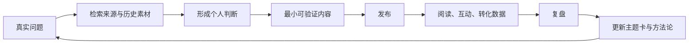

# 第二大脑、学习与内容创作闭环

## 一句话定义

第二大脑不是收藏库，而是一个把外部信息转成个人判断、可执行实验和可发布作品的系统。

判断系统是否有效，不看文件数，而看三个结果：需要时能否找到、能否改变行动、能否形成作品。

## 一、组织层：按行动性，而不是学科分类

PARA 的关键不是四个英文单词，而是按行动性组织信息：有明确终点的放入项目，需要持续维护的放入领域，可能复用的外部材料放入资源，不再活跃的进入归档。[1]

本库在 PARA 上增加内容生产管线与常青知识层：

```text
捕捉 → 澄清 → 项目 / 内容 / 资源 → 原子洞察 → 主题卡 → 发布 → 数据 → 方法论
```

这样做解决两个冲突：项目需要短期上下文，知识需要跨项目复用；内容需要快速发布，事实又需要长期追溯。

## 二、信息层：捕捉越少，信噪比越高

CODE 将第二大脑的工作分为 Capture、Organize、Distill、Express。真正重要的是最后的 Express：如果信息从未帮助你表达、决定或行动，它只是库存。[2]

捕捉时使用三问：

1. 它能支持哪个正在推进的问题？
2. 我预计在 30 天内如何使用它？
3. 它包含新的证据、模型或反例吗？

三问都答不出时，不进入知识库。链接留在浏览器收藏也比制造永久噪音更好。

## 三、知识层：从摘录升级为常青笔记

Andy Matuschak 将常青笔记定义为跨项目持续演化、积累和贡献的笔记，并强调三个特征：原子化、面向概念、密集链接。[3]

本库采用三级转换：

| 层级 | 内容 | 写作要求 |
|---|---|---|
| 来源 | 原文、逐字稿、数据 | 不改写，记录来源 |
| 原子洞察 | 一个主张、问题、证据或反例 | 用自己的话，单一焦点 |
| 主题卡 | 多个原子之间的关系 | 写清边界、冲突和用途 |

摘录不是知识。只有当你能用自己的话回答“它改变了我什么判断”，才值得升级。

## 四、学习层：提取优先于重读

Roediger 与 Karpicke 的实验表明，测试不只是测量记忆，也能增强延迟保持；与重复阅读相比，主动回忆在较长延迟后更有优势。[4] Cepeda 等人的综述进一步支持分散练习，也就是间隔练习，而不是一次性集中学习。[5]

因此每份学习笔记必须包含：

- 不看资料写出的 3 个要点。
- 一个能推翻或限制结论的反例。
- 一个 24 小时内可执行的动作。
- 计划在 2 天、7 天、30 天后的回忆问题。

阅读时间不再是核心指标。核心指标是无提示回忆率、行动完成率和跨场景迁移次数。

## 五、认知负荷：一次只推进一个问题

信息效率不是单位时间读得更多，而是减少工作记忆中的无关竞争。实践规则：

1. 一个项目只有一个当前问题。
2. 一次研究只维护一个证据台账。
3. 长文先写结构和关键判断，再补材料。
4. 工具和模板只有在重复三次后才值得自动化。
5. 每周删除不再支持当前目标的输入源。

## 六、内容创作闭环



每一环都有退出条件：

| 环节 | 退出条件 |
|---|---|
| 选题 | 能写成一个具体问题 |
| 研究 | 关键主张有来源，至少有一个反例 |
| 判断 | 能用一句话表达自己的立场和边界 |
| 草稿 | 没有虚构故事、无来源数字和空洞段落 |
| 发布 | 平台、日期和链接已记录 |
| 复盘 | 找到一个保留项、一个删除项、一个新假设 |
| 沉淀 | 只有经数据或重复实践支持的规律进入方法论 |

## 七、低质量 AI 内容判定

AI 生成不是自动低质；无法追溯、无法验证、无法行动才是低质。

高置信度归档或删除条件：

- 空文件、测试文件、临时合并件。
- 精确重复或明确被新版本替代。
- 标题截断、转义残留、模板变量未填。
- 第一人称故事没有真实来源。
- 精确数字、研究结论或名人观点无法定位来源。
- 只重复常识，没有新判断、证据、反例或行动。
- 同一文件同时承担素材、草稿、成品和报告四种职责。

不确定时归档，不直接删除。归档必须保留原因与原路径。

## 八、每周运行协议

### 周一：选择问题

- 从项目和数据中选一个真实问题。
- 删除本周不服务该问题的输入。

### 周二至周四：研究与表达

- 来源进入 `03-资源/`，并保留作者、日期、链接或原文件位置。
- 单一洞察进入 `04-知识/原子笔记/`，跨洞察关系进入 `04-知识/卡片/`。
- 用最小内容验证观点，不追求一次写完体系。

### 周五：发布与复盘

- 发布后记录数据。
- 把反馈分为赞同、疑问、反例和购买信号。

### 周日：维护

- 清空收件箱。
- 归档无动作草稿。
- 更新一个主题卡，不批量制造新文件。

## 九、领域层：只记录长期标准，不复制项目

`04-知识/方法论/` 用来回答“哪些责任需要长期维持在什么水平”，不承载一次性交付。一个主题只有同时满足以下条件，才建立领域：

1. 没有明确结束日期，需要持续维护。
2. 有可以定期检查的最低标准。
3. 标准失守会产生真实代价。
4. 已经有相关项目、数据或例行行动，而不是预先建空分类。

领域页只维护四类信息：责任边界、最低标准、检查周期、关联项目。具体行动进入 `01-项目/`，参考资料进入 `03-资源/`，成熟结论进入 `04-知识/`。尚未满足建档条件的领域留在总表中，不创建空目录。

## 参考来源

1. Tiago Forte, “The PARA Method”: https://fortelabs.com/blog/para/
2. Tiago Forte, “Building a Second Brain: The Definitive Introductory Guide”: https://fortelabs.com/blog/basboverview/
3. Andy Matuschak, “Evergreen notes”: https://notes.andymatuschak.org/Evergreen_notes
4. Roediger & Karpicke, “Test-enhanced learning”: https://pubmed.ncbi.nlm.nih.gov/16507066/
5. Cepeda et al., “Distributed practice in verbal recall tasks”: https://pubmed.ncbi.nlm.nih.gov/16719566/
