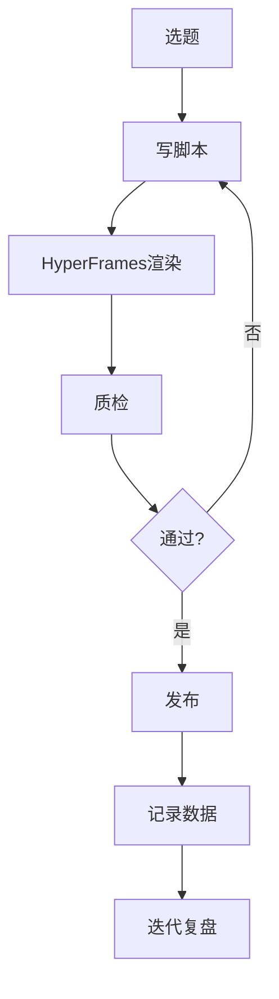
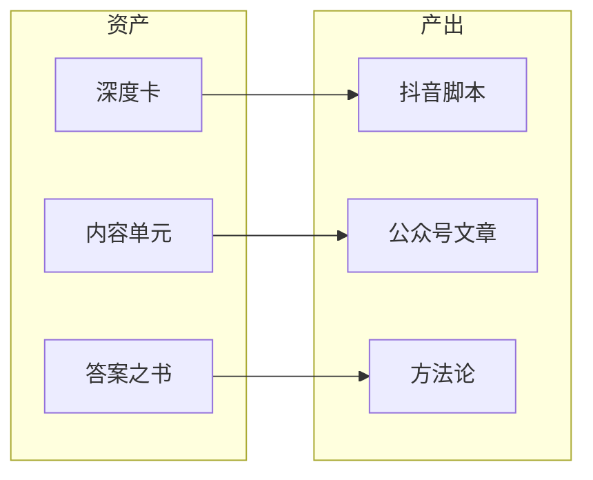
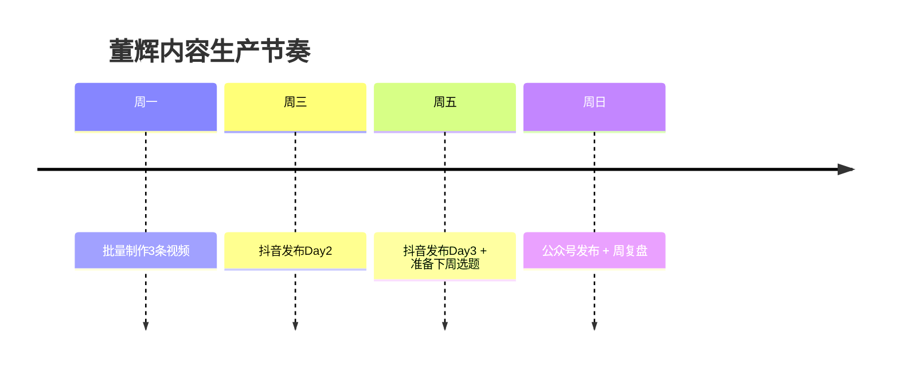
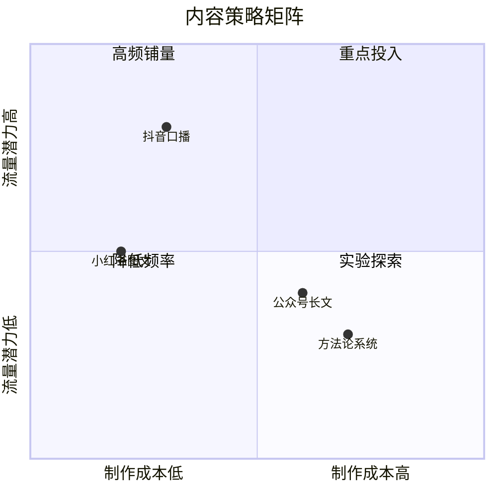

# 工具链快速启动指南

> **目标**: 今天下班前跑通全部工具链,明天开始只关心内容本身。
> **更新时间**: 2026-07-02 | **适用机器**: Windows 台式机 (12核/32GB)

---

## 0. 前置: 环境自检 (2 分钟)

```powershell
# 逐条跑,全部打勾才能继续
node --version          # 需要 >= 22
npm --version           # 需要 >= 10
ffmpeg -version         # 第一个输出行有 "ffmpeg version"
npx hyperframes --version  # 如果报错->跳到 1.1 安装
```

如果 `ffmpeg` 没装:
```powershell
winget install ffmpeg
# 关掉 PowerShell 重开后再跑 ffmpeg -version
```

---

## 1. HyperFrames -- 你的第一条不露脸口播视频

### 1.1 安装 (30 秒)

```powershell
npm install -g hyperframes
npx hyperframes doctor --json   # 环境诊断,全绿才继续
```

### 1.2 第一条测试视频 (5 分钟)

```powershell
# 创建工作目录
mkdir D:\videos\douyin\projects -Force
cd D:\videos\douyin

# 创建测试项目
npx hyperframes init "projects/2026-07-02-ceshi" --non-interactive --example=blank

# 写入测试脚本
@"
22岁那年,我亏了5300块。不是做生意亏的,是交易。
一个月,什么都不懂,冲进去,5300块没了。
那是我全部积蓄的三分之一。
但现在回头看,这是我最值的学费。
"@ | Out-File -Encoding utf8 "projects/2026-07-02-ceshi/capture/extracted/visible-text.txt"

# 渲染
npx hyperframes render --skill=faceless-explainer --quality draft --output projects/2026-07-02-ceshi/test-output.mp4 -- --width=1080 --height=1920
```

> 渲染完成后,双击 `test-output.mp4` 播放。能播 + 有字幕 = 工具链通了。

### 1.3 正式生产流程 (每条视频 30-45 分钟)

```
写脚本 (08:00)
  -> npx hyperframes init "videos/douyin/day{N}-{slug}" --non-interactive --example=blank
  -> 把脚本粘贴进 capture/extracted/visible-text.txt
  -> npx hyperframes lint
  -> npx hyperframes validate
  -> npx hyperframes inspect
  -> npx hyperframes snapshot --frames 9
  -> npx hyperframes preview          (人工审查)
  -> npx hyperframes render --skill=faceless-explainer --quality high --output renders/douyin_YYYYMMDD_day{N}.mp4 -- --width=1080 --height=1920
  -> 发布 (21:00)
```

### 1.4 模板速选

| 内容类型 | 模板 | 命令中 --style 参数 |
|---------|------|-------------------|
| 方法论/认知类 | 模板A 白板讲解 | `--style minimal-knowledge` |
| 个人故事/案例 | 模板B 故事叙述 | `--style narrative-dark` |
| 数据分析/对比 | 模板C 数据可视 | `--style data-visual` |

### 1.5 批量生产 (一次做 3 条)

```powershell
# 假设 scripts/ 下有 day01.txt, day02.txt, day03.txt
$scripts = Get-ChildItem "scripts/day*.txt" | Sort-Object Name
foreach ($s in $scripts) {
    $out = "renders/" + $s.BaseName + ".mp4"
    Write-Output "Rendering: $($s.Name)"
    npx hyperframes render --skill=faceless-explainer --style minimal-knowledge -i $s.FullName --quality high -o $out -- --width=1080 --height=1920
}
```

---

## 2. 公众号配图生成

### 方案 A: AI 生成底图 (推荐,零成本)

公众号配图分两部分:**底图**(AI生成纯背景,无文字) + **文字叠加**(Canva加)。

**底图生成**(用即梦/豆包):
```
# 即梦/豆包 Prompt 直接粘贴
# 参数: --ar 16:9 --style clean minimal

# 理性认知类文章配图:
A minimalist flat illustration, warm beige background #F5F1EB,
a single elegant S-shaped rising curve in deep navy blue #1A3A5C,
four golden dots on the curve, 40% negative space,
clean geometric, hopeful, no readable text, 16:9

# 故事经历类文章配图:
A minimalist flat illustration, a 22-year-old male silhouette
from behind looking at distant golden light,
warm beige environment, deep navy blue silhouette,
hopeful mood, 50% negative space, no readable text, 16:9

# 数据方法类文章配图:
A minimalist two-column comparison, left navy blue descending,
right golden ascending, clean divider line,
warm beige background, no readable text, 16:9
```

**文字叠加**(Canva 操作):
1. 打开 Canva -> 创建设计 -> 自定义尺寸 `1200x630`(公众号封面)
2. 上传 AI 底图 -> 拖入画布
3. 添加标题文字: 阿里巴巴普惠体 Bold, 深蓝 `#1A3A5C`, 36-48pt
4. 添加金色分割线: 宽度 300px, 高度 2px, `#D4A843`
5. 底部加小字: 董辉, 12pt, 白色, 深蓝底条
6. 导出 PNG -> `cover_wechat_{日期}.png`

### 方案 B: 纯 Canva 模板 (不用 AI)

前提: 在 Canva 中搜索 "知识类公众号封面", 选一个干净模板, 改配色为深蓝+金色。

**一次性创建 Canva 模板**(15 分钟,之后每次 2 分钟):
1. Canva 首页 -> "创建设计" -> "微信公众号封面"(自带 900x383 或自定义 1200x630)
2. 背景色设为 `#F5F1EB`
3. 添加文本框: "你的标题", 字体阿里巴巴普惠体 Bold, `#1A3A5C`
4. 添加一条横线: 颜色 `#D4A843`, 粗 2px
5. 底部加矩形: `#1A3A5C`, 高度 60px, 加白字 "董辉"
6. "文件" -> "保存为模板"
7. **以后每次**: 打开模板 -> 改标题文字 -> 导出 -> 完成

### 方案 C: 正文配图 (文中插图)

```powershell
# 如果用 Mermaid 图表,直接在公众号编辑器里粘贴渲染后的截图
# 如果用 AI 插图,用即梦/豆包,Prompt 同 2.A
```

---

## 3. 封面制作 2 分钟流水线

### 核心原则

> **底色米白+大字深蓝+金色点缀+留白40%+无乱码文字**。
> 完整设计系统见 `抖音封面设计系统_v1.md`。

### 流水线 (从选题到封面导出, 2 分钟)

```
Step 1 (30秒): 从选题表取"大字标题" (<=10字)
               例: D01 -> "亏5300块"
               D02 -> "22岁一人企业"

Step 2 (30秒): 打开即梦/豆包,粘贴对应场景 Prompt
               选 1 张满意的底图,导出 PNG

Step 3 (30秒): 打开 Canva 模板 "董辉抖音封面"
               替换底图 -> 改大字文字 -> 改副标题

Step 4 (30秒): 导出 PNG (1080x1920, 质量 90%)
               命名: cover_D{N}_{v}.png
```

### Canva 模板链接

在 Canva 中搜索或直接创建:

> **模板 1: 数字冲击型** (H1/H3/H6 Hook)
> 底图: AI 图形/曲线 | 大字: "亏5300块" | 副标题: "22岁那年的第一课"

> **模板 2: 故事叙述型** (H4/H7/H8 Hook)
> 底图: 剪影+远光 | 大字: "22岁一人企业" | 副标题: "从宿舍书桌开始的生意"

> **模板 3: 对比论证型** (H2/H5 Hook)
> 底图: 双栏对比 | 大字: "资产VS负债" | 副标题: "重新定义你的时间"

### 封面提示词速查 (直接粘贴)

```
# === 场景类 (故事型用) ===

# 宿舍书桌微光:
A minimalist flat illustration, dorm desk at midnight,
laptop casting soft blue glow, desk lamp with golden light,
22-year-old male silhouette from behind,
city skyline through window, warm beige walls, 9:16,
40% negative space, no readable text

# S型成长曲线:
A minimalist S-curve rising from bottom-left to upper-right,
four golden dots marking key points, deep navy blue curve,
warm beige background, 9:16, generous negative space,
no readable text

# === 图形类 (认知型用) ===

# 杠铃:
A minimalist barbell, left plate golden shield, right plate flame,
middle bar with cross-out mark, warm beige background,
deep navy blue bar, 9:16, no readable text

# 环形箭头:
A circular arrow loop in deep navy blue, one segment broken
with golden arrow escaping, warm beige, 9:16, no readable text

# === 人物类 (身份型用) ===

# 剪影+远光:
A 22-year-old male silhouette walking toward distant golden light,
deep navy blue silhouette, warm beige environment, 9:16,
50% negative space, hopeful mood, no readable text

# 剪影+分岔路:
A fork-in-the-road scene, 22-year-old male silhouette at junction,
left path crowded gray figures, right path empty leading to golden light,
9:16, no readable text
```

### 发布前 10 秒检查

```
[ ] 拿远手机,大字能读清?
[ ] 画面颜色 <= 3 种?
[ ] 文字 <= 2 行?
[ ] AI 底图中无乱码文字?
[ ] 底部 280px 无重要信息 (预留给抖音 UI)?
```

---

## 4. 流程图生成

### 4.1 Mermaid (免费,代码即图表)

公众号文章中的流程图,用 Mermaid 写,渲染为 PNG 后插入。

**在线渲染**:
1. 打开 https://mermaid.live
2. 粘贴 Mermaid 代码 -> 实时预览
3. 导出 PNG/SVG -> 插入公众号编辑器

**常用模板 (直接改内容)**:

````markdown
# === 流程图 ===


# === 对比图 ===


# === 时间线 ===


# === 象限图 ===

````

### 4.2 Napkin AI (推荐,更快)

网址: https://app.napkin.ai

**用法**:
1. 粘贴你的文章段落 -> Napkin 自动生成图表
2. 从生成的 5+ 个版本中选一张
3. 调整配色: 深蓝 `#1A3A5C` + 金色 `#D4A843` + 米白背景
4. 导出 PNG -> 插入公众号

> **适用场景**: Napkin 适合"一图胜千言"的概念解释图;Mermaid 适合步骤流程和架构图。

---

## 5. 数据表填写

### 5.1 CSV 模板

文件: `D:\KnowledgeBase\05-数据统计\数据统计表.csv`

**第一条发布后,立即追加一行**:

```csv
日期,平台,内容标题,类型,播放量,点赞,评论,收藏,分享,粉丝净增,发布时间,备注
2026-07-02,抖音,亏5300块--22岁那年最值的学费,口播视频,,,,,,,21:00,D01-测试发布
```

### 5.2 数据追踪节奏

| 时间点 | 记录内容 | 目的 |
|--------|---------|------|
| 发布后 1h | 播放量 | 初始推流判断 |
| 发布后 24h | 全部数据 | 单条内容首日表现 |
| 发布后 7d | 全部数据 | 完整周期数据 |
| 每周日 | 本周汇总 (六格复盘) | 周趋势判断 |

### 5.3 六格复盘模板 (每周日晚填)

```markdown
## 本周复盘 {日期范围}

| 指标 | 数值 | vs 上周 |
|------|------|--------|
| 发布条数 | N | - |
| 总播放量 | N | - |
| 平均点赞率 | N% | - |
| 粉丝净增 | N | - |
| 最高播放内容 | 标题 | - |
| 最低播放内容 | 标题 | - |

**做得好的**:
**需要改进的**:
**下周实验**:
```

---

## 6. 常见报错及解决

| 报错/现象 | 原因 | 解决 |
|-----------|------|------|
| `hyperframes: command not found` | 未全局安装 | `npm install -g hyperframes` |
| `ffmpeg not found` | FFmpeg 未安装或不在 PATH | `winget install ffmpeg` -> 重开 PowerShell |
| HyperFrames 渲染无声音 | faceless-explainer 默认无配音 | 检查 `--skill=faceless-explainer` 参数,音频需额外 TTS 配置 |
| 视频字幕重叠/偏移 | 模板布局参数问题 | 跑 `npx hyperframes inspect` 检查溢出 |
| 渲染速度慢 (>5min) | 中文字体加载或高画质参数 | 迭代阶段用 `--quality draft`;最终版再用 `--quality high` |
| 文件太大 (>100MB) | 比特率过高 | 在渲染时传 `--bitrate 2M` 参数 |
| Node.js 版本太低 | 需要 >=22 | 用 nvm-windows 或直接下载 LTS |
| 即梦/豆包生成底图有乱码 | AI 模型倾向生成文字 | Prompt 末尾加 `no readable text, no letters, no characters, abstract` |
| Canva 导出模糊 | 导出设置不对 | 导出时选 PNG,质量 90%,尺寸 1080x1920 |
| Mermaid 图表中文乱码 | 在线渲染字体问题 | 在 mermaid.live 中选支持中文的字体或在配置中指定 |
| CSV 乱码 | 编码问题 | PowerShell 里用 `Out-File -Encoding utf8`;Excel 里用"数据->从文本/CSV"导入选 UTF-8 |

---

## 7. 工具链就绪检查清单

> 全部打勾 = 明天可以开始只关心内容。

### 环境
- [ ] `node --version` >= 22
- [ ] `ffmpeg -version` 有输出
- [ ] `npx hyperframes --version` 有输出
- [ ] `npx hyperframes doctor --json` 全绿

### HyperFrames
- [ ] 成功生成 1 条测试视频 (test-output.mp4 可播放)
- [ ] 知道 lint -> validate -> inspect 三连怎么跑
- [ ] 知道 `--quality draft` vs `--quality high` 的区别
- [ ] 知道 `--width=1080 --height=1920` 竖屏参数

### 配图
- [ ] 即梦/豆包能生成底图 (至少试过 1 个 Prompt)
- [ ] Canva 中创建了"董辉抖音封面"模板 (底色米白+深蓝大字+金色分割线)
- [ ] 完成一次: 改标题 -> 导出 -> 命名 cover_D01_v1.png

### 流程图
- [ ] 在 mermaid.live 中渲染过 1 张流程图
- [ ] 知道怎么导出 PNG (或截图)
- [ ] (可选) 试过 Napkin AI 粘贴文章段落生成图表

### 数据
- [ ] 知道 `05-数据统计/数据统计表.csv` 的位置
- [ ] 知道 CSV 的列结构 (日期,平台,标题,类型,播放,点赞,评论,收藏,分享,粉丝净增,发布时间,备注)
- [ ] 准备好第一条发布后立即填数据

### 账号侧
- [ ] 抖音号已注册,头像+昵称+简介已设置
- [ ] 公众号已注册,头像+名称+简介已设置
- [ ] 知道抖音创作者中心的上传入口 (电脑版: creator.douyin.com)
- [ ] 知道公众号后台的素材管理入口

### 内容侧
- [ ] `01-内容生产/选题管理/` 里有 >= 5 个排期选题
- [ ] 至少 1 条脚本已用脚本工厂模板写完
- [ ] 至少 1 条脚本已用质检工作台自检

---

## 速查: 一条视频从想到发的完整命令

```powershell
# === 环境确认 ===
npx hyperframes doctor --json

# === 创建项目 ===
cd D:\videos\douyin
npx hyperframes init "projects/day01-kuisanshibai" --non-interactive --example=blank

# === 放入脚本 ===
# 手动: 用 VS Code 打开 projects/day01-kuisanshibai/capture/extracted/visible-text.txt
# 粘贴脚本全文,保存

# === 质检链 ===
npx hyperframes lint && npx hyperframes validate && npx hyperframes inspect

# === 抽帧预览 ===
npx hyperframes snapshot --frames 9

# === Studio 人工审查 ===
npx hyperframes preview

# === 最终渲染 ===
npx hyperframes render --skill=faceless-explainer --style minimal-knowledge --quality high --output renders/douyin_20260702_day01.mp4 -- --width=1080 --height=1920

# === 制作封面 (Canva 模板 + 即梦底图) ===
# 见 3. 流水线

# === 发布 (21:00) ===
# 打开 creator.douyin.com -> 上传视频 + 封面 -> 填标题 -> 定时发布

# === 记录数据 (次日 09:00) ===
# 打开 05-数据统计/数据统计表.csv -> 追加一行
```

---

> **这页指南只有在你第一次跑通全流程时才有用。跑通一次之后,它就变成你的肌肉记忆。**
>
> 下一步: 打开 `内容生产操作系统_v1.md` 2 选题生成器,选一个选题,开始写你的第一条脚本。
>
> *v1.0 | 2026-07-02 | 30 条发布后更新 v1.1*
