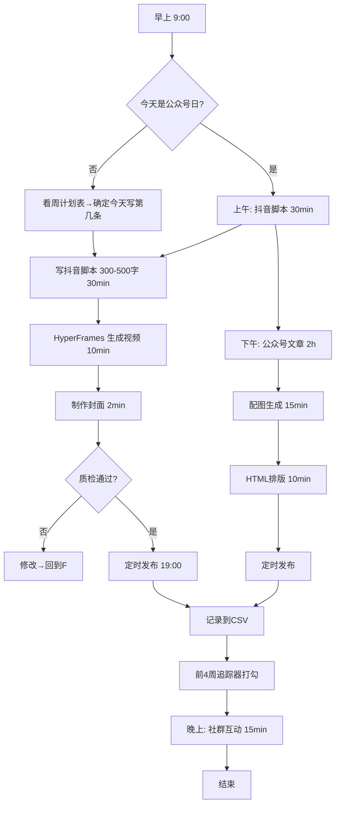
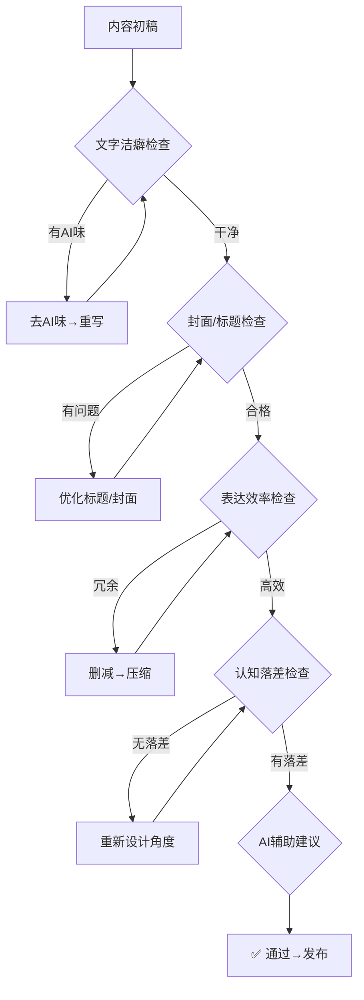
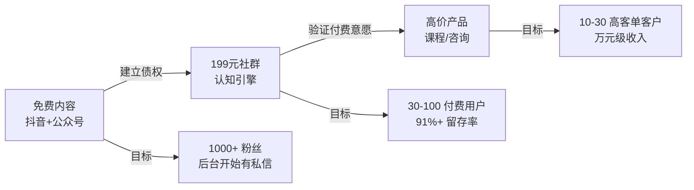
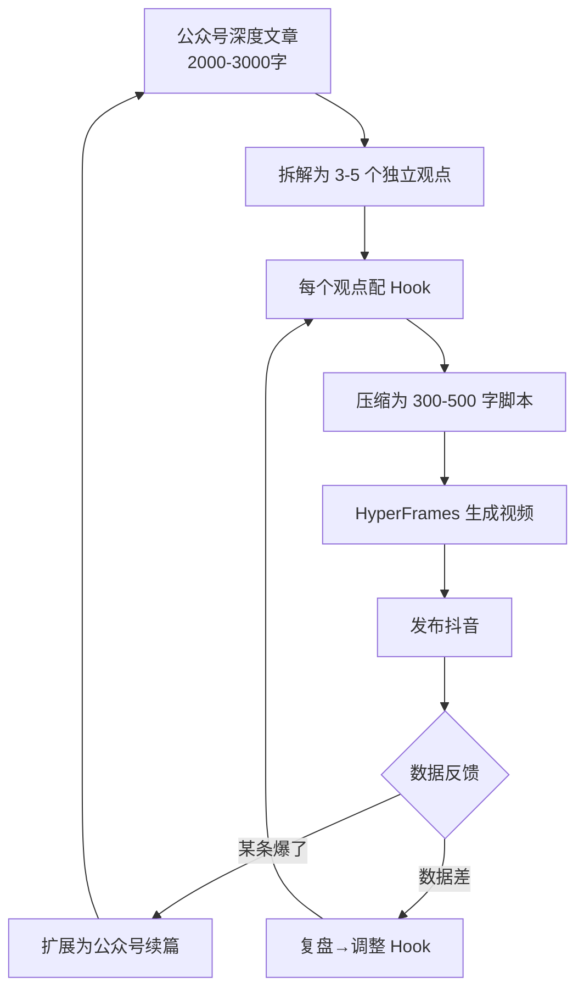
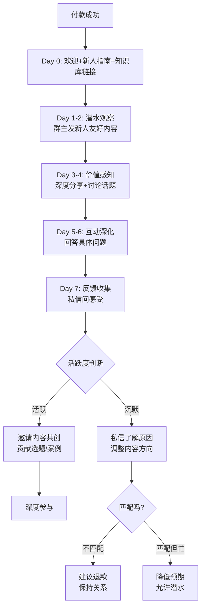
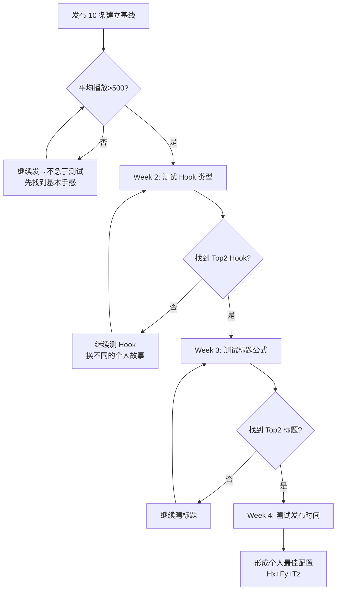
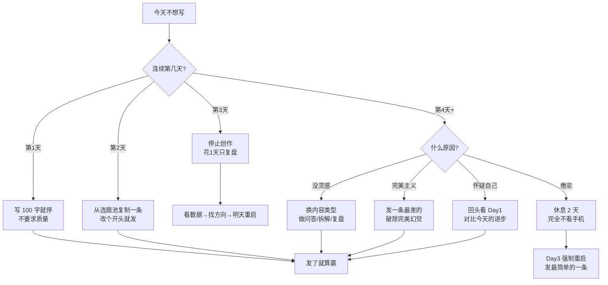

# 董辉自媒体系统流程图集

> 所有流程图的 Mermaid 源码，可直接粘贴到 mermaid.live 渲染
> 覆盖：发布全流程、内容复用、变现漏斗、社群运营

---

## 流程图 1：每日发布全流程

---

## 流程图 2：DBS 五维诊断

---

## 流程图 3：变现三阶段漏斗

---

## 流程图 4：内容复用闭环

---

## 流程图 5：社群新成员 journey

---

## 流程图 6：AB 测试决策树

---

## 流程图 7：遇到创作瓶颈怎么办

---

## 使用说明

1. 复制任意 Mermaid 代码块
2. 粘贴到 https://mermaid.live
3. 导出 PNG/SVG
4. 插入公众号文章
