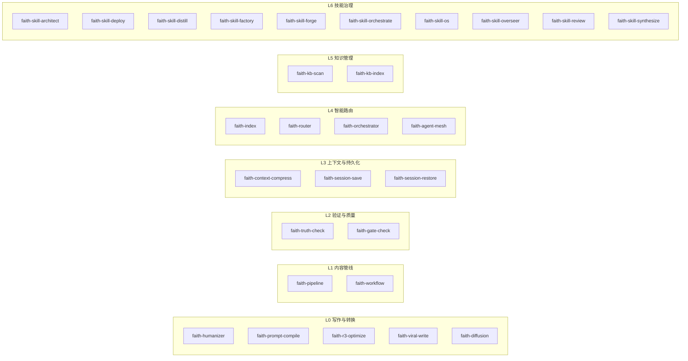
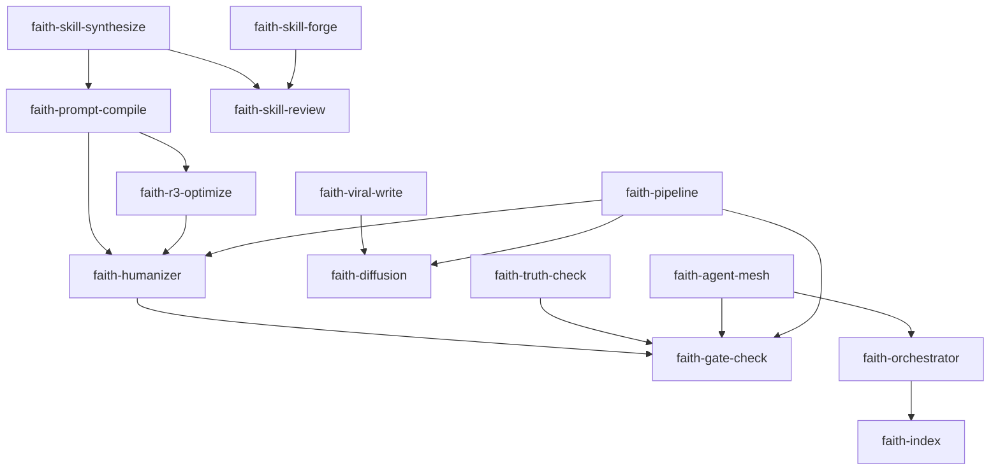

# faith 技能家族全景分析

> 生成日期：2026-06-16 | 技能总数：28

---

## 一、体系架构概览

faith 技能家族按照功能分为 7 层。从底层的写作引擎到顶层的技能治理，每一层解决一个独立的问题域。

---

## 二、逐层详细分析

### L0 写作与转换（6 个）

这层是 faith 家族的核心生产力层。解决的是"写出好东西"这个基本问题。

#### faith-humanizer

- **版本**：3.1.0 | R3
- **定位**：AI 脚手架 → 自然手写文转换引擎
- **能力**：29 类 AI 写作特征检测 + 修复。A 类固定句式、B 类虚假深度、C 类排版脚手架、D 类空话泛话、E 类引注问题、F 类标题与标点、G 类真实性缺陷、H 类结构臭虫、I 类灵魂缺失
- **特色机制**：声音校准（Voice Calibration）、注入人味、反 AI 最终轮
- **输入**：AI 生成文本 → **输出**：自然手写风格文本
- **不适用**：短平台适配→faith-diffusion；事实核查→faith-truth-check
- **优化历史**：从 blader/humanizer 英文 29 模式 + faith-prompt-compile + faith-r3-optimize + faith-workflow 融合而来，已吸收 humanizer v2.5.1 的 Voice Calibration、Personality and Soul、反 AI 最终轮
- **门禁**：G1-G6 全部通过

#### faith-prompt-compile

- **定位**：提示词编译/简化结构方法论
- **作用**：作为 faith-humanizer 和 faith-r3-optimize 的基础方法论，提供提示词简化和结构优化能力
- **关联**：被 faith-humanizer、faith-r3-optimize、faith-skill-synthesize 引用

#### faith-r3-optimize

- **定位**：反模式优化引擎
- **作用**：R3（Review-Rewrite-Refine）深度重写循环，检测并修复反模式
- **关联**：与 faith-humanizer 协作使用，提供反模式检测能力

#### faith-viral-write

- **版本**：2.0.0 | R3
- **定位**：自媒体内容创作引擎
- **能力**：7 维度 + 三平台（公众号/小红书/抖音）深度适配 + HKR 选题框架 + 5 标题策略 + 金句提炼 + 情感曲线 + 配图指导
- **输入**：选题或素材 → **输出**：平台适配的自媒体内容
- **不适用**：纯翻译→baoyu-translate；学术论文→article-writing
- **优化历史**：经过 SkillOpt R3 深度重写

#### faith-diffusion

- **版本**：1.0.0 | R1
- **定位**：跨平台内容扩散引擎
- **能力**：从 dbs-content-system 产出的内容单元自动适配为多平台版本（公众号/小红书/推特/抖音/飞书），保持核心观点一致但形式适配
- **输入**：内容单元 → **输出**：多平台适配版本
- **来源**：从 dbs-content-system + crosspost + dbs-xhs-title + khazix-writer + faith-viral-write 模式孵化

---

### L1 内容管线（2 个）

解构"从想法到发布"的端到端流程。

#### faith-pipeline

- **版本**：1.0.0
- **定位**：统一内容全管线
- **能力**：覆盖微信读书划线提取 → 结构化 → 创作 → 去 AI 味 → 多媒体 → 跨平台分发 → 终验全流程
- **融合来源**：knowledge-forge（微信读书到文章）+ content-pipeline-orchestrator（三平台分发流水线）
- **输入**：微信读书素材 → **输出**：多平台发布就绪内容
- **不适用**：单一环节→对应 faith-\* skill；纯创作不发布→faith-viral-write

#### faith-workflow

- **版本**：1.0.0
- **定位**：高级工作流架构师
- **能力**：融合 workflow-composer（编排）+ dmux-workflows（多 agent）+ task-capsule-builder（任务胶囊）+ heartbeat（心跳监控）+ rollback（回滚恢复）
- **输入**：复杂流程设计需求 → **输出**：可监控可回滚的工作流架构
- **不适用**：简单线性流程（≤3步）→workflow-composer；单 agent 任务→dmux-workflows
- **优化历史**：2026-06-11 吸收了 workflow-composer（去重）

---

### L2 验证与质量（2 个）

确保内容在发布前经过事实核查和质量门禁。

#### faith-truth-check

- **版本**：1.0.0
- **定位**：内容真实性验证
- **能力**：事实核查、数据引用验证、来源可靠性评估
- **输入**：待核查内容 → **输出**：真实性报告
- **触发词**：事实核查、验证来源、内容真实性
- **不适用**：AI 味检查→humanizer

#### faith-gate-check

- **版本**：1.0.0
- **定位**：统一质量门禁
- **能力**：组合 faith-humanizer（去 AI 味）+ compile-and-verify（任务验证）+ content-auditor（发布审计）+ 禁用词扫描 + 平台规则校验。布尔门禁（只判通过/不通过）
- **输入**：待发布内容 → **输出**：通过/不通过
- **优化历史**：2026-06-11 吸收了 content-auditor（去重）
- **与 content-auditor 互补**：content-auditor 偏重内容审计流程，faith-gate-check 偏重布尔门禁

---

### L3 上下文与持久化（3 个）

在长对话中管理上下文，保存和恢复会话状态。

#### faith-context-compress

- **版本**：3.0.0 | R3
- **定位**：上下文压缩器
- **能力**：在长对话中将已完成任务的上下文压缩为结构化摘要，保留关键决策/规则/未解决问题，丢弃已完成细节
- **输入**：长对话 → **输出**：结构化摘要
- **不适用**：开始新话题→直接开始；会话存档→dbs-save

#### faith-session-save

- **定位**：会话存档
- **作用**：保存当前会话的关键结论和状态

#### faith-session-restore

- **定位**：会话恢复
- **作用**：从存档恢复之前的会话状态

---

### L4 智能路由（4 个）

把用户输入路由到正确的 skill。

#### faith-index

- **定位**：faith-\* 技能家族入口
- **能力**：自动识别用户的意图，路由到对的 skill
- **触发方式**：/faith、/help、"我该用什么skill"、"看看我有什么skill"
- **作用**：L4 的浅层路由层

#### faith-router

- **定位**：精确判定路由
- **能力**：当 faith-index 无法直接匹配时，用 if-then-else 决策树精确路由

#### faith-orchestrator

- **定位**：深度路由中枢
- **能力**：当 faith-index 无法直接匹配时，用 if-then-else 决策树逐层下钻，精确定位到最匹配的 faith-\* skill。覆盖全部 25 个 faith skill 的路由逻辑
- **触发词**：自动路由、自动判断、帮我找、不知道该用哪个、深度路由、决策树

#### faith-agent-mesh

- **版本**：1.0.0
- **定位**：Agent 多技能编排引擎
- **能力**：将复杂任务分解为 DAG 工作单元 → 路由到对应 skill/agent → 并行执行 → 逐单元验证 → 集成终验。融合 faith-orchestrator（路由）+ rfc-pipeline（DAG）+ dmux（并行）+ faith-gate-check（门禁）
- **输入**：复杂任务 → **输出**：多 skill/agent 执行计划+集成结果
- **不适用**：简单线性任务（≤3步）→直接触发对应 skill；单 skill 任务→直接用 skill

---

### L5 知识管理（2 个）

管理和维护知识库的健康状态。

#### faith-kb-scan

- **版本**：1.0.0
- **定位**：知识库健康巡检与自动维护
- **能力**：检测去重候选、孤点文件、[INDEX.md](http://INDEX.md) 过期、交叉引用断裂，输出修复清单

#### faith-kb-index（推测）

- **作用**：知识库索引管理

---

### L6 技能治理（10 个）

这是 faith 家族的元层级——管理技能本身的技能。

#### faith-skill-os

- **版本**：1.0.0 | R1
- **定位**：Skill 操作系统
- **能力**：所有 skill 的总管理中心——路由编排+生命周期管理+质量审计+自我进化。不是单个 skill，是 skill 的 skill
- **方法论**：Prompt-OS v8.0 × SkillOpt Manual Loop
- **输入**：skill 体系状态 → **输出**：管理决策
- **优化历史**：2026-06-11 吸收了 skill-auditor + skill-catalog（去重）
- **孵化来源**：150+ skills deep synthesis across .agents + .codex ecosystems

#### faith-skill-review

- **版本**：1.0.0
- **定位**：全 skill 评测与优化总控
- **能力**：融合 SkillOpt 循环 + skill-review 评分 + G1-G6 门禁。支持批量评测
- **方法论**：SkillOpt + Microsoft
- **不适用**：单次 skill 使用、非 skill 内容评测、纯代码 review
- **边界**：faith-skill-review（评测评分）vs skill-creator（创建）vs skill-evolver（进化）vs compile-and-verify（验证）

#### faith-skill-forge

- **版本**：1.0.0 | R1
- **定位**：Skill 锻造台
- **能力**：对已有 skill 做 R3 升级。不是从零创建，是在已有 skill 基础上做迭代优化
- **孵化来源**：8x R3 optimization patterns
- **不适用**：从零创建 skill→skill-creator；评测 skill→faith-skill-review

#### faith-skill-synthesize

- **版本**：1.0.0
- **定位**：Skill 合成器
- **能力**：基于已有 skill 交叉学习 + SkillOpt 评测 + faith-prompt-compile 编译，合成新的高质量 skill。不是从零创建，是交叉已有 skill 的最佳模式
- **不适用**：从零创建→faith-skill-forge；单 skill 优化→faith-skill-review

#### faith-skill-architect

- **版本**：1.0.0
- **定位**：架构治理
- **能力**：技能架构定义和规范管理

#### faith-skill-deploy

- **定位**：部署管理
- **作用**：技能部署和版本管理

#### faith-skill-distill

- **定位**：知识蒸馏
- **作用**：从多个 skill 中提取精华模式

#### faith-skill-factory

- **定位**：批量创建
- **作用**：根据模板批量生成 skill

#### faith-skill-orchestrate

- **定位**：智能路由编排
- **作用**：根据用户意图自动匹配最优 skill，编排多 skill 流水线

#### faith-skill-overseer

- **版本**：1.0.0
- **定位**：终极监工 skill
- **能力**：强制 Agent 以 git 时间戳/文件 hash/diff 统计为唯一真实证据——所有交付须附 [EVIDENCE.md](http://EVIDENCE.md) 证明工时。识别并打回 12 种造假 + 6 种偷懒
- **输入**：交付物 → **输出**：审计通过/打回
- **不适用**：优化 skill→faith-skill-forge

---

## 三、依赖关系分析

---

## 四、使用路径推荐

| 你想做什么 | 路径 |
| --- | --- |
| 去 AI 味 | faith-humanizer |
| 自媒体创作 | faith-viral-write → faith-humanizer → faith-diffusion |
| 微信读书到发布 | faith-pipeline |
| 事实核查 | faith-truth-check |
| 发布前检察 | faith-gate-check |
| 长对话管理 | faith-context-compress |
| 创建新 skill | faith-skill-forge |
| 优化已有 skill | faith-skill-review |
| 合成新 skill | faith-skill-synthesize |
| 编排复杂任务 | faith-agent-mesh |
| 管理 skill 体系 | faith-skill-os |
| 不确定用哪个 | faith-index → faith-orchestrator |

---

## 五、关键发现与建议

1. **L0 写作层最强**：faith-humanizer + faith-viral-write + faith-diffusion 构成完整的内容创作到分发的闭环。faith-humanizer 经过多次迭代已接近成熟。
2. **L6 治理层最重**：10 个治理类 skill 占了总数的 35%。存在功能重叠风险——faith-skill-review / faith-skill-forge / faith-skill-synthesize 三者边界需要执行时明确区分。
3. **缺口**：缺少专门的写作素材收集/管理 skill（当前由 faith-pipeline 部分覆盖）；缺少 A/B 测试 skill。
4. **健康状态**：28 个 skill 中 10 个标注了 version，18 个未标注版本号。建议统一版本管理体系。
5. **去重历史**：faith-gate-check 已吸收 content-auditor，faith-workflow 已吸收 workflow-composer，faith-skill-os 已吸收 skill-auditor + skill-catalog。说明有意识在做 skill 收敛。
6. **最活跃的 skill**：faith-humanizer（3.1.0）、faith-context-compress（3.0.0）、faith-viral-write（2.0.0）的版本号最高，说明迭代次数最多。