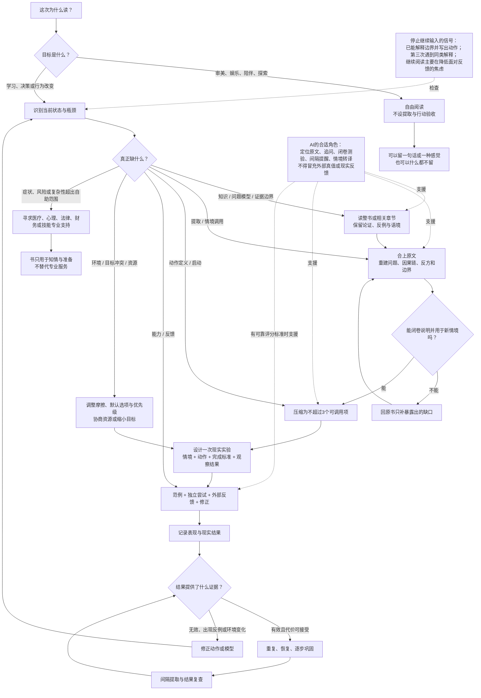

# COMPRESSED VERSIONS｜《书不是行动系统》跨媒介版本

> 这些版本按各自媒介重新设计，并非从旗舰文章机械截取。关于“AI自动摘要是否改善学习或行为”的判断，现有材料没有直接比较证据；下文凡涉及其效果，均明确标为模型推断。

## 一、500字核心摘要

书籍并不普遍阻碍“知道做到”。它更像一种偏向行为链前半程的媒介：擅长命名问题、建立模型、保存证据、呈现反例，也能让一种此前难以想象的生活变得可见；但到了正确时刻提取、把原则编译成动作、启动、纠错和跨周维持，传统书籍的能力迅速减弱。

阅读最常见的错位，是把眼前的熟悉当成日后的提取，把意图当成行动。实验显示，重读可以改善即时表现，却未必改善延迟回忆；改变意图也不会等比例改变行为。不过，这些证据不能推出“长书使人不行动”。出版研究同样不能证明非虚构普遍注水。背景、案例和故事有时在建模，有时也会用鲜活性遮蔽总体证据。

反证来自结构化书目疗法：一本把日记、练习、反馈标准和恢复方案编进阅读顺序的手册，确实能参与行为和症状改变。有效的不是“读完”，而是执行一个被写成书的协议。

因此，关键不在长短，而在状态、瓶颈与接口是否匹配。新手缺模型时，摘要可能删掉证据和边界；已有模型的人缺调用线索时，摘要可能更适合作为提示。关于AI摘要的这项判断仍是模型推断，并非直接试验结论。现有AI教学和阅读实验只能较窄地提示：AI替人完成活动，与组织人完成活动，后果可能不同。

最小原则是：书负责建模，AI负责定位、追问、提取练习和情境转译，现实练习负责提供表现证据，教师、同伴、专业人员与环境负责反馈和维持。文学、哲学和娱乐阅读可以不进入这套协议。不是所有阅读都欠现实一张行动清单。

---

## 二、1500字普通读者版

陈雨把一本习惯书读到78%，划过“降低摩擦”“绑定提示”“从两分钟开始”。她都能解释。可那份准备投给三家公司的转岗作品集，仍叫“最终版7”，躺在桌面上。陈雨是合成人物，代表一种常见处境：读书既让人理解自己、降低焦虑，也可能用“方法还没学完整”挡住一次真实评价。

问题不是读书人为什么懒，而是书能把人带到哪里。我们常把见过、理解、记忆、提取、迁移和技能都叫“学会”，再把想做、启动、重复、稳定行为和结果混在一起。一个人可以理解原则，却在需要时想不起；能背出原则，却不知道下一步；动作明确，却因害怕评价而不启动。

书在前半条链上很强。它能给经验命名，建立模型，展示案例与反例。Roediger 和 Karpicke 的短文实验却提醒我们：即时顺畅不等于延迟后能独立提取，一周后做过提取练习的学生优于反复重读者。这个结果不是整书研究，更不能直接证明阅读妨碍行为。

长篇也不等于注水。出版证据显示页数与定价相关，销量预期会影响出版投入，却不能证明商业非虚构普遍被拉长。背景可能提供图式，案例可能减少初学者的无效搜索。叙事沉浸实验发现故事会影响即时信念；健康传播综述中，统计证据对信念还有小幅优势。两类研究都没有证明叙事会导致基准率忽略。

书真正弱的地方，常在合上之后。Webb 与 Sheeran 发现意图变化大于行为变化。Milkman 等人的疫苗现场试验中，信息相同，只增加“写下准备接种的日期和时间”，接种率便提高4.2个百分点。差别不在多一条道理，而在有没有行动接口。

我起初因此判断：书只能负责前半程。失眠书目疗法推翻了这句话。Jernelöv 等人的结构化CBT手册要求读者连续六周记日记、执行睡眠限制和认知练习。只用手册组缓解率为24.4%，候补组为2.3%；加入每周短电话指导后达到61.4%。它不能代表普通自助书，却证明文本把动作、记录、标准和恢复方案编入流程后，也能参与下游改变。

更准确的判断是：书通常是“前半程媒介”，但可以成为协议的一部分。结构性冲突并非书太长，而是瓶颈已经转到启动、能力、环境或反馈，阅读却继续供应解释。阅读会不会提供替代性满足，目前缺少直接实验，是模型推断。

同一本书作用不同，也不只是“因人而异”。Gandhi 在自传中把一次人生转向与 *Unto This Last* 联系起来，相邻章节记录了随后迁移报社的行动；但他已有价值倾向、组织、伙伴和资源。“书补上最后一个上游缺口”是对这份自我归因的解释，不是独立因果证明。

摘要和AI同样没有一般性的胜负。新手缺模型时，压缩可能删掉限定与证据链；已有模型的人缺调用线索时，三条提示可能更实用。这是状态—瓶颈—接口模型的推断，目前没有整书、AI摘要与长期行为的直接比较试验。

相邻证据只能校准方向。Bastani 等的高中数学实验中，在0—1计分尺度上，普通GPT的练习系数为 `+.137`，撤去工具后的考试系数为 `-.054`；护栏版练习系数为 `+.361`，撤去后与对照无显著差异。这些不是标准差。Kreijkes 等分析344名学生：相对只用LLM，手写笔记组三天后的保持、理解和自由回忆为 `d=.44/.38/.21`。但研究无纯阅读组，只用GPT-3.5且仅一次活动，不能推出LLM必然损害阅读。两项都不是AI书摘实验。

一个最小协议是：阅读前判断自己缺知识、模型、提取、动作、能力、环境、反馈还是资源；阅读中只留改变判断的证据、一个边界和一个待验证动作；阅读后压成不超过三个可调用项，做一次现实实验，再按反馈回书补洞。若你已能解释原则、写出动作，第三本同类书仍只在降低面对反馈的焦虑，就该暂停输入。

小说、哲学和娱乐阅读可以退出这套协议。审美、休息与陪伴不需要证明转化率。书不是完整的行动系统，但人生也不是每翻一页都要验收的项目。

---

## 三、10条论断卡片

### 卡片1｜书通常是前半程媒介

**论断**：书擅长命名问题、建模和说服，不擅长及时提醒、观察表现、纠错和长期维持。

**证据性质**：跨学习科学、行为科学与媒介可供性的综合判断，不是单项试验的直接结论。

**边界**：带练习、评分、指导或社群的书，已经不再是单纯的静态文本。

### 卡片2｜“我懂了”不是一个状态

**论断**：知道、理解、记忆、提取、迁移、技能、意图、启动、重复行为和结果可以彼此分离。

**现实含义**：评价一本书前，必须说明它完成了哪一次转换。不能因读者没形成习惯，就否认书帮助他建立模型；也不能因读者很受触动，就宣称行为已改变。

### 卡片3｜熟悉感容易冒充提取能力

**论断**：当答案始终留在眼前、未来任务却要求独立生成时，重读和划线带来的熟悉感可能高估掌握。

**证据**：Roediger 与 Karpicke 的短文实验中，提取练习在延迟测验上优于反复重读。

**边界**：这不是整书研究，也不证明所有流畅阅读都会制造错觉。

### 卡片4｜长篇不等于注水

**论断**：背景、案例和论证有时在提供图式、减少无效搜索或保存可审查的证据链。

**反方证据**：出版市场确实受到页数、定价、销量预期和类型惯例影响。

**边界**：现有证据不足以证明非虚构作品普遍被商业性拉长；“有注水”与“长篇结构总体有害”不是一回事。

### 卡片5｜故事既能建模，也能误导

**论断**：叙事能组织时间、因果、欲望和代价，但现有证据不支持“故事普遍比统计更有效”。

**证据**：叙事沉浸会影响即时信念；健康传播综述没有测到实际行为优势，统计证据在信念上还有小优势。这些研究没有直接测基准率忽略。

**行动含义**：故事帮助理解时保留，代替总体证据时警惕。

### 卡片6｜意图不会等比例变成行为

**论断**：让人更想做一件事，通常比让他真正做出来容易。

**证据**：Webb 与 Sheeran 的元分析中，意图变化效应大于行为变化；疫苗现场试验中，具体日期和时间提示提高了接种率。

**边界**：实施意图不是行为遥控器，领域、强化和现实约束会改变效果。

### 卡片7｜一本书可以参与下游改变

**论断**：当书把动作、记录、反馈标准、恢复方案和停止边界编进使用流程时，它可以成为干预协议的一部分。

**证据**：结构化失眠CBT手册的随机试验显示，纯手册优于候补，短电话指导进一步增效。

**边界**：这不能外推到普通自助书，更不能把临床手册等同于无指导的励志阅读。

### 卡片8｜摘要是否有用，取决于读者缺什么

**论断**：已有模型的人缺调用线索时，摘要可能减少摩擦；新手缺证据链和边界时，摘要可能只留下口号和熟悉感。

**证据性质**：这是状态—瓶颈—接口模型的推断，目前没有直接比较整书、AI摘要与长期现实行为的统一试验。

**判断问题**：被删掉的内容，是否正是当前转换所需要的？

### 卡片9｜AI的关键不是聪明，而是替代了哪一步

**论断**：AI可定位原文、追问、生成提取练习和情境提示；也可代替用户思考，让“处理内容”变得过于容易。

**证据**：Bastani 等在0—1计分尺度上观察到普通GPT的练习系数 `+.137`、撤去工具后的考试系数 `-.054`，而护栏版考试系数与对照无显著差异；这些不是标准差。Kreijkes 等发现，相对只用LLM，手写笔记组在三天后的保持和理解较好，但没有纯阅读组，不能证明LLM普遍有害。

**边界**：这些研究都是相邻的学习证据，不是AI书摘研究；关于AI摘要的利弊仍是模型推断。

### 卡片10｜不是所有阅读都必须行动

**论断**：技能书应接受表现验收，自助书应接受结果与安全审查；文学、哲学、探索和娱乐阅读可以把体验本身作为终点。

**判断**：要求一本编程书只负责启发，标准太低；要求一部小说交付三条行动建议，标准荒唐。

---

## 四、10分钟演讲稿

各位好。

我想先介绍一个不存在的人。

她叫陈雨。周日晚上十一点四十七分，她在微信读书里搜索“行动”。一本习惯书已经读到78%，划线密密麻麻：降低摩擦，绑定提示，从两分钟开始。她都能解释。可她真正想做的事，是把转岗作品集发给三家公司。那份文件还在桌面上，名字叫“最终版7”。

陈雨不是我采访到的人。她是一个合成人物，由购买、收藏、划线和迟迟不交付拼成。她也不只是懒。读书确实帮她理解完美主义和启动成本，也让焦虑下降。问题在于，理解同时给了她一个体面的延迟理由：方法还没学完整。

这把我们带到今天的问题：书这种媒介，是否结构性地妨碍“知道做到”？

我查资料前的判断很简单：商业书太长，一个点子灌成二百页；读者在案例和重复中获得掌握感，最后什么也没做。

查完以后，我只能保留一半。

先说保留下来的那一半。

“我学会了”其实混合了很多状态。见过一个观点，叫接触；能解释因果和边界，叫理解；过几天还保留，叫记忆；原文不在眼前还能调出来，叫提取；换一个问题还能使用，叫迁移；在速度、标准和变化条件下做出来，才更接近技能。

这之后还有另一条链：我想做，我在一个具体时刻开始做，我重复了几次，行为逐渐稳定，最后现实结果发生变化。

这些状态可以完全分开。一个人能理解，却提取不出来；能提取，却不知道下一步；知道下一步，却害怕评价；反复做了，结果仍可能不好。

阅读最容易跨错的一步，是把眼前的熟悉当成未来的提取。

Roediger 和 Karpicke 让大学生学习短篇说明文。一组重读，一组尝试回忆。五分钟后，重读更好；一周后，提取练习组反而领先。在其中一个实验里，一周后的结果是56%对42%。而且反复学习者对自己未来记忆更有信心。

这不是一本书的实验，更不是行为改变实验。它只能支持一个较窄的提醒：你读得很顺，不代表离开答案后还能调出来。

提取也还不是行动。

Webb 和 Sheeran 汇总47个确实改变了行为意图的实验。意图的变化效应是 `d=.66`，行为只有 `d=.36`。Milkman 等人的现场试验更直观：三千多名员工都收到免费接种流感疫苗的信息。多写一个准备接种的日期，效果不显著；写下日期和具体时间，接种率提高4.2个百分点。

信息没变，改变的是行动接口。

书在这里确实有结构限制。它不知道你明早八点是否想起那条原则，不知道你第一次尝试时哪里出错，不知道你昨天到底做没做。传统书是单向、静态的。

但不能因此说，长篇里的东西都是赘肉。

Bransford 和 Johnson 的经典实验表明，合适的语境若在阅读前出现，会改善理解和回忆；读完再补，帮助很小。语境参与编码，不只是装饰。Sweller 和 Cooper 的例题研究也显示，初学者看完整范例，可以减少无效搜索。

故事同样不是简单的填充。它能把时间、因果、欲望和代价放在一起。但故事也不是魔法。健康传播研究的汇总发现，统计证据在信念改变上有一个小优势；叙事对实际行为有没有优势，研究根本没有测出来。

所以，背景和故事有时在帮助建模，有时在用鲜活性替代证据。我们要逐段判断，不能因为好读就放弃核查，也不能因为摘要更快就把语境全部判成赘肉。

我原本准备在这里下结论：书负责理解，行为必须交给别的系统。

然后，一份失眠手册让我改了判断。

Jernelöv 等人把133名长期失眠成人随机分成三组：六周CBT手册加每周15分钟电话、只用手册、候补。那本手册不是泛泛讲睡眠的重要性。它要求写睡眠日记，执行刺激控制、睡眠限制和认知练习。

治疗后，缓解率分别是61.4%、24.4%和2.3%。

这项研究有开放标签、自报数据和样本教育程度较高等限制，不能外推到所有自助书。但它证明了一件事：一本书可以参与行为链的后半程。

条件是什么？有效的不是“读完一本关于睡眠的书”，而是连续六周执行一个被写成书的治疗协议。书把动作、记录、标准和恢复方案编进了阅读顺序。它没有把阅读完成误当成干预完成。

Gandhi 的故事提供了另一个角度。他在自传里把一次人生转向归因于 Ruskin 的 *Unto This Last*：读完后整夜未眠。相邻章节记录了随后发生的商议、人员安排、购地和迁移。

但书不是唯一原因。Gandhi 已经在经营报纸，已有简朴生活的价值倾向，也有伙伴、组织和购地资源。他自己说，那本书照亮了他已经知道或朦胧感到的东西。

外观看，是一本书一夜改变了人生。更准确的解释是：读者已经积累了问题、价值、能力和机会，书补上最后一个上游缺口。

由此，我形成了一个“状态—瓶颈—接口”模型。

第一步，不问“这本书好不好”，先问读者现在在哪个状态。他是连问题都说不清，还是已经能解释，却在需要时想不起？他是不知道下一步，还是知道却不敢开始？他已经在做，只是没有反馈，还是根本缺钱、时间、安全和专业支持？

第二步，找真正的瓶颈。缺知识和模型，长篇可能正合适；缺提取，需要主动回忆和间隔提示；缺动作定义，需要把原则翻译成时间、地点和完成标准；缺能力，需要示范、练习和即时反馈；缺环境与资源，再读一章很可能只会增加自责。

第三步，给瓶颈配接口。书负责模型、证据、反例和声音；摘要负责调用，前提是读者已有模型；AI可以定位原文、追问和安排提取；现实练习提供表现证据；教师、教练、同伴、专业人员和环境负责纠错与维持。

这里要特别说明：关于AI摘要是否帮助不同状态的读者，目前没有直接比较试验。刚才那句是模型推断，不是“研究表明”。

AI没有改变这套判断，只是把利弊都放大了。

2025年一项高中数学实验发现，在0—1计分尺度上，普通GPT的练习表现回归系数是 `+.137`，撤去工具后的考试系数是 `-.054`；护栏版练习系数为 `+.361`，撤去后的考试与对照没有显著差异。这些数字是原量纲系数，不是标准差。

Kreijkes 等在英格兰七所学校招募405名十四至十五岁学生，排除后分析344人。相对只用LLM，手写笔记组在三天后的字面保持、理解和自由回忆分别为 `d=.44、.38、.21`。学生却多数更偏爱LLM条件。这个反差很有意思，但研究没有纯阅读组，只用GPT-3.5，也只观察一次活动，所以不能写成“手写必然优于AI”。

这些都不是AI书摘研究。它们不能证明自动摘要有益或有害。它们只提示我们：AI替人完成认知活动，和AI组织人完成认知活动，是两件不同的事。

那么，普通读者明天可以怎么做？

阅读前只问两个问题：我为什么读？我现在缺的是知识、模型、提取、动作、能力、环境、反馈，还是资源？

阅读中只留三类东西：真正改变判断的证据，一个适用边界，一个准备检验的动作。漂亮句子可以欣赏，不必全部进入知识系统。

阅读后，最多压成三个可调用项。选一个做现实实验：在什么情境，做什么，完成标准是什么，观察什么结果。两天和一周后不看笔记再回答。遇到反例，回原书补洞；没有信息增量，就允许归档。

如果你已经能闭卷解释原则，能写出下一步，又连续读到第三个相似技巧还没有第一次尝试，先停下输入。

不过，我想保留最后一条豁免。

小说不欠我们三条行动建议。哲学有时只是把一个过快的答案重新变成问题。审美、休息、陪伴和沉醉，本来就是生活的一部分，不需要先证明生产率。

所以，我最后的结论不是“少读书”，也不是“读完一定要做”。

它是：别再用上游工具解决下游问题，也别用下游的验收标准审判所有阅读。

陈雨当然可以继续读那本书。

只是别再把阅读进度，记在转岗项目下面。

---

## 五、“书籍—AI—行动”流程图

---

## 六、来源阅读顺序

链接、原文访问状态与详细限制见 `SOURCE_LEDGER.md`；括号内编号对应 `ARTICLE_FINAL.md` 的注释。

| 顺序 | 来源 | 为什么先读这一层 | 阅读时必须守住的边界 |
| --- | --- | --- | --- |
| 1 | Roediger & Karpicke, 2006（注1） | 建立“阅读表现不等于延迟提取”的基础机制 | 短篇材料、学生样本、回忆测验；不是整书或行为改变研究 |
| 2 | Koriat & Bjork, 2005（注2） | 修正“流畅必然制造错觉”的过度概括 | 能力错觉依赖线索结构和联想方向，并非普遍过度自信 |
| 3 | Butler, 2010（注3） | 从提取走向迁移，观察测试与反馈的作用 | 远迁移题明确提示旧知识相关，现实调用通常没有这种提示 |
| 4 | Webb & Sheeran, 2006（注9） | 建立意图—行为差距的总体证据 | 平均效应不代表每个领域或个人；意图仍有作用 |
| 5 | Milkman et al., 2011（注10） | 看一个很小的行动接口如何改变现场行为 | 日期加时间提高4.2个百分点；日期单独不显著，不可夸大为万能计划法 |
| 6 | Gollwitzer & Sheeran, 2006；Silva et al., 2018（注11） | 把总体实施意图效应与具体领域的弱结果并读 | `d=.65`不是成功率提高65%；体力活动领域总体效应较小且置信区间跨零 |
| 7 | Lally et al., 2010；Harkin et al., 2016（注12、13） | 理解稳定行为为何需要时间、监测和反馈 | “66天”是39名良好曲线拟合者的中位数；监测元分析异质性高 |
| 8 | Bransford & Johnson, 1972；Sweller & Cooper, 1985（注6、7） | 为长篇中的语境与案例建立最强辩护 | 两项都是受控、较窄任务；不能证明长篇天然优越或自动产生远迁移 |
| 9 | Green & Brock, 2000；Zebregs et al., 2014（注8） | 把叙事的优势与风险放在同一桌面 | 叙事沉浸影响即时信念；健康传播汇总没有测到实际行为优势 |
| 10 | Jernelöv et al., 2012（注14） | 阅读初始判断的关键反证：书可以参与下游转换 | 有效对象是结构化CBT协议；开放标签、自报睡眠、样本选择限制外推 |
| 11 | Williams et al., 2013；Cuijpers et al., 2011（注15、16） | 检查书目疗法的增益、随访损耗与“纯自助”边界 | Williams正文12个月响应率差异不显著；Cuijpers七项中仅一项是书本且效果约零 |
| 12 | Gandhi, *An Autobiography*，相关三章（注17） | 核查一本书改变人生的自传归因与后续行动记录 | 不能把时间相邻写成书的独立因果；既有价值、伙伴、组织和资源均未排除 |
| 13 | Felski, *Uses of Literature*（注18） | 防止把所有阅读收编进生产率逻辑 | 属于文学理论论证，不是四类文学效用的疗效试验 |
| 14 | Wolf, *Reader, Come Home*；Pfeffer & Sutton, *The Knowing–Doing Gap*（注27、28） | 分别钢人化持续注意价值，并提供组织层的知行类比 | 两书均只访问授权节选/有限预览；前者不是群体实验，后者不能外推个人阅读 |
| 15 | Delgado et al., 2018（注19） | 校准纸张与屏幕的理解差异 | 平均纸张优势较小、异质性高；自定步调与叙事材料中的优势缩小或接近零 |
| 16 | Bastani et al., 2025；Kestin et al., 2025（注20、21） | 比较两种不同设计下的AI学习结果 | Bastani数字是0—1尺度上的回归系数，不是标准差；两项都是教学实验，不能识别统一机制或证明书摘效果 |
| 17 | Kreijkes et al., 2025在线/2026卷期（注26） | 补充阅读中的过程证据：主观便利与三天后的表现可以分离 | `N=344`；无纯阅读组、GPT-3.5、单次活动，两套随机框架不能跨组直接比较；不能证明LLM普遍损害阅读 |
| 18 | Franssen & Velthuis；美国司法部出版并购判决（注4、5） | 最后处理篇幅、定价和市场激励，避免先入为主 | 可证明市场结构影响出版决策，不能证明非虚构普遍注水或某段内容多余 |

建议按四轮阅读：先读1—3理解学习机制，再读4—7理解行为接口，随后读8—14处理长篇价值与关键反证，最后读15—18处理媒介、AI和出版经济。关于AI摘要的适用性，仍应作为待检验的模型推断，而不是从16—17直接外推。
