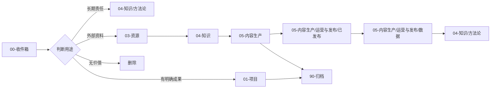

# KnowledgeBase 结构地图

## 设计原则

本库采用“现实主体性 + PARA 行动分流 + 常青知识层 + 内容生产闭环”。最终目标不是增加资料，而是让理解进入行动、作品、关系和纠错。

使命详见 [[99-系统/元数据/planning/KNOWLEDGE_BASE_MISSION_V2_2026-08-08]]。

七层目标为：现实连接、注意力与自我治理、证据与理解、判断与责任、行动与创造、反馈与纠错、关系/组织/公共行动（第二阶段）。

本库采用“PARA 行动分流 + 常青知识层 + 内容生产闭环”：

- 项目承载有结束条件的成果，领域承载长期责任，资源保留外部证据，归档退出活跃视野。
- 知识层只保存可复用且可追溯的结论，内容生产层允许草稿、实验和平台变体。
- 发布稿、运营数据和方法论分层保存，避免把“写完”误当成“验证过”。
- 原始稿件、过程输出和正式内容分开；所有中间产物必须进入所在职责区的 `00-缓冲区/`。
- 根目录只保留权威导航、自动索引和必要配置。

## 目录职责

| 目录 | 唯一职责 | 进入条件 | 退出条件 |
|---|---|---|---|
| `00-收件箱/` | 未分类输入 | 尚未判断用途 | 7 天内分流或删除 |
| `01-项目/` | 有明确成果和结束条件的工作 | 有交付物与下一步 | 完成、取消或转为领域 |
| `04-知识/方法论/` | 长期责任、标准和例行检查 | 需要持续维护 | 不再承担时归档 |
| `03-资源/` | 外部资料、素材和来源台账 | 来源可定位 | 可长期保留原件 |
| `04-知识/` | 方法论、卡片和原子笔记 | 可复用、可追溯、已判断 | 被新证据替代时归档 |
| `05-内容生产/` | 选题、研究、内容系统与草稿 | 准备创作或发布 | 发布、放弃或转项目 |
| `05-内容生产/运营与发布/数据/` | 发布、增长和商业数据 | 可量化记录 | 持续保留 |
| `05-内容生产/运营与发布/已发布/` | 实际公开版本 | 已发布 | 被新版替换时归档旧版 |
| `08-媒体与产品/` | 书稿、图片、视频和媒介成品 | 已形成明确媒介形态 | 旧版归档 |
| `90-归档/` | 历史版本和退出活跃区的内容 | 不再参与当前工作 | 默认不返回主库 |
| `99-系统/` | 脚本、元数据、日志和工具镜像 | 服务于知识库运行 | 随系统生命周期维护 |

任何新增目录必须标明服务的目标层、责任人、退出条件和现实反馈方式；没有明确职责的目录不进入正式结构。

## 信息生命周期



## 内容质量分级

| 等级 | 定义 | 允许位置 |
|---|---|---|
| S 原始证据 | 原文、逐字稿、数据、截图和真实记录 | `03-资源/`、来源台账 |
| A 人工确认 | 有来源，并经过人工判断和改写 | `04-知识/`、项目正文 |
| B AI 派生 | 模型总结、装配稿和候选框架 | 草稿、内容体系、项目中间件 |
| C 低置信度 | 无来源数字、虚构故事、空模板和重复旧版 | `90-归档/` 或删除 |

B 级内容必须补齐来源、适用边界和人工判断，才能升级为 A。

## 内容状态

```text
raw → extracted → interpreted → human-endorsed → reality-tested → canonical
                                                               ↘ superseded / archived
```

AI 派生内容默认从 `extracted` 或 `interpreted` 开始。`canonical` 不得与“待核对”并存；进入成熟知识前必须有来源、个人判断、适用边界和现实使用或反驳审查。

## 防熵规则

1. 一个事实只设一个权威文件，其他位置只链接。
2. 文件名不使用 `final2`、`最终最新版`，使用日期或语义版本。
3. 同一主题超过三个版本时，指定当前版，其余归档。
4. `node_modules/`、`dist/`、缓存和模型权重等可重建产物不入库。
5. 运行日志保留 30 天；审计报告只保留最近一次和重大里程碑。
6. 清理顺序：空文件、临时文件、精确重复、可重建产物、被替代的低质派生物。
7. `00-缓冲区/` 只存过程文件，不进入正式 MOC；超过 30 天未提升或删除的内容进入 `90-归档/`。
8. 重要项目必须保留问题、预测、行动、结果、反例和修订记录；平台指标或 AI 模拟不能单独证明现实价值。

## 权威入口

- 日常导航：[[HOME]]
- 版本事实：[[SOURCE_OF_TRUTH]]
- 卡片索引：[[_MOC_Cards]]
- 内容索引：[[_MOC_Content]]
- 旗舰索引：[[_MOC_Flagship]]
