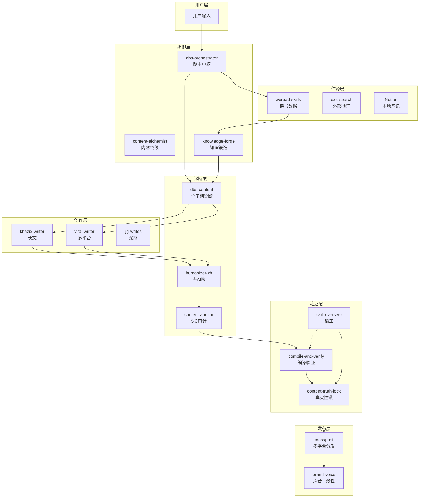
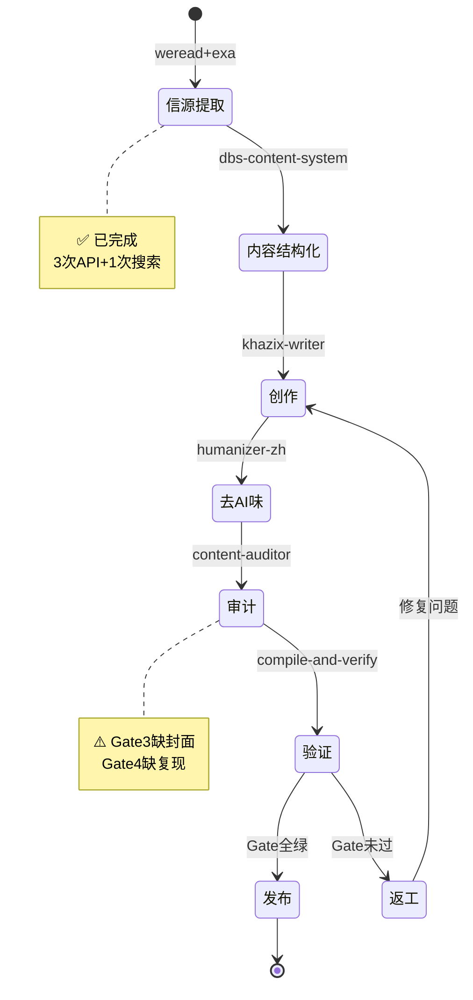
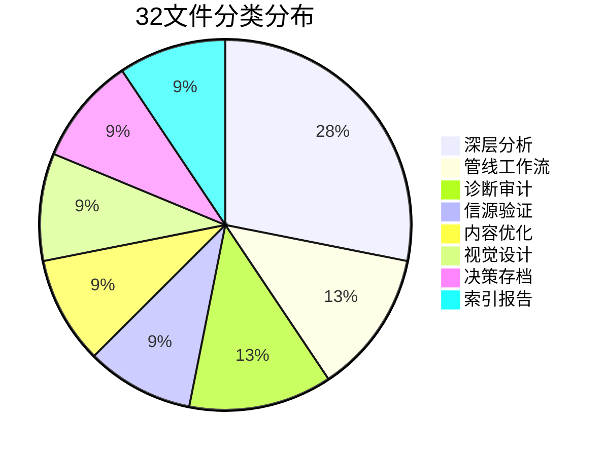

# baoyu-diagram 架构图 | Skill生态 + 内容创作管线

> 使用skill: baoyu-diagram (专业深色SVG图表/Mermaid)
> 时间: 2026-06-08

---

## 图1: Skill生态系统架构图

---

## 图2: 本轮Skill调用流程图

---

## 图3: 内容管线状态图

---

## 图4: 本轮产出文件分类占比

