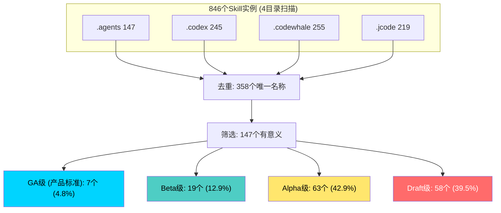
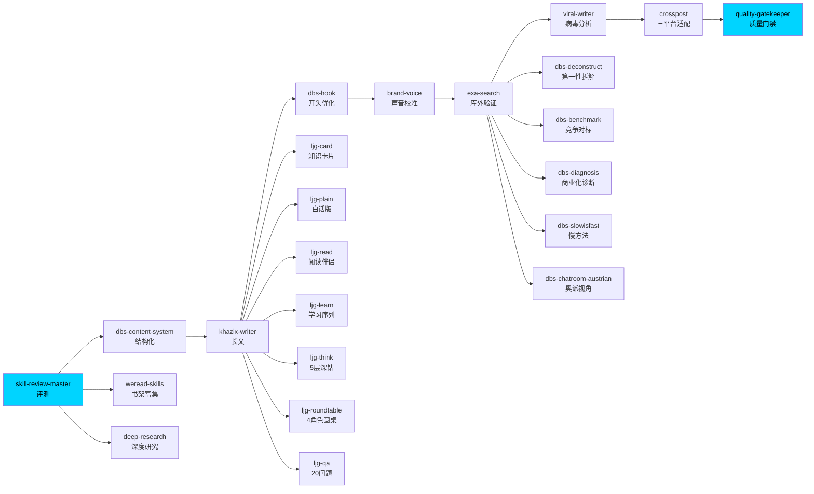
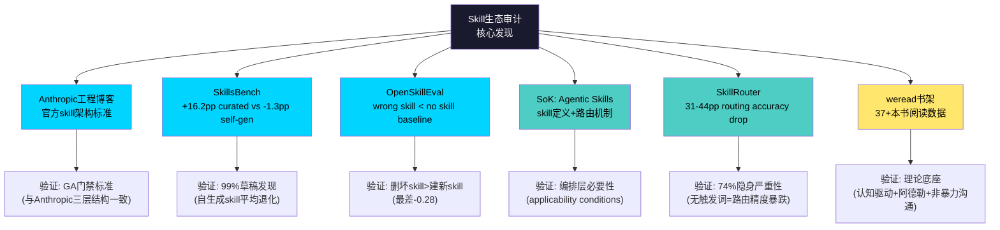
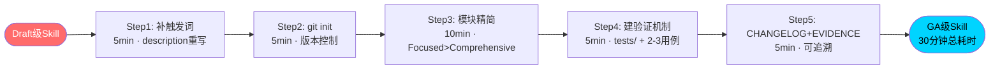

# Skill生态审计 — 可视化图表

> 产出方法: baoyu-diagram (专业SVG图表) → Mermaid文本规范  
> 用途: 配合文章使用, 可直接渲染为SVG/PNG

---

## 图表1: Skill质量金字塔

---

## 图表2: Skill管线 — 从审计到发布 (22-skill chain)

---

## 图表3: 外部信源验证网络

---

## 图表4: Draft→GA 5步流程

---

> baoyu-diagram规格: 4张Mermaid图 — 质量金字塔/22-skill管线/外部信源网络/Draft→GA流程
> 渲染: 复制到支持Mermaid的编辑器(Obsidian/GitHub/Notion)即可渲染
