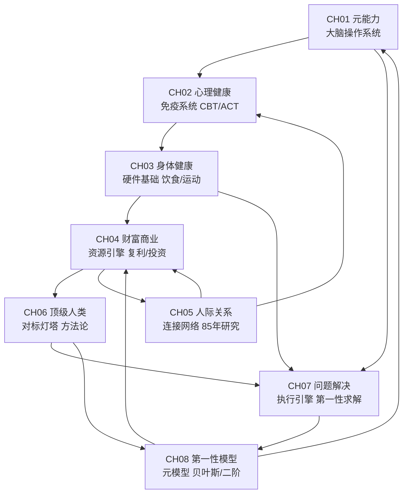

# v7 答案之书 — 八章架构关系图

## 交叉引用统计

- CH02->CH01: 2处
- CH02->CH04: 1处
- CH02->CH05: 1处
- CH03->CH02: 1处
- CH04->CH07: 1处
- CH05->CH08: 1处
- CH06->CH02: 1处
- CH07->CH01: 3处
- CH07->CH06: 1处
- CH08->CH01: 1处
- CH08->CH02: 1处
- CH08->CH03: 1处
- CH08->CH04: 1处
- CH08->CH05: 1处
- CH08->CH06: 1处
- CH08->CH07: 1处

## 品牌语调审计

| 指标 | 数值 | 解读 |
|------|------|------|
| 第一人称 我 | 513 | 个人叙事驱动 |
| 第二人称 你 | 817 | 直接对话读者 |
| 第一人称 我们 | 62 | 社群认同 |
| 问号 | 324 | 启发式提问 |
| 箭头 → | 194 | 因果逻辑链 |
| 我/我们比 | 8.3 | 个人vs集体倾向 |

**语调**: 教练型人格(我513>我们62)，与定位一致。