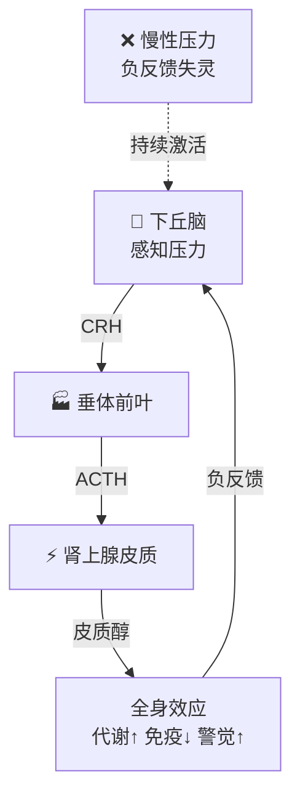

# 人体机制策略

> **你的身体不是黑箱，而是一台可编程的生物机器。** 以下是你能通过行为、环境和营养主动干预的核心生物机制——按「可干预程度」和「回报率」排序。
> 

---

<aside>
↘️

本页已降级为辅助机制参考页。

研究主页统一以 [21岁男性生命养护系统](Experiments%EF%BC%88%E5%AE%9E%E8%B7%B5%20%E5%AE%9E%E9%AA%8C%EF%BC%89/21%E5%B2%81%E7%94%B7%E6%80%A7%E7%94%9F%E5%91%BD%E5%85%BB%E6%8A%A4%E7%B3%BB%E7%BB%9F%20b9f03c54805d83d69943812f1b44b1e5.md) 为主。

</aside>

# 一、昼夜节律系统（Circadian Rhythm）

<aside>
☀️

**可干预指数：★★★★★** · 回报率极高 · 影响范围：睡眠、激素、代谢、情绪、认知、免疫——几乎所有系统

</aside>

## 机制原理

- 下丘脑的 **视交叉上核（SCN）** 是你的主生物钟，通过光信号校准 24 小时节律
- SCN 通过神经和激素信号同步全身器官的「外周时钟」（肝脏、肠道、肌肉等都有独立时钟）
- **核心信号通路**：视网膜特化感光细胞（ipRGC）→ SCN → 松果体（褪黑素）/ 肾上腺（皮质醇）

## 关键节律激素

| **激素** | **自然峰值** | **功能** | **被什么打乱** |
| --- | --- | --- | --- |
| **皮质醇** | 醒后 30-45 min | 唤醒、警觉、免疫调节、代谢启动 | 晚睡、不见晨光、慢性压力 |
| **褪黑素** | 入睡前 2h 开始分泌 | 诱导睡意、抗氧化、免疫调节 | 夜间蓝光、深夜屏幕、不规律作息 |
| **生长激素** | 深睡期（入睡后 1-2h） | 修复组织、燃脂、抗衰老 | 睡眠不足、睡前进食、酒精 |
| **睾酮** | 早晨 6-8 点 | 肌肉合成、精力、动力、认知 | 睡眠不足（-10~15%/晚）、肥胖 |

## 干预策略

### 高杠杆行为

1. **晨光暴露**（醒后 30 min 内接受 10+ min 户外光）→ 校准皮质醇峰值，稳定整个节律
2. **固定起床时间**（误差 ≤30 min）→ 比固定入睡时间更重要
3. **夜间避光**（日落后减少蓝光，屏幕用暖色模式）→ 保护褪黑素分泌窗口
4. **进食窗口对齐节律**（主要进食在白天，晚餐距睡眠 ≥3h）→ 同步外周时钟
5. **定时运动**（上午或下午运动最优，避免深夜高强度运动）→ 强化节律信号

### 效果量级

> 仅靠规律作息 + 晨光暴露，就能改善 **睡眠质量 40-60%**、**白天精力 30-50%**、**情绪稳定性 20-40%**。这是性价比最高的单一干预。
> 

---

# 二、神经递质系统

<aside>
🧠

**可干预指数：★★★★★** · 回报率极高 · 影响范围：动力、快感、情绪、注意力、学习

</aside>

## 四大核心神经递质

| **神经递质** | **功能** | **不足时表现** | **过度刺激后表现** |
| --- | --- | --- | --- |
| **多巴胺** | 动力、奖赏预期、目标追求、学习强化 | 无动力、拖延、对什么都提不起兴趣 | 成瘾、焦躁、基线崩塌后的重度低迷 |
| **血清素** | 情绪稳定、满足感、社会地位感、冲动控制 | 焦虑、抑郁、强迫、易怒 | （少见，药物过量可致血清素综合征） |
| **去甲肾上腺素** | 警觉、注意力、危机应对、专注 | 注意力涣散、嗜睡、动力不足 | 焦虑、心悸、过度警觉 |
| **GABA** | 抑制性递质，镇静、抗焦虑、睡眠 | 焦虑、失眠、过度思虑、肌肉紧张 | 过度镇静、嗜睡 |

## 多巴胺系统深度解析（最可干预的递质）

### 多巴胺的运作规律

- 多巴胺驱动的不是「快感」，而是 **「期待和动力」**——它让你想去做某事
- **基线-峰值模型**：每次高峰之后，基线会暂时下降 → 这就是为什么刷完短视频后你什么都不想做
- **峰值越高、越频繁，基线跌得越深** → 成瘾的本质机制

### 常见活动的多巴胺峰值

| **活动** | **基线提升倍数** | **对基线的后续影响** |
| --- | --- | --- |
| 美食 | 1.5x | 轻微下降，快速恢复 |
| 运动 | 1.5-2x | **提升基线**（少数能提升基线的活动） |
| 音乐 | 1.5-2x | 轻微下降，快速恢复 |
| 社交媒体/短视频 | 2-3x（间歇式高频） | 显著降低基线，恢复慢 |
| 游戏 | 2-3x | 显著降低基线 |
| 尼古丁 | 2.5x | 严重降低基线，形成依赖 |
| 色情内容 | 2-3x | 显著降低基线，脱敏效应 |
| 冷水暴露 | 2.5x | **持续提升基线 2-3h**（极少数） |

### 干预策略

1. **减少高多巴胺活动的频率**（短视频、游戏、色情）→ 让基线自然恢复
2. **增加健康多巴胺活动**（运动、冷水暴露、深度工作、社交）→ 提升基线
3. **间歇性奖赏**：不要每次完成任务都奖励自己 → 间歇性奖赏反而增强动力
4. **前体补充**：富含酪氨酸的食物：蛋鱼豆→ 多巴胺合成原料
5. **多巴胺斋戒**：每月安排 1 天极低刺激日 → 重置基线

## 血清素干预策略

- **阳光暴露**：光线通过视网膜-缝核通路直接促进血清素合成
- **色氨酸**：香蕉、坚果、鸡蛋 → 血清素前体
- **规律运动**：30 min 中等强度有氧运动 → 血清素释放 + 色氨酸转运增加
- **社交连接**：积极社交互动直接激活血清素系统
- **肠道健康**：95% 的血清素在肠道合成 → 肠道菌群直接影响血清素水平

---

# 三、自主神经系统（ANS）：交感 vs 副交感

<aside>
⚡

**可干预指数：★★★★★** · 回报率极高 · 影响范围：压力应对、心率、消化、免疫、恢复

</aside>

## 机制原理

|  | **交感神经（战或逃）** | **副交感神经（休息与消化）** |
| --- | --- | --- |
| **激活场景** | 压力、危险、运动、竞争 | 安全、休息、进食、社交 |
| **核心效应** | 心率↑、血压↑、瞳孔扩大、消化↓、皮质醇↑ | 心率↓、消化↑、修复↑、免疫↑ |
| **主要神经** | 脊髓侧角交感链 | **迷走神经**（第十对脑神经） |
| **现代人常见问题** | **慢性过度激活**（永远在「战斗模式」） | 激活不足 → 恢复不良、消化问题、免疫低下 |

## 迷走神经：你最强的「镇静按钮」

- 迷走神经是最长的脑神经，从脑干一直延伸到腹部，连接心、肺、肠
- **迷走神经张力（Vagal Tone）** = 你从压力中恢复的能力 → 可以通过训练显著提升
- 高迷走神经张力 = 更好的情绪调节 + 更强的免疫 + 更低的炎症 + 更好的消化

## 干预策略

### 即时激活副交感（快速镇静）

1. **生理性叹息（Physiological Sigh）**：双吸一呼（快速吸气两次 + 长呼气一次）→ **最快的即时镇静方法**（1-3 次即可生效）
2. **延长呼气法**：吸气 4 秒 → 呼气 8 秒 → 激活迷走神经
3. **冷水刺激面部**：用冷水泼脸或冷毛巾敷脸 → 触发潜水反射 → 心率立即下降
4. **哼唱/发 "嗡" 声**：声带振动直接刺激迷走神经

### 长期提升迷走神经张力

1. **规律有氧运动**（心肺训练直接增强迷走张力）
2. **冷暴露训练**（冷水淋浴从 30 秒开始，渐进增加）
3. **冥想/正念练习**（8 周规律练习可显著提升迷走张力）
4. **社交连接**（安全的社交互动激活腹侧迷走系统）
5. **充足的深度睡眠**（副交感主导的修复时间）

---

# 四、HPA 轴（下丘脑-垂体-肾上腺轴）

<aside>
🔥

**可干预指数：★★★★☆** · 影响范围：压力应对、免疫、代谢、认知、衰老速度

</aside>

## 机制原理

### 皮质醇的双面性

- **急性皮质醇**（短期）：有益 → 提升警觉、动员能量、增强免疫
- **慢性皮质醇**（长期）：有害 → 免疫抑制、肌肉分解、腹部脂肪堆积、脑萎缩（海马体）、加速衰老

### 关键指标

- **健康模式**：早晨高峰 → 白天缓降 → 夜间最低
- **失调模式**：早晨平坦 + 夜间偏高 = 慢性压力特征

## 干预策略

| **干预** | **机制** | **效果** |
| --- | --- | --- |
| **晨光暴露 10 min** | 校准皮质醇晨峰，重建健康曲线 | ★★★★★ |
| **规律运动（中等强度）** | 短期升高→长期降低基线皮质醇 | ★★★★★ |
| **深度社交** | 催产素释放→直接拮抗皮质醇 | ★★★★☆ |
| **正念冥想** | 降低杏仁核反应性→减少 HPA 激活 | ★★★★☆ |
| **充足睡眠（7-9h）** | 睡眠期间 HPA 轴复位 | ★★★★★ |
| **减少咖啡因（下午后）** | 咖啡因延长皮质醇半衰期 | ★★★☆☆ |
| **Ashwagandha（南非醉茄）** | 适应原，降低皮质醇 20-30% | ★★★☆☆ |

---

# 五、神经可塑性（Neuroplasticity）

<aside>
🔗

**可干预指数：★★★★☆** · 影响范围：学习速度、习惯形成/打破、认知能力、情绪模式

</aside>

## 机制原理

- **赫布法则**："Neurons that fire together, wire together" → 反复激活的神经通路越来越强
- **突触可塑性**：包括长时程增强（LTP，强化连接）和长时程抑制（LTD，弱化连接）
- **关键窗口**：
    - 深度专注（高去甲肾上腺素 + 高乙酰胆碱）→ 标记需要改变的突触
    - **深度睡眠**（NREM）→ 真正完成突触重塑 → **学习实际上在睡眠中完成**

## 增强神经可塑性的三大杠杆

### **① 专注力（标记阶段）**

- **高强度专注 90 min 是一个完整的可塑性周期（ultradian cycle）**
- **专注时的「挣扎感」不是坏事——挣扎 = 可塑性信号，说明大脑正在重组**
- **每天 1-2 个 90 min 深度专注块 = 最大化学习效率**

### ② 睡眠（巩固阶段）

- **NREM 深睡**：重放白天学习的神经模式，完成突触强化
- **REM 快速眼动**：整合情绪记忆、创造性连接
- 学习后一夜好睡 > 学习后通宵复习

### ③ 化学调节

| **因子** | **作用** | **如何提升** |
| --- | --- | --- |
| **BDNF（脑源性神经营养因子）** | 神经生长的"肥料" | 有氧运动（最强效）、间歇性断食、社交 |
| **乙酰胆碱** | 聚焦注意力、标记可塑性位点 | 专注训练、Alpha-GPC、鸡蛋（胆碱） |
| **去甲肾上腺素** | 唤醒、增强信号信噪比 | 冷暴露、新奇环境、适度压力 |

---

# 六、免疫-炎症系统

<aside>
🛡️

**可干预指数：★★★★☆** · 影响范围：抗病能力、衰老速度、慢性疾病风险、认知功能

</aside>

## 核心概念：慢性低度炎症（Inflammaging）

- 急性炎症 = **有益**（感染修复）
- 慢性低度炎症 = **万病之源**（心血管病、糖尿病、抑郁、认知衰退、加速衰老）
- **驱动因素**：久坐、加工食品、睡眠不足、慢性压力、内脏脂肪、肠道通透性增加

## 干预策略

### 抗炎行为

| **干预** | **抗炎机制** | **证据强度** |
| --- | --- | --- |
| **规律运动** | 释放抗炎肌肉因子（myokines），降低 IL-6、CRP | ★★★★★ |
| **充足睡眠** | 睡眠中免疫系统执行"清扫"，控制炎症标志物 | ★★★★★ |
| **Omega-3 脂肪酸** | EPA/DHA 直接合成抗炎介质（resolvins） | ★★★★☆ |
| **减少加工食品** | 减少促炎因子（trans-fat、精制糖、添加剂） | ★★★★☆ |
| **间歇性断食** | 激活自噬，清除受损细胞和促炎物质 | ★★★★☆ |
| **冷暴露** | 训练抗炎反应，降低基线炎症 | ★★★☆☆ |
| **肠道维护** | 维持肠道屏障完整性 → 防止 LPS 入血引发全身炎症 | ★★★★☆ |

---

# 七、肠-脑轴（Gut-Brain Axis）

<aside>
🦠

**可干预指数：★★★★☆** · 影响范围：情绪、认知、免疫、代谢、炎症

</aside>

## 机制原理

- 肠道有 **5 亿+神经元**（"第二大脑"），通过迷走神经与大脑双向通信
- 肠道菌群产生 **95% 的血清素**、50% 的多巴胺前体、GABA 等神经递质
- 肠道屏障（tight junctions）完整性决定全身炎症水平
- **肠漏（Leaky Gut）** → 细菌毒素入血 → 全身慢性炎症 → 影响大脑功能

## 干预策略

1. **多样化膳食纤维**（每天 25-35g）→ 喂养有益菌群
2. **发酵食品**（酸奶、泡菜、味噌）→ 直接补充有益菌
3. **减少抗生素滥用** → 每次抗生素使用后菌群需要数月恢复
4. **减少加工食品和精制糖** → 促进有害菌增殖
5. **管理压力** → 慢性压力直接增加肠道通透性
6. **充足睡眠** → 睡眠不足 2 天即可改变菌群组成

---

# 八、mTOR / AMPK 代谢开关

<aside>
🔄

**可干预指数：★★★★☆** · 影响范围：衰老速度、细胞修复、代谢灵活性、癌症风险

</aside>

## 机制原理

|  | **mTOR（合成通路）** |
| --- | --- |
| **激活条件** | 进食（尤其蛋白质）、胰岛素升高 |
| **核心功能** | 细胞生长、蛋白质合成、肌肉建设 |
| **过度激活后果** | 加速衰老、癌症风险↑、炎症↑ |
| **理想状态** | **在两者之间有节律地切换**（白天建设，夜间/空腹修复） |

## 干预策略

- **时间限制性饮食**（16:8 或 14:10 进食窗口）→ 每天给 AMPK/自噬一个激活窗口
- **训练后 30 min 内摄入蛋白质** → 利用 mTOR 窗口最大化肌肉合成
- **避免持续进食** → 不间断进食让 mTOR 永远在线，自噬无法启动
- **定期 24-48h 断食**（每月 1 次）→ 深度激活自噬和细胞清理

---

# 九、体温调节与冷热暴露

<aside>
🌡️

**可干预指数：★★★★☆** · 影响范围：代谢、多巴胺、免疫、恢复、棕色脂肪激活

</aside>

## 冷暴露（Cold Exposure）

| **效应** | **机制** | **时间窗口** |
| --- | --- | --- |
| 多巴胺持续提升 2.5x | 去甲肾上腺素大量释放→多巴胺基线上移 | 效果持续 2-3h |
| 棕色脂肪激活 | 寒冷激活 UCP1→产热→基础代谢↑ | 长期适应后更显著 |
| 抗炎训练 | 反复冷暴露训练抗炎细胞因子（IL-10↑） | 需要规律暴露 4+ 周 |
| 迷走神经张力↑ | 冷刺激→潜水反射→迷走张力增强 | 即时效应 + 长期适应 |
| 精神韧性 | 自愿承受不适 → 前额叶-杏仁核连接增强 | 心理层面即时起效 |

### 执行方案

- **入门**：每天淋浴最后 30 秒切冷水
- **进阶**：冷水淋浴 1-3 min（水温 ≤15°C）
- **高阶**：冰浴 2-5 min（水温 ≤10°C）
- **关键**：放在运动前可增强后续训练的去甲肾上腺素效应；但运动后立即冷暴露会削弱肌肥大效果

## 热暴露（桑拿/热水浴）

- 桑拿 20 min（80-100°C）→ 生长激素释放↑ 200-300%
- 热休克蛋白（HSP）激活 → 保护蛋白质折叠 → 抗衰老
- 每周 4 次桑拿 → 心血管疾病风险降低 40%（芬兰长期研究）
- 改善血管弹性、促进深度睡眠

---

# 十、激素优化

<aside>
💪

**可干预指数：★★★☆☆** · 影响范围：体能、精力、性功能、骨密度、体脂率、情绪

</aside>

## 睾酮（尤其重要)

### 自然提升策略

| **干预** | **效果** | **证据** |
| --- | --- | --- |
| **充足睡眠 7-9h** | 睡 5h vs 8h → 睾酮差 10-15% | ★★★★★ |
| **力量训练（大肌群复合动作）** | 深蹲/硬拉/卧推 → 急性睾酮↑ + 长期基线↑ | ★★★★★ |
| **维持低体脂（12-18%）** | 脂肪组织含芳香化酶 → 把睾酮转化为雌激素 | ★★★★☆ |
| **锌 + 维生素 D + 镁** | 睾酮合成的关键辅因子 | ★★★★☆ |
| **减少酒精** | 酒精直接抑制睾酮合成 | ★★★★☆ |
| **管理压力** | 皮质醇与睾酮是跷跷板关系 | ★★★★☆ |
| **竞争/胜利体验** | 赢的感觉直接提升睾酮 | ★★★☆☆ |

---

# 干预优先级

<aside>
🎯

如果你只能做 5 件事，做这 5 件。它们覆盖了上述所有系统的 80% 收益。

</aside>

| **优先级** | **行为** | **覆盖的系统** | **每天耗时** |
| --- | --- | --- | --- |
| **#1** | **睡眠 7-9h + 固定起床时间** | 节律、激素、神经可塑性、免疫、HPA、代谢 | 0 min（改变时间分配） |
| **#2** | **晨光暴露 10 min** | 节律、皮质醇、血清素、多巴胺基线 | 10 min |
| **#3** | **运动 30-60 min** | 多巴胺、BDNF、炎症、激素、迷走神经、代谢 | 30-60 min |
| **#4** | **时间限制性饮食 + 减少加工食品** | mTOR/AMPK、炎症、肠脑轴、代谢 | 0 min（改变习惯） |
| **#5** | **面对面社交 + 压力管理** | 催产素、血清素、迷走神经、HPA、免疫 | 因人而异 |

> **底层逻辑**：这 5 件事几乎不需要花钱，但能撬动你身体 80% 的生物系统。剩下的 20%（补剂、冷暴露、桑拿等）是锦上添花。**先把地基打好，再装修。**
> 

---

*基于 Huberman Lab 神经科学框架 + 进化生物学 + 分子代谢研究构建 · 最后更新：2026-03-14*