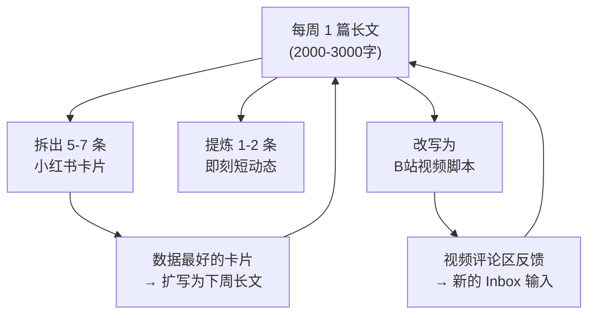
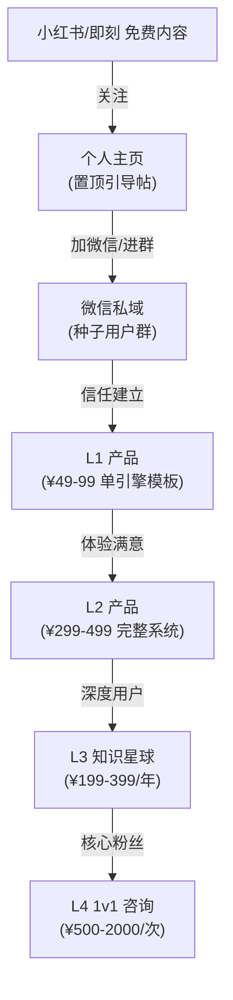

# 地球 Online｜商业执行手册 v1.0

**Status**：Draft v1.0 ｜ **Last Updated**：2026-03-14 ｜ **Owner**：再创世

> "不要选择一个利基市场（Niche），你要让自己成为那个利基市场。" — Dan Koe
> 

<aside>
⚠️

**当前执行约束**：这份手册继续保留，但在本阶段只承担“最小商业脉冲”角色。

默认动作只有 1 个：内容草稿、认知卡片、或 1 条选题。

禁止借“打磨产品”之名无限扩张任务；总入口回到 [P0](%E4%BA%BA%E7%94%9FOS%20v2%200/P0%20de703c54805d8304a6c481702d40ff68.md)。

</aside>

---

## 📌 一句话定位

**帮助 18-25 岁的中国年轻人，用系统化思维重新设计自己的人生，而不是被考研/考公/内卷推着走。**

产品本质：把 Naval × Dan Koe × 芒格 × 塔勒布的认知系统，用中国语境重写，用 AI 引擎驱动，变成一套可执行的「人生操作系统」。

---

# SECTION 1｜产品抽象：什么能卖，什么必须留

### 核心原则

**结构（Structure）是资产，数据（Data）是隐私。**

把你的系统想象成一个游戏引擎：

- **卖的是引擎（Engine）**：系统架构 + 决策框架 + SOP 模板 + AI Prompt
- **不卖的是存档（Save File）**：你的个人数据、日记、具体数字

### ✅ 可商业化的公共部分

| **模块** | **具体内容** | **商业化形式** |
| --- | --- | --- |
| Cognitive OS v2.0 架构 | 四库闭环（Inbox → Questions → Models → Experiments → Output）、五阶段信息流、决策分层协议（L0-L3）、抗退化机制、健康指标看板 | Notion 模板 + 架构说明文档 |
| 四大总纲引擎框架 | Capital OS / Decision OS / Knowledge-to-Cash OS / Machine OS 的决策树、公式、SOP | 引擎模板 + 视频教程 |
| 模型库（去个人化版） | Dan Koe 四支柱、芒格格栅、Naval 杠杆分类、塔勒布杠铃策略等的结构化整合 | 费曼笔记模板 + 中国化解读文集 |
| 各子系统框架层 | 饮食决策 OS、生命养护系统、亲密关系认知系统、交易系统框架的方法论骨架 | 子系统模板（可单独售卖） |
| MCS Synthesizer Prompt | 信息提纯 SOP + AI 协作框架 + 各类专用 Prompt | AI Prompt 工具包 |
| 插件目录索引结构 | 按场景插拔的模块化索引 | 系统扩展指南 |

### 🚫 必须剥离的隐私部分

- 用户画像背景中的所有个人信息（存款数、家庭背景、情感经历）
- 日记/反思内容（如 3.13 等）
- 具体交易记录、持仓数据、账户截图
- 所有 Inbox 中的碎片输入原始内容
- 具体的实验数据和个人健康指标数值

### 去隐私化执行清单

- [ ]  复制 Cognitive OS v2.0 为「商业版」副本
- [ ]  删除所有 Inbox 中的个人碎片输入，替换为示例数据
- [ ]  删除用户画像背景页面，替换为「用户画像模板」
- [ ]  删除所有日记内容，保留日记模板结构
- [ ]  交易系统保留框架，删除所有具体交易记录和复盘数据
- [ ]  健康系统保留 SOP 框架，删除个人体检数据和指标
- [ ]  Models 库：保留所有「巨头宝典」系列，删除带个人注释的部分
- [ ]  为每个模块写一份「使用说明」（文字 + 视频脚本）
- [ ]  全系统检查：搜索所有包含真实姓名/数字/地点的内容并替换

---

# SECTION 2｜目标用户画像

### 核心用户：「觉醒期」中国年轻人

<aside>
🎯

**一句话画像**：已经意识到传统路径（考研/考公/大厂螺丝钉）不是唯一选择，但还没有找到替代方案的 18-25 岁中国年轻人。

</aside>

| **维度** | **描述** |
| --- | --- |
| 年龄 | 18-25 岁（大学生 + 职场 0-3 年） |
| 性别 | 男性为主（70%+），叙事和内容调性天然吸引男性 |
| 教育 | 本科及以上，有一定信息素养（能用 Notion、接触过英文内容） |
| 心理状态 | 「觉醒期」— 知道要独立思考但不知道怎么做 |
| 付费能力 | ¥50-500 舒适区（一顿火锅到一双球鞋） |
| 出没平台 | 小红书、即刻、B站、知乎、Twitter |

### 用户的四大核心痛点

1. **认知混沌**：信息过载，看了很多 Naval/芒格/Dan Koe 但无法系统化，也无法对应到中国现实
2. **路径迷茫**：考研/考公/就业/自媒体，不知道选哪条路，也不知道怎么做决策
3. **执行瘫痪**：知道很多道理但做不到，缺乏可执行的系统和 SOP
4. **身体退化**：久坐/外卖/熬夜，知道不健康但没有低摩擦的执行方案

### 排除人群

- **30+ 职场人**：问题更具体（管理、家庭、房贷），缺乏经验共情
- **纯小白**：不知道 Naval 是谁的人，教育成本太高
- **纯技术人群**：产品是认知产品，不是技术产品

---

# SECTION 3｜产品构建：五大引擎 × 中国语境

### 为什么必须「中国化」而不是翻译 Dan Koe

Dan Koe / Naval 的底层逻辑是普世的（第一性原理、复利、杠杆），但执行层假设完全基于美国环境：

| **维度** | **美国假设** | **中国现实** |
| --- | --- | --- |
| 财富路径 | 一人企业 + Substack + 数字产品 | 小红书/即刻/知识星球 + 私域 + 微信生态 |
| 社会结构 | 个人主义，"做自己就是利基" | 集体主义底色，家庭期望是真实约束 |
| 信息环境 | Twitter/YouTube 长内容生态 | 短视频为王，注意力更碎片，平台规则更不稳定 |
| 健康文化 | 生物黑客 + 补剂文化 | 中医养生传统 + 食疗 + 体检驱动 |
| 关系模式 | 约会市场化 / AA制 | 彩礼、房车压力、原生家庭纠缠是真实变量 |
| 财务起点 | 信用卡杠杆 + 创业文化 | 考公/考编安全导向，存款少是常态 |
| 精神资源 | 冥想/斯多葛主义 | 佛学/道家/儒家有天然土壤，需"去玄学化" |

### 五大引擎详细设计

### 引擎 1：🧠 认知引擎（Cognitive Engine）

**核心交付**：四库闭环 + 信息提纯 SOP + AI 协作 Prompt

**中国化要点**：

- 处理「内卷 vs 躺平」的二元陷阱 — 提供第三条路：系统化地构建个人杠杆
- 把 "Think for yourself" 翻译成："独立思考 ≠ 不听劝，而是有自己的决策协议"
- 整合中国思想家的模型：王阳明「知行合一」、曾国藩「日课十二条」、段永平「本分」

**AI 输出任务**：

- [ ]  批量生成中国思想家费曼笔记（王阳明、曾国藩、段永平、李录等）
- [ ]  为每个核心模型写「中国场景案例」
- [ ]  生成「信息提纯 Prompt 工具包」使用说明

### 引擎 2：💰 财富引擎（Wealth Engine）

**核心交付**：Capital OS 框架 + 杠铃策略 + 杠杆分类 + 一人企业路线图

**中国化要点**：

- A 股 vs 美股差异化框架（A 股政策市特征、打板/龙头模式）
- 体制内外的双轨决策树（考公 vs 创业 vs 混合模式的 EV 计算）
- 中国年轻人的「第一桶金」路径：小红书/视频号/知识星球 + 私域
- 房产在中国资产配置中的特殊地位分析
- Naval 杠杆理论中国落地：Labor → Capital → Code → Media 的中国版路径

**AI 输出任务**：

- [ ]  生成不同资产阶段的资产配置 SOP（0-10w / 10-100w / 100w+）
- [ ]  生成「中国一人企业」启动清单
- [ ]  生成体制内外决策矩阵模板

**⚠️ 法律红线**：所有交易/投资内容必须标注"决策框架教育，非投资建议"，避免无证荐股风险

### 引擎 3：🏃 机体引擎（Body Engine）

**核心交付**：生命养护系统 + 饮食 OS + 机体 SOP + 运动框架

**中国化要点**：

- 基于中国食材体系重写饮食执行层（不是牛油果和藜麦，是糙米、红薯、豆制品、鸡蛋）
- 整合中国体检指标体系和三甲医院检查项目
- 处理「久坐加班 + 外卖文化 + 996」的真实场景
- 中医养生概念的循证医学翻译（哪些有证据支持，哪些是安慰剂）
- 低成本方案：大学食堂/外卖怎么选，不需要买补剂

**AI 输出任务**：

- [ ]  按预算生成中国食材版饮食方案（日均 20/30/50 元三档）
- [ ]  生成「宿舍/出租屋极简训练方案」（无器械版）
- [ ]  生成「体检报告解读 SOP」

**⚠️ 法律红线**：不能宣称治疗效果，必须加健康免责声明

### 引擎 4：❤️ 关系引擎（Relationship Engine）

**核心交付**：亲密关系认知系统 + 人性认知系统 + 社交策略

**中国化要点**：

- 原生家庭边界问题（美国几乎不是话题，中国是核心变量）
- 彩礼/房车的博弈论分析
- 中国婚恋市场的真实激励结构
- 在「孝道文化」和「个人边界」之间的纳什均衡
- 大学 → 职场社交圈重建的实操 SOP
- 向上社交的中国版策略（即刻/线下活动/行业社群）

**AI 输出任务**：

- [ ]  生成「原生家庭边界设定 SOP」
- [ ]  生成「社交圈质量审计模板」
- [ ]  生成「关系决策树」模板

### 引擎 5：🧘 精神引擎（Spirit Engine）

**核心交付**：注意力管理 + 欲望管理 + 冥想/内观 + 人生哲学框架

**中国化要点**：

- 王阳明「知行合一」× Naval「幸福是一种技能」的融合
- 道家「无为」和斯多葛主义的同构性
- 佛学「无常」和塔勒布「反脆弱」的同构性
- 把「活在当下」从鸡汤变成可执行的注意力管理协议
- 处理中国年轻人特有的精神困境：「意义感缺失」×「社会比较焦虑」×「信息茧房」

**AI 输出任务**：

- [ ]  生成中西哲学融合版「每日精神运行 SOP」
- [ ]  生成「认知偏差自检清单」（带中国场景案例）
- [ ]  生成「多巴胺排毒 7 天协议」

---

# SECTION 4｜商业策略

### 4.1 产品阶梯（Product Ladder）

| **层级** | **产品** | **定价** | **边际成本** | **目的** |
| --- | --- | --- | --- | --- |
| L0 免费 | 小红书/即刻认知卡片 + 公开内容 | ¥0 | ≈0 | 获客漏斗顶部，建立信任 |
| L1 低价入门 | 单引擎 Notion 模板（如纯认知引擎 or 纯健康引擎） | ¥49-99 | ≈0 | 让用户"尝一口"，验证付费意愿 |
| L2 核心产品 | 完整「地球 Online」系统 + AI Prompt 包 + 视频教程 | ¥299-499 | ≈0 | 主要收入来源 |
| L3 订阅层 | 知识星球年费：持续更新 + 问答 + 社群 + 月度 AMA | ¥199-399/年 | 时间成本 | 复购 + 社区效应 + 持续收入 |
| L4 高价层 | 1v1 咨询/教练（限量） | ¥500-2000/次 | 高（时间） | 品牌溢价 + 案例积累（Phase 4+） |

**定价逻辑**：

- ¥299-499 是中国 18-25 岁用户「咬咬牙能买」的心理阈值
- 高于 ¥99 的「冲动消费区」，筛选出真正有行动力的用户
- 低于 ¥500 的「需要反复考虑」区，降低决策摩擦

### 4.2 渠道策略

| **渠道** | **内容形式** | **目的** | **优先级** |
| --- | --- | --- | --- |
| 小红书 | 图文认知卡片（Hook 式标题 + 模型图解） | 获客主渠道 | P0（必须做） |
| 即刻 | 短思考 + 系统进展真实记录 | 建立真实感，吸引同频人 | P0（必须做） |
| B站 / 视频号 | 深度讲解视频（10-20 min） | 建立专业信任 + 长尾流量 | P1（Phase 2 开始） |
| 知识星球 | 付费内容 + 问答 + 社群 | 变现 + 社群 | P1（Phase 2 开始） |
| 微信公众号 | 长文（周更） | SEO + 内容沉淀 | P2（有余力时） |
| Twitter/X | 英文内容（可选） | 海外华人市场 + 国际视野背书 | P2（有余力时） |

### 4.3 内容杠杆策略（2-Hour Content Ecosystem 中国版）

核心思路：**一次深度思考 → 多平台多形式分发**



**每日 3 小时分配方案**：

- **1.5h**：写 1 条小红书图文（认知卡片）
- **1h**：打磨 Notion 产品系统（去隐私化 + 内容填充 + 使用说明）
- **0.5h**：社区互动（回复评论、刷同领域内容、学习爆款结构）

### 4.4 转化漏斗



**关键转化节点**：

- 免费 → 关注：**Hook 质量**（标题 + 首图决定 80% 的点击率）
- 关注 → 私域：**置顶帖引导** + 个人简介里的微信/群入口
- 私域 → L1：**社群内的价值输出** + 限时优惠 + 用户见证
- L1 → L2：**L1 产品内的升级引导** + 完整系统的预览展示

### 4.5 价格带上移策略：不卷知识库，改卖高密度判断系统

**核心判断**：如果把自己定义成“卖知识库的人”，就会自动进入比拼“更全、更便宜、更新更快”的低价战场。

更优解：把产品从“资料仓库”升级为**决策系统 / 人生操作系统 / 高密度研究服务**。

#### 高价用户真正购买的，不是信息，而是：

- **筛选**：替用户过滤低质量输入和信息垃圾
- **压缩**：把原本需要数月试错的路径压缩成一套可执行结构
- **判断**：告诉用户哪些变量最重要，哪些问题根本不值得纠结
- **标准**：用更高的审美、方法论洁癖和边界感服务少数人
- **身份认同**：让用户感觉自己买的不是模板，而是一种更高质量的生活方式与判断框架

#### 价格升级原则

- 不打“全网最全”“性价比最高”“小白也适合”的标签
- 不和成熟知识库卷价格、卷主题数、卷更新频率
- 把主要收入重心放在 **L2-L4**，而不是低价冲动消费产品
- L1 只是“尝一口”的入口，不是主战场
- 高价的前提不是“同样的东西卖更贵”，而是**让用户觉得这根本不是同一种产品**

#### 产品语言升级

- 少说：知识库、资料库、合集、大全
- 多说：判断系统、决策协议、人生架构、私人研究室、去噪后的高密度输入

### 4.6 目标客群升级：赚高支付人群的零花钱，不赚低预算人群的生存钱

#### 理想客群

- 一二线城市、家境尚可或收入不错的年轻人
- 高潜力、高执行力，但信息过载、路径混乱的人
- 愿意为**节省时间、降低误判、提高生活质量**付费的人
- 对审美、结构、长期主义有感知，不想买廉价鸡汤的人

#### 不主动服务的人群

- 极度价格敏感、持续比价的人
- 期待“买完就翻身”的人
- 购买后需要大量情绪安抚和额外陪聊的人
- 只想索取、几乎不执行的人

#### 筛选机制

- 文案上明确“这不是给所有人的”
- 不承诺万能结果，只承诺提升判断质量和减少试错
- 通过定价、申请制、资格问卷、小范围社群，把不对的人自然挡在门外

---

# SECTION 5｜品牌叙事

### 你的英雄之旅

> "品牌不是一个 Logo，而是你从'过去的自己'走到'现在的自己'的英雄之旅。" — Dan Koe
> 

**你的叙事主线**：

一个 21 岁的信息与计算科学本科生，在大四时放弃了滴滴的 Java Offer，因为他意识到传统路径无法通向他想要的人生。他没有选择考研、考公或继续内卷，而是开始用第一性原理——融合 Naval 的财富哲学、芒格的多元思维模型、Dan Koe 的一人企业理念——从零构建一套属于中国年轻人的人生操作系统。

这不是一个「已经成功」的人来教你。这是一个和你一样的人，正在实时地、透明地重建自己的人生，并把整个过程系统化、产品化，让你可以直接复用。

### 叙事的三个层次

1. **表层（Hook）**："21 岁放弃大厂 Offer，用第一性原理重建人生"
2. **中层（共鸣）**："我也曾在考研/考公/就业之间迷茫，直到我找到了第三条路"
3. **深层（哲学）**："人生是一场有限游戏，但你可以选择用无限游戏的方式来玩"

### 你的「思想签名」（Intellectual Signature）

你的独特交集：

- **计算机/数学背景** × **跨学科认知系统** × **中国青年视角** × **AI 原生工作流** × **极简主义实践**

这个组合在中文互联网上几乎没有竞争者。

### 品牌升级原则：灵感可以来自 Dan Koe，但外部呈现不能像“仿号”

**内部参考系**可以是 Dan Koe / Naval / 芒格，但**外部身份不能写成“中国版 Dan Koe”**。

原因：

- 会削弱个人品牌的独立性
- 会降低高支付用户的信任感
- 会让账号看起来像模仿者，而不是新的价值源头

#### 正确做法

- 学习其结构、密度、长期主义和品牌克制感
- 放大你自己的独特交叉：**中国青年现实 + AI 原生工作流 + 计算机理性 + 跨学科整合**
- 把“像谁”留在内部，把“我是谁”留给用户

### 账号身份与主页策略

#### 名字原则

- 用**像真人笔名**的中文名，而不是“认知实验室 / 第一性成长 / 人生架构师”这类概念号
- 名字要短、冷静、可记忆、可长期承载内容与产品
- 可采用：**{笔名}｜人生OS**（小红书） / **{笔名}｜重建人生**（抖音） 的结构

#### 头像原则

- 不使用 Dan Koe 同款头像或高仿视觉
- 用你自己的极简个人照：黑白或低饱和、深色背景、留白感、克制表情
- 目标不是“像 Dan Koe”，而是“像一个认真思考且有审美标准的人”

#### 简介原则

- 不写泛泛的“终身学习 / 持续成长 / AI + 商业 + 认知”
- 直接写清：**给谁、解决什么、用什么方式**

#### 主页一句话定位（候选）

- 给中国年轻人的人生系统
- 写认知、成长、AI 与长期主义
- 帮你从默认人生脚本里拿回判断权

### 品牌气质关键词

- 克制
- 清醒
- 有结构
- 不讨好
- 有审美门槛
- 不做廉价成功学

---

# SECTION 6｜内容选题矩阵

### 三大内容赛道（Phase 0 测试用）

### 赛道 A：认知觉醒类（Cognitive Awakening）

目标：引发共鸣 + 吸引关注

1. "为什么大学 4 年没教你最重要的事"
2. "我放弃滴滴 Offer 后的 30 天"
3. "21 岁，我开始用第一性原理重建人生"
4. "内卷 vs 躺平？你漏掉了第三个选项"
5. "Naval 说的'专属知识'，翻译给中国大学生"
6. "芒格的多元思维模型，为什么你的专业课不教"
7. "信息过载的解药：我的四库信息管理系统"
8. "别人在刷短视频时，我在做什么"
9. "如何用 AI 做高质量学习笔记（附 Prompt）"
10. "为什么'努力'是最大的认知陷阱"

### 赛道 B：实用系统类（Practical Systems）

目标：展示专业度 + 引导到产品

1. "我用 Notion 管理人生的完整系统（全展示）"
2. "一套让你不再信息过载的方法"
3. "如何做一个'被实验验证过'的决策"
4. "大学生的极简饮食系统（日均 20 元版）"
5. "零成本训练方案：宿舍/出租屋也能练"
6. "用 AI 做读书笔记的正确方式（不是让它帮你总结）"
7. "我的每日 30 分钟系统运行流程"
8. "如何从零搭建你的个人知识库"
9. "注意力管理 SOP：每天多出 2 小时"
10. "体检报告看不懂？这份 SOP 给你"

### 赛道 C：顶级人类解读类（Top Human Decoded）

目标：建立思想深度 + 差异化

1. "Naval 的财富公式，翻译给中国 25 岁以下的人"
2. "Dan Koe 的一人企业，中国版怎么玩"
3. "芒格说的'普世智慧'，其实王阳明 500 年前就说了"
4. "塔勒布的杠铃策略：如何在不确定中生存"
5. "马斯克的第一性原理 vs 中国人的'差不多就行'"
6. "段永平的'本分'，和 Naval 的'长期主义'是同一件事"
7. "Ray Dalio 的原则，为什么在中国职场水土不服"
8. "李录的价值投资哲学，给中国年轻人的启示"
9. "曾国藩的日课十二条 vs Dan Koe 的每日系统"
10. "所有顶级人类的共同模式：我读了 10 个人的书后发现的"

### 内容卡片模板

每条小红书内容遵循以下结构：

```
[Hook]  大多数人以为 [旧认知]…
[Break] 但 [你验证过的/发现的新认知]
[Model] 核心模型：[Model Name]
[Evidence] 支撑证据 / 我的观察 / 实验结果
[Action] 你可以这样用：[1-3 步行动]
[CTA]   关注我，我正在用这套系统重建自己的人生
```

### 长文主线升级：从“认知卡片”走向“两篇一组的深度长文”

未来内容不只做短卡片，而是建立**每周长文主线**，再把长文拆成小红书和抖音图文。

#### 长文主线 A：三大主义与传统路径批判

关键词：优绩主义、功利主义、经验主义、教育、工作、婚恋、主体性

目标：打中“活得很对却越来越空”的年轻人，让用户先产生深层共鸣

典型题目：

- 我们为什么活得越来越不像自己
- 优绩主义、功利主义和经验主义，怎样一点点拿走一个人的灵魂
- 传统路径真正可怕的地方，不是累，而是它让你不再思考

#### 长文主线 B：认知分层与人格重建

关键词：着相者、破相者、创造者、觉醒、虚无、重建

目标：提供一套更具个人叙事和阶段感的成长框架，让用户把自己代入进去

典型题目：

- 一个人是怎么慢慢醒过来的
- 从着相者到破相者，再到创造者
- 看穿幻觉之后，人如何重新建立自己

### 长文写作风格准则

#### 要保留的部分

- 反常识视角
- 高信息密度
- 长期主义与系统感
- 个人故事与真实困境

#### 要减少的部分

- 过多“不是……而是……”这类模板句
- 过度工整、过度像 AI 的排比句
- 纯概念堆叠，不落到生活和经验

#### 更有人味的写法

- 多写“我是怎么卡住的”“我为什么那时会信这个”
- 多写生活里真实的疲惫、羞耻、幻灭、迟疑
- 不急着喊结论，先把一个人如何被环境塑形写出来
- 让读者感觉是在读一个人慢慢想明白，而不是在听一个博主下判决

### 分发策略升级

- **一篇长文** → 3-5 条小红书图文卡片
- **同一篇长文** → 1 篇抖音图文文章版
- **评论区高频问题** → 下一篇长文的开头
- 让长文成为“母内容”，短内容成为“分发器”

---

# SECTION 7｜执行路线图

### Phase 0：内容基建期（第 1-4 周）

**目标**：发出 30 条内容，找到数据最好的赛道

- [ ]  注册/优化小红书账号（头像、简介、置顶帖）
- [ ]  注册/优化即刻账号
- [ ]  从三个赛道各选 3-4 个选题，开始每天发 1 条
- [ ]  每周复盘：哪条数据最好？为什么？
- [ ]  同步推进 Notion 系统去隐私化

**硬性指标**：

- 发布内容数 ≥ 28 条
- 找到 1 个数据明显优于其他的赛道

**不做的事**：不做产品、不做视频、不纠结完美

### Phase 1：流量积累期（第 2-4 个月）

**目标**：聚焦最优赛道，积累种子用户

- [ ]  聚焦数据最好的赛道，每天 1 条更新
- [ ]  建立微信种子用户群（从评论区引流）
- [ ]  把最受欢迎的 10 条内容扩写为长文（公众号/B站脚本）
- [ ]  用 AI 批量生成系统内容填充
- [ ]  开始在即刻记录「系统建设日志」

**里程碑**：

- 小红书粉丝 ≥ 1000
- 微信种子群 ≥ 50 人
- 即刻同频用户 ≥ 30 个

### Phase 2：MVP 产品期（第 4-6 个月）

**目标**：发布第一个付费产品，验证付费意愿

- [ ]  打包数据最好的 1-2 个引擎为 L1 产品（¥49-99）
- [ ]  制作使用说明视频（10-15 min）
- [ ]  在小报童/Notion 模板市场上线
- [ ]  发布「我用这套系统 XX 天后的变化」系列内容
- [ ]  收集前 50 个用户的反馈，迭代产品

**里程碑**：

- L1 产品售出 ≥ 50 份
- 收到 ≥ 10 条真实用户反馈
- 小红书粉丝 ≥ 3000

### Phase 3：完整产品期（第 6-12 个月）

**目标**：发布完整系统，建立稳定收入

- [ ]  发布完整「地球 Online」系统（L2 产品，¥299-499）
- [ ]  配套 10+ 视频教程
- [ ]  开通知识星球（L3，¥199-399/年）
- [ ]  每月 1 次直播/AMA
- [ ]  开始 B站/视频号深度内容

**里程碑**：

- L2 产品售出 ≥ 200 份
- 知识星球成员 ≥ 100 人
- 月收入 ≥ ¥5000（稳定）

### Phase 4：规模化（12 个月+）

**目标**：从「一个人的产品」到「一个人的品牌」

- [ ]  推出 1v1 咨询/教练（L4，限量）
- [ ]  探索「收徒」模式（教别人做中国版 Dan Koe）
- [ ]  考虑自建官网/支付系统
- [ ]  扩展到播客/线下活动
- [ ]  考虑英文版面向海外华人市场

---

# SECTION 8｜财务模型

### 保守估算（12 个月）

| **时间段** | **收入来源** | **月收入估算** | **累计收入** |
| --- | --- | --- | --- |
| Month 1-3 | 无（纯内容期） | ¥0 | ¥0 |
| Month 4-6 | L1 产品 × 15-20份/月 | ¥750 - ¥2,000 | ¥2,250 - ¥6,000 |
| Month 7-9 | L1 + L2 产品 + 星球早鸟 | ¥3,000 - ¥8,000 | ¥11,250 - ¥30,000 |
| Month 10-12 | L1 + L2 + L3 星球续费 | ¥5,000 - ¥15,000 | ¥26,250 - ¥75,000 |

**假设**：小红书月均涨粉 500-1000，付费转化率 1-3%

**盈亏平衡点**：月收入 ≥ ¥2000（覆盖基本生活开销），预计 Month 5-6 达到

### 成本结构

| **项目** | **月成本** | **说明** |
| --- | --- | --- |
| Notion 订阅 | ¥0-96 | 免费版够用 / Plus ¥96/月 |
| AI 工具（ChatGPT/Claude） | ¥140-280 | $20-40/月 |
| 知识星球 | ¥0 | 平台抽成（约 5%） |
| 设计工具（Canva等） | ¥0 | 免费版够用 |
| **总月成本** | **¥140 - ¥376** | 极低，符合零边际成本模型 |

---

# SECTION 9｜风险管理

### 法律合规风险

| **风险** | **等级** | **应对** |
| --- | --- | --- |
| 金融内容（无证荐股） | 🔴 高 | 所有投资内容包装为"决策框架教育"；加免责声明；不推荐具体标的 |
| 健康内容（医疗建议） | 🟡 中 | 加健康免责声明；标注"非医疗建议"；引用循证来源 |
| 知识产权（整合他人内容） | 🟡 中 | 标注所有来源；明确是"解读与整合"而非"原创"；避免直接搬运原文 |
| 平台封号/限流 | 🟡 中 | 多平台分发，不把鸡蛋放在一个篮子里；建立私域（微信群）作为备份 |

### 商业风险

| **风险** | **等级** | **应对** |
| --- | --- | --- |
| 模板被抄袭 | 🔴 高（必然发生） | 护城河不在模板本身，在于持续更新 + 个人品牌 + 社群。把抄袭当免费宣传 |
| 流量起不来 | 🟡 中 | Phase 0 测试 3 个赛道；如果 30 条内容后数据仍为零，调整选题方向而非放弃 |
| 付费转化低 | 🟡 中 | 先用 ¥49 低价验证；如果 1000 粉丝卖不出 10 份，说明产品或定位有问题 |
| 现金流断裂 | 🟢 低 | 家庭有数十万储备；月开销极低；12 个月跑道充足 |

### 护城河构建策略

短期护城河（0-6 月）= **你的真实故事 + 持续输出的一致性**

中期护城河（6-18 月）= **社群关系 + 用户见证 + 内容资产积累**

长期护城河（18 月+）= **品牌不可替代性 + 教练网络 + 系统持续迭代**

---

# SECTION 10｜KPI 看板

### 月度核心指标

| **指标** | **🟢 健康** | **🟡 黄灯** | **🔴 红灯** |
| --- | --- | --- | --- |
| 月发布内容数 | ≥ 25 条 | 15-24 条 | < 15 条 |
| 小红书月涨粉 | ≥ 500 | 200-499 | < 200 |
| 私域新增人数 | ≥ 30 | 10-29 | < 10 |
| 产品月销量（Phase 2+） | ≥ 20 份 | 5-19 份 | < 5 份 |
| 月收入（Phase 2+） | 月环比增长 | 持平 | 连续 2 月下降 |

### 关键决策节点

- **Week 4**：30 条内容后，如果所有赛道数据都极差 → 调整内容形式（图文 → 视频？）而非放弃
- **Month 3**：如果粉丝 < 300 → 研究爆款同类账号，模仿其结构
- **Month 6**：如果 L1 产品售出 < 20 份 → 做用户访谈，找出产品-市场不匹配的原因
- **Month 9**：如果月收入仍 < ¥1000 → 评估是否需要调整整个商业模型

---

# SECTION 11｜竞品分析清单

需要研究的竞品/参照系：

- [ ]  **生财有术**：亦仁的社群模式和定价策略
- [ ]  **flomo**：知识管理工具的产品化路径
- [ ]  **小红书 Notion 模板卖家**：前 10 名的定价、内容风格、转化路径
- [ ]  **即刻上的「系统化生活」类博主**：谁在做类似的事？
- [ ]  **B站知识区 UP 主**：谁在讲 Naval/Dan Koe/芒格？
- [ ]  **知识星球 TOP 圈子**：定价、活跃度、内容形式

---

# SECTION 12｜立即行动清单

### 本周必须完成（P0）

- [ ]  发出第 1 条小红书内容
- [ ]  优化小红书/即刻个人主页（头像、简介、定位一句话）
- [ ]  开始 Notion 系统去隐私化

### 本月必须完成

- [ ]  累计发布 ≥ 28 条内容
- [ ]  确定数据最好的 1 个赛道
- [ ]  建立微信种子用户群
- [ ]  完成 Notion 商业版的第一个引擎

### 绝对不做的事（Anti-Todo）

- ❌ 不搭建落地页/官网
- ❌ 不纠结定价（先用最低价验证）
- ❌ 不等"系统完善了"再发内容
- ❌ 不花钱买粉/投流
- ❌ 不做视频（Phase 0 只做图文）
- ❌ 不考虑收徒/教练（至少 12 个月后）