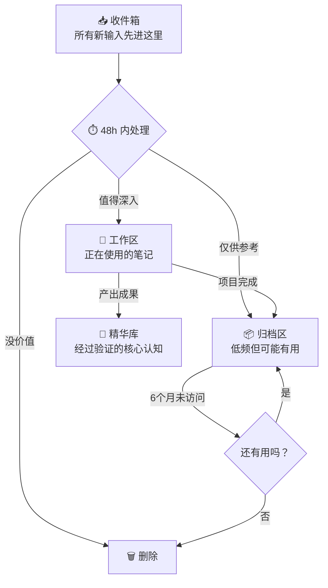
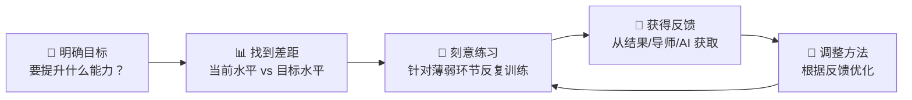
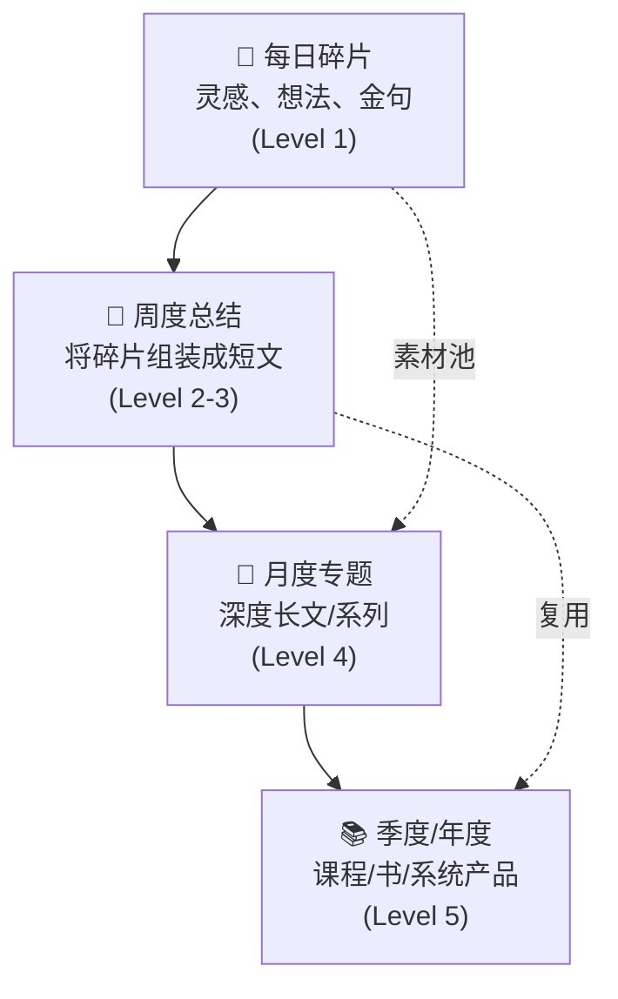

# 笔记库管理 × 阅读学习输出

> **两大核心领域：驯服你的笔记系统，以及建立「输入→处理→输出」的完整知识飞轮。**
> 

---

# 一、笔记库太复杂的学习、管理与筛选策略

<aside>
🧩

**核心原则**：笔记系统的目的不是「收藏一切」，而是「在你需要时，用最短路径找到能用的东西」。如果你的系统让你焦虑而不是让你高效，系统本身就是问题。

</aside>

## 1.1 为什么笔记库会变得复杂到失控

| **病因** | **症状** | **底层心理** |
| --- | --- | --- |
| **收集癖** | 收藏了几百篇文章，从来没看过第二遍 | 「万一以后用得上」的囤积安全感 |
| **分类强迫症** | 花 3 小时设计文件夹结构，0 小时写笔记 | 对混乱的恐惧 > 对输出的渴望 |
| **系统迷恋** | 不断换工具、换框架、重建系统 | 构建系统的快感替代了实际学习 |
| **完美主义** | 每条笔记必须格式完美、标签齐全 | 高摩擦 → 不愿动笔 → 系统荒废 |
| **无退出机制** | 笔记只进不出，越堆越多 | 删除焦虑：觉得删掉就是「浪费」 |

## 1.2 笔记库的黄金法则

### 法则一：只保留能改变行动的笔记

> **判断标准**：这条笔记能不能在未来 6 个月内改变我的某个决策或行动？
> 

> 如果不能 → **删除或归档**，不犹豫。
> 

### 法则二：收集 ≠ 学习

- 把文章存进 Notion ≠ 你学到了东西
- **真正的学习 = 用自己的话重写 + 连接到已有知识 + 产出行动**
- 收藏夹是知识的坟墓，除非你有重访机制

### 法则三：复杂度守恒定律

> **系统的复杂度应该 ≤ 你愿意维护它的精力。**
> 

> 一个你不用的完美系统 < 一个你每天用的粗糙系统。
> 

### 法则四：结构服务于检索，不服务于美观

- 问自己：「3 个月后我会用什么关键词找这条笔记？」
- 用检索逻辑倒推组织方式，而不是用分类学逻辑

## 1.3 笔记库管理策略：三层架构

### 📥 层一：收件箱（Inbox）

- **规则**：所有新笔记、灵感、收藏先进收件箱，不分类
- **处理频率**：每天或每两天清空一次
- **处理方式**：对每条笔记做三选一 → 深入处理 / 归档 / 删除
- **48 小时规则**：超过 48 小时未处理的笔记，降低期望值——如果你 48 小时都没想处理它，它大概率不重要

### 📝 层二：工作区（Active）

- **只放正在进行的项目和活跃主题的笔记**
- 笔记数量上限：保持在你能一屏浏览的范围内
- 完成后立即归档，不留在工作区

### 💎 层三：精华库（Core）

- **经过实践验证的核心认知、模型、SOP**
- 这里的每一条都应该是你「反复使用」的东西
- 定期迭代更新，而不是堆砌新内容

## 1.4 笔记筛选的减法策略

### 季度大扫除协议（每 3 个月执行一次）

1. **打开笔记库**，按「最后编辑时间」排序
2. **6 个月未触碰的笔记** → 全部标记
3. 对标记笔记逐条问：「如果这条笔记消失了，我的生活/工作会受到影响吗？」
4. **答案是「不会」→ 删除**（不是归档，是删除）
5. **答案是「可能」→ 归档到冷存储**
6. **答案是「会」→ 移入精华库，并用自己的话重写**

### 日常筛选原则

| **信号** | **动作** |
| --- | --- |
| 看到一条笔记但完全不记得为什么保存 | 删除 |
| 笔记内容已经内化为你的默认认知 | 删除（它已经在你脑子里了） |
| 笔记是纯复制粘贴，没有任何你自己的话 | 要么重写，要么删除 |
| 同一个主题有 5+ 条笔记说类似的事 | 合并为 1 条精华笔记 |
| 笔记对应的项目已经结束 | 归档 |
| 笔记让你焦虑（"我还没学这个"） | 删除——焦虑笔记没有价值 |

## 1.5 复杂笔记库的学习策略

### 不要试图「读完」你的笔记库

> **你的笔记库不是待读清单，是可查询的外部大脑。** 从「消费所有笔记」的心态，切换到「需要时精准检索」的心态。
> 

### 主题式深潜法

1. **确定本周/本月的一个核心主题**
2. **只围绕这个主题检索和学习** → 忽略所有其他笔记
3. **从笔记中提炼出 3-5 个关键洞察**
4. **用自己的话写一篇总结（费曼输出）**
5. **将总结存入精华库**，原始笔记归档或删除

### 渐进式总结法（Progressive Summarization）

- **Layer 0**：原始材料（全文收藏）
- **Layer 1**：加粗关键句子
- **Layer 2**：高亮最关键的加粗句子
- **Layer 3**：用自己的话写顶部摘要
- **Layer 4**：将洞察连接到其他笔记 / 产出内容
- **每次重访笔记时推进一层，而不是一次做完**

## 1.6 防止笔记库再次失控的机制

| **机制** | **执行方式** | **频率** |
| --- | --- | --- |
| **进出平衡** | 每新增 1 条笔记，删除或归档 1 条旧笔记 | 每次新增时 |
| **收件箱清零** | 收件箱超过 20 条未处理时，强制清空 | 每 48h |
| **季度大扫除** | 删除 6 个月未触碰的笔记 | 每 3 个月 |
| **工具锁定** | 选定工具后至少 6 个月不换，把精力放在内容而非系统 | 持续 |
| **输出驱动** | 每次学习必须产出一个东西（哪怕是一条推文） | 每次学习时 |

---

# 二、书籍阅读原则、学习原则、输出原则

<aside>
📖

**核心原则**：阅读的目的不是「读完一本书」，而是「从书中提取能改变你行动的洞察」。读 100 本书但行动不变 = 零。读 1 本书但改变了 3 个行动 = 无价。

</aside>

## 2.1 📖 书籍阅读原则

### 原则一：不是所有书都值得读完

> **一本书 80% 的价值通常集中在 20% 的内容里。** 你的任务不是读完它，而是找到那 20%。
> 
- **前 30 页规则**：读了前 30 页仍然没有被吸引 → 放下，换一本
- **目录筛选法**：先读目录，标记最相关的 3-5 章，只读这些
- **结尾倒读法**：非虚构类书籍可以先读结论章，再决定要不要读过程

### 原则二：带着问题读书

- **读之前写下 3 个你希望这本书回答的问题**
- 读的过程中只关注与这 3 个问题相关的内容
- 读完后检查：这 3 个问题被回答了吗？
- **为什么有效**：问题给大脑装上了「滤网」，过滤掉噪音，只捕获信号

### 原则三：主动阅读 > 被动扫视

| **被动阅读（低效）** | **主动阅读（高效）** |
| --- | --- |
| 从头到尾逐字读 | 跳读 + 精读关键段落 |
| 划线但不思考 | 划线 + 在旁边写自己的想法 |
| 读完觉得「挺好的」但说不出啥 | 读完能用 3 句话概括核心论点 |
| 追求阅读量 | 追求洞察密度 |
| 一本书读到底不管好坏 | 烂书果断放弃，好书反复读 |

### 原则四：好书读三遍，烂书读零遍

- **第一遍**：快速扫读，标记「让你停下来思考」的段落
- **第二遍**（间隔 1-4 周）：只读标记段落，写笔记
- **第三遍**（间隔 1-3 个月）：只读自己的笔记，检查哪些已经内化，哪些需要重新理解
- **Naval 的原则**：*"I don't believe in reading a book once. If a book is worth reading, it's worth reading twice. If it's worth reading twice, it's worth reading three times."*

### 原则五：书籍选择策略

| **优先读** | **少读或不读** |
| --- | --- |
| 经典（经过 10+ 年时间检验的书） | 畅销书排行榜上的速朽品 |
| 作者有实践经验（做过事，不只是写过书） | 纯理论学者的畅销科普 |
| 信息密度高、每页都有洞察的书 | 本可以是一篇文章但被注水成一本书的书 |
| 被你信任的多个人独立推荐的书 | 算法推荐给你的、标题党式的书 |
| 与你当前最大问题直接相关的书 | 「听说很好但跟你当前无关」的书 |

### 原则六：阅读节奏管理

- **同时读 2-3 本**：1 本深度思考类 + 1 本实操工具类 + 1 本轻松/叙事类
- **不同时段读不同类型**：深度类放在精力最好的时段（通常是早上），轻松类放在睡前
- **设定最低阅读量**：每天 20 页（约 30 分钟），不追求更多，但不允许更少

## 2.2 🧠 学习原则

### 原则一：学习 = 行为改变

> **如果学完之后你的行为没有任何改变，你没有学到任何东西。** 你只是被「知道了」的幻觉安慰了。
> 
- **检验标准**：学完一个概念后，问自己——「这会让我明天做什么不一样？」
- 如果答不出来 → 继续深入，直到能答出来

### 原则二：费曼法则——教是最好的学

1. **选择一个概念**
2. **假装教给一个 12 岁小孩**（不用行话，只用大白话和比喻）
3. **卡住的地方 = 你没真正理解的地方** → 回去重新学
4. **简化再简化** → 直到一句话能说清楚

### 原则三：间隔重复 > 一次猛攻

- **艾宾浩斯遗忘曲线**：学完 24 小时后遗忘 70%
- **应对策略**：学完后在 1 天、3 天、7 天、30 天各复习一次
- **最轻量的间隔重复**：每天花 5 分钟翻看昨天的笔记

### 原则四：连接 > 收集

- 每学一个新概念，问自己：**「这和我已经知道的什么东西类似？」**
- 新知识如果不连接到已有知识网络 → 很快被遗忘
- **芒格方法**：把新概念挂到思维模型格栅上 → 形成跨学科理解

### 原则五：刻意练习框架

- **注意**：刻意练习 ≠ 重复。重复是在舒适区内做同样的事。刻意练习是在 **学习区**（略微超出能力边界）反复训练。

### 原则六：T 型学习策略

| **维度** | **策略** | **目的** |
| --- | --- | --- |
| **横向（广度）** | 每月接触 1-2 个全新领域，浅读入门材料 | 建立跨学科连接能力，发现异质同构 |
| **纵向（深度）** | 选择 1-2 个核心领域，持续 6 个月以上深耕 | 建立真正的专业壁垒和独特洞察 |
- **现阶段**：你的纵向 = AI 协作 + Notion 系统 + 内容创作；横向 = 交易、认知科学、人性

### 原则七：学习的反面——什么不该学

- ❌ 「听说很火但跟你目标无关的技能」
- ❌ 「能 Google/AI 到的纯记忆性知识」
- ❌ 「让你觉得自己在学习但实际只是消遣的内容」（如无限刷知乎/播客而不做笔记）
- ❌ 「基础已经够用但你想继续深入以获得安全感的领域」（收益递减区）

## 2.3 ✍️ 输出原则

<aside>
🔥

**核心原则**：输出不是学习的附属品，**输出就是学习本身**。不输出的学习 = 自我安慰。输出才是检验你是否真正理解的唯一标准。

</aside>

### 原则一：输出倒逼输入（Output-First）

> **先决定要输出什么，再决定学什么。** 不是「学完再写」，而是「为了写而学」。
> 
- 决定写一篇关于「多巴胺管理」的文章 → 然后去读相关书籍和论文
- 这比「读完一本书再想写什么」高效 5 倍
- **为什么有效**：输出目标给学习装上了「目的滤网」，所有输入都有了方向

### 原则二：从最小输出开始

| **输出级别** | **形式** | **时间** | **难度** |
| --- | --- | --- | --- |
| **Level 1** | 一条笔记 / 一条朋友圈 / 一条推文 | 5 分钟 | ★☆☆☆☆ |
| **Level 2** | 一段费曼式总结 / 一个短视频脚本 | 15-30 分钟 | ★★☆☆☆ |
| **Level 3** | 一篇完整文章 / 一个小红书帖子 | 1-2 小时 | ★★★☆☆ |
| **Level 4** | 一个系统化专题 / 一期长视频 | 3-5 小时 | ★★★★☆ |
| **Level 5** | 一个完整课程 / 一本书 / 一套系统 | 数周-数月 | ★★★★★ |
- **从 Level 1 开始**，不要一上来就想写万字长文
- 每天至少一个 Level 1 输出 → 积累素材 → 定期组装成更高级别的输出

### 原则三：输出的 3-2-1 法则

每次学完一个主题后：

- **3 个关键洞察**：这个主题最重要的 3 个点是什么？
- **2 个行动改变**：因为学了这个，我要开始/停止做什么？
- **1 个类比/比喻**：怎么用一句话向外行解释这个概念？

### 原则四：公开输出 > 私人笔记

- **公开输出的压力让你不敢糊弄** → 逼出更高质量的理解
- 不需要等到「准备好了」才公开 → 边学边输出，展示过程而非完美结果
- **平台选择**：先选一个主平台（小红书/公众号/推特），做到稳定输出后再扩展

### 原则五：输出的复利——内容金字塔

- **关键**：Level 1 的碎片不是浪费，它们是更高级别输出的原材料
- **复用策略**：同一个洞察可以变成推文 → 短文 → 长文章的一段 → 课程的一节

### 原则六：不完美输出 > 完美沉默

> **完成 > 完美。发出去的 60 分作品 > 永远在打磨的 100 分草稿。**
> 
- 第一版永远是垃圾 → 这是正常的，发出去再改
- 输出质量随数量提升 → 写 100 篇的人比想写 1 篇完美文章的人进步快 100 倍
- **Naval 原则**：*"The best way to get started is to get started."*

### 原则七：输出的质量检验清单

每次输出前，问自己：

- [ ]  **这篇内容有没有至少一个「原创洞察」？**（不是复述别人的话）
- [ ]  **读者看完后能做什么不一样的事？**（有 actionable takeaway）
- [ ]  **我能用一句话说清楚这篇内容的核心论点吗？**
- [ ]  **如果删掉一半，核心信息还在吗？**（如果在 → 删掉那一半）
- [ ]  **这是我真正相信的东西，还是我觉得「应该」说的？**

---

# 三、输入→处理→输出 完整飞轮

<aside>
♻️

将前面所有原则整合成一个可执行的系统。

</aside>

| **阶段** | **动作** | **工具/方法** | **频率** |
| --- | --- | --- | --- |
| **📥 输入** | 带着问题阅读 → 标记关键段落 | 书籍 + 文章 + 播客（有目的选择） | 每天 30-60 min |
| **🔄 处理** | 用自己的话重写 → 连接已有知识 → 提炼行动点 | 费曼法 + 渐进式总结 + 3-2-1 法则 | 每天 15-30 min |
| **✍️ 输出** | 将处理后的洞察变成公开内容 | 推文 → 短文 → 长文 → 专题 | 每天 1 个 Level 1+ |
| **🔍 筛选** | 定期清理笔记库，保留精华 | 季度大扫除 + 进出平衡机制 | 每 3 个月 |
| **🔁 迭代** | 根据输出反馈调整输入方向 | 看什么内容反馈好 → 在该方向深入 | 每月复盘 |

### 终极公式

> **知识价值 = 输入质量 × 处理深度 × 输出频率 × 时间复利**
> 

> 
> 

> 四个变量中，**输出频率**是大多数人最弱的环节。从今天开始，每天至少一条输出。
> 

---

*基于 Naval 阅读哲学 + 费曼学习法 + 渐进式总结 + 内容创作复利模型构建 · 最后更新：2026-03-14*