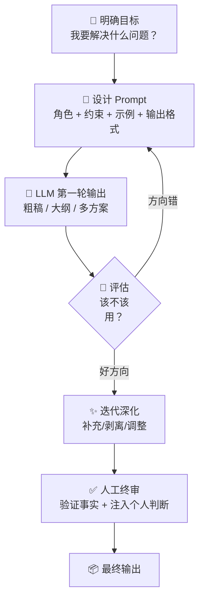

# 🤖 人生最佳实践笔记 II｜AI 协作 × 人类社交 × 动力重启

> **四大核心领域的最佳实践：认识 AI 边界、用好 AI 杠杆、经营人类关系、从低迷中重启。**
> 

---

# 一、大语言模型擅长与不擅长的话题方向

<aside>
🧠

**核心原则**：LLM 是世界上最强的「语言模式匹配引擎」，不是「真理发现引擎」。理解它的能力边界，才能最大化利用它。

</aside>

## 1.1 ✅ LLM 擅长的领域

| **能力类型** | **具体擅长** | **为什么擅长** |
| --- | --- | --- |
| **结构化思维** | 拆解复杂问题、建立框架、分类分层、制作 SOP | 训练数据中大量结构化文本，模式匹配能力极强 |
| **语言转换** | 改写、翻译、风格转换、语气调整、简化/深化表达 | 核心能力就是语言操作 |
| **知识整合** | 跨领域连接、费曼式解释、类比生成、概念映射 | 见过大量跨领域文本，擅长找“异质同构” |
| **内容生成** | 草稿、大纲、文案、发散式头脑风暴、变体生成 | 生成式架构天然擅长产出多样化内容 |
| **代码与工具** | 写代码、调试、解释代码、写正则、写公式、SQL | 代码是高度结构化的语言，与 LLM 能力高度匹配 |
| **分析与评估** | 优缺点分析、风险评估、多角度审视、放徃号角色 | 可以同时持有多个视角，不受情绪干扰 |
| **教学与解释** | 逐步解释、苏格拉底式对话、调整难度级别 | 可以无限耐心地重复解释，根据用户水平调整 |

## 1.2 ❌ LLM 不擅长的领域

| **局限类型** | **具体表现** | **为什么不擅长** | **应对策略** |
| --- | --- | --- | --- |
| **事实核查** | 可能自信地编造具体数据、日期、引用 | 生成模型优化“流畅性”而非“准确性” | 所有关键事实必须自己验证 |
| **实时信息** | 不知道今天的新闻、股价、最新事件 | 训练数据有截止日期 | 结合搜索工具 / RAG |
| **数学计算** | 复杂算术、统计、精确计算会出错 | 语言模型而非计算器 | 让 LLM 写代码来计算 |
| **个人体验与感受** | 无法提供真实的主观体验、情感共鸣 | 没有身体、没有经历、没有情感 | 将其视为“思维工具”而非“人生导师” |
| **高度专业前沿** | 最新研究、未发表的洞察、小众领域深度 | 训练数据偏向大众知识 | 先喋它专业材料，再让它处理 |
| **复杂逻辑推理** | 多步因果链、反事实推理、矛盾检测 | 模式匹配而非真正推理 | 拆成小步，一步一步引导 |
| **“不知道自己不知道”** | 很少主动说"我不确定"，倾向于给出看起来合理的答案 | 训练目标是最大化有用性 | 主动要求它标注确定性级别 |

## 1.3 实用决策矩阵

| **场景** | **用 LLM** | **不用 LLM** |
| --- | --- | --- |
| 写商业计划大纲 | ✅ 擅长结构化 |  |
| 核实某家公司去年营收 |  | ❌ 可能编造 |
| 写代码解决问题 | ✅ 非常强 |  |
| 花 3 万应该买什么理财产品 |  | ❌ 不懂你的真实风险偏好 |
| 整理 10 篇笔记的共同模式 | ✅ 跨材料整合极强 |  |
| 判断“我该不该和这个人分手” |  | ❌ 不懂情感复杂性 |
| 给文章换 3 种风格重写 | ✅ 语言操作核心能力 |  |
| 评估今天某只股票能不能买 |  | ❌ 无实时数据 + 无风控责任 |

### 黄金法则

> **让 LLM 做“思考的脚手架”，你做“判断的屋顶”。** 它负责展开、结构化、变体；你负责筛选、验证、决策。
> 

---

# 二、与语言模型协作创作交流的最佳策略

<aside>
⚙️

**核心原则**：你与 LLM 的关系不是「提问-回答」，而是「导演-演员」。你提供意图、约束和质量标准；LLM 提供执行、变体和规模。**Prompt 质量 = 输出质量**。

</aside>

## 2.1 Prompt 工程七大原则

### 原则一：明确角色（Role Setting）

- ✅ "你是一个有 10 年经验的中文文案策划师"
- ❌ "帮我写点东西"
- **为什么有效**：角色设定激活了训练数据中特定领域的知识模式

### 原则二：给约束而非给自由（Constraints » Freedom）

- ✅ "用 3 层结构，每层不超过 5 点，风格如 Dan Koe"
- ❌ "随便写写"
- **为什么有效**：约束越明确，输出方差越小，质量越稳定

### 原则三：给示例而非描述（Show » Tell）

- ✅ 直接贴一个你满意的输出样本，说“照这个风格写”
- ❌ 花 200 字描述你想要的风格
- **为什么有效**：模型模仿能力远强于解读抽象指令

### 原则四：迭代而非一次成型（Iterate » Perfect）

- **第一轮**：让 LLM 先出粗稿 / 大纲 / 多个方向
- **第二轮**：从中选择最好的方向，要求深化
- **第三轮**：微调语言、结构、补充细节
- 这比“一次性写一个完美 prompt”高效 10 倍

### 原则五：拆解复杂任务（Decompose）

- 大任务拆成小任务，每次只让 LLM 做一件事
- 例如：写文章 = ① 先列大纲 → ② 展开每节 → ③ 统一风格 → ④ 最终打磨
- **为什么有效**：每次只分配一个清晰目标，输出质量更高

### 原则六：让 LLM 思考而非直接输出（Think First）

- ✅ "先分析这个问题的 3 个关键维度，然后再给出答案"
- ✅ "列出你的推理过程，然后给出结论"
- **为什么有效**：Chain-of-Thought 让模型在生成答案前先组织思维

### 原则七：主动要求质疑和补充（Adversarial Mode）

- ✅ "请指出这个方案的 3 个最大弱点"
- ✅ "如果你是反对者，你会怎么攻击这个观点？"
- **为什么有效**：LLM 默认倾向于顺从，主动要求它反驳才能获得更全面的视角

## 2.2 协作工作流模板

## 2.3 高频协作场景模板

| **场景** | **Prompt 模板** |
| --- | --- |
| **将复杂概念写成费曼笔记** | "把以下内容用费曼方法重写：像给一个 15 岁学生解释，用具体比喻，每个概念后附带『为什么重要』和『实践洞察』。" |
| **写小红书文案** | "写 3 版小红书文案，主题是『XX』。风格：口语化、有洞察、前 2 行必须停下滚动。每版角度不同：①反常识 ②实操步骤 ③个人故事。" |
| **审视自己的方案** | "你现在是一个恶意审计师。请找出这个方案的 5 个最大弱点，用塔勒布反脆弱框架分析，并给出修复建议。" |
| **跨领域连接** | "将『XX』概念与『YY』领域做类比映射。找出 3 个异质同构的层面，每个用一句话概括 + 一个具体例子。" |

## 2.4 警告：与 LLM 协作的常见陷阱

1. **懒人 Prompt**：“帮我写一篇文章” → 输出泛泛而模糊
2. **过度信任**：不核实事实就直接使用 → 传播幻觉
3. **一次性期望**：希望一个 prompt 出完美答案 → 不如迭代 3 次
4. **只问不用**：得到答案但不转化为行动 → 知识僧尷”幻觉
5. **验证偏见**：只问 LLM 支持你观点的问题 → 回音室效应

---

# 三、现实人类社交原则

<aside>
🤝

**核心原则**：社交的本质不是「认识更多人」，而是「找到值得深度连接的人、建立可持续的高质量关系」。社交是报酬极高的投资，但前提是你知道跟谁投资、如何投资、以及什么时候该换赌桌。

</aside>

## 3.1 🔍 筛选原则：跟谁社交

> **你是你最常接触的 5 个人的平均值。** 筛选的质量决定你人生质量的天花板。
> 

### 高价值社交对象特征

- ✅ **能量向上**：和 TA 在一起后你更有动力、更清晰，而非更地被消耗
- ✅ **说真话**：会对你说不想听但需要听的真话
- ✅ **有东西可学**：在某个维度比你强，或视角独特
- ✅ **可靠**：说到做到，不空谈
- ✅ **双向流动**：不是只有你在付出

### 低价值社交对象信号

- ❌ 每次见面后你感觉被抽干了
- ❌ 只在需要你时才出现
- ❌ 持续负能量输出（抱怨、评判、PUA）
- ❌ 言行不一致，反复无常

### 社交圈结构配置

| **圈层** | **人数** | **特征** | **投入频率** |
| --- | --- | --- | --- |
| **核心圈** | 2-5 人 | 无条件信任、相互助力、可说真话 | 每周联系 |
| **成长圈** | 5-15 人 | 各有所长、互相启发、同频赛道 | 每月深度交流 |
| **资源圈** | 15-50 人 | 特定资源互换、合作机会 | 按需激活 |
| **弱连接圈** | 不限 | 偏发现机会、信息异质性 | 低维护 |

## 3.2 🚧 底线原则：不可谈判的红线

> **底线不是用来说的，是用来执行的。** 一次不执行，所有人都会知道你的底线是假的。
> 

### 不可突破的红线

1. **不接受人格侥辱**：当面攻击你的人格、家庭、外貌等 → 立即终止对话，不解释
2. **不接受持续单向索取**：只拿不给的关系 → 降级或终止
3. **不接受背后说三道四**：发现后直接降级信任等级
4. **不借钱给不熟的人**：无论对方多会说
5. **不在情绪失控时做重大社交决策**：延迟 24 小时规则

### 底线执行 SOP

1. **触线时**：保持平静，不情绪化反应
2. **明确表达**：一句话说清楚你的边界（“这个我不接受”）
3. **不解释过多**：解释越多，被利用的空间越大
4. **执行后果**：降级关系 / 减少联系 / 终止关系
5. **不强求对方理解**：你的底线不需要对方同意

## 3.3 🗣️ 交谈原则：怎么说话

> **80% 的社交问题不是「说什么」的问题，而是「听什么」的问题。**
> 

### 听的原则

- **2:1 规则**：听的时间是说的 2 倍
- **不要等对方说完就开始准备你的回复** → 先确认你真的听懂了
- **复述确认**：“你的意思是……对吗？” → 让对方感到被理解

### 说的原则

- **先情绪后事实**：对方情绪激动时，先回应情感（“我理解你很累”），再说建议
- **少给建议，多问问题**：“你觉得什么是最难的部分？” 比 “你应该……” 更有力
- **不在公开场合批评人**：批评私下说，表扬公开说
- **用“我”开头而非“你”**：“我觉得这样可能有风险” vs “你这样做不对”
- **不反驳感受，只补充视角**：“你的感受是真实的，同时还有另一个角度…”

### 尖锐对话的处理

- **不同意但不想吾架** → "我理解你的角度，我的看法不同，原因是…"
- **对方复制你的情绪** → 暂停，慢一拍回应，不被节奏带着走
- **被 PUA / 道德绑架** → 识别模式（“你不这样做就是不爱我”）→ 不接招，回到事实层面

## 3.4 🚀 主动原则：如何经营关系

> **好关系不是等来的，是经营来的。** 主动不等于讨好。主动 = 有策略地投资注意力。
> 

### 主动社交 SOP

1. **定期触达**：核心圈每周至少 1 次有质量联系（不是发表情）
2. **提供价值先行**：先想“我能给 TA 什么”，而不是“我能从 TA 这里得到什么”
3. **分享有用的东西**：看到好文章/机会 → 想到谁会受益 → 发给 TA
4. **主动约见面**：线下见面的关系质量是线上的 10 倍
5. **记住对方提过的事**：下次见面主动问进展 → 让人感受到真正被关注

### 初次社交的快速连接法

- 问「你最近在忙什么有意思的事？」而不是「你做什么工作？」
- 真诚分享你正在做的事 + 遇到的问题 → 脆弱性建立信任
- 不要试图表演「成功人设」，“有意思的人”比“厉害的人”更有吸引力

## 3.5 ⚠️ 红线原则：必须立即远离的关系模式

<aside>
🚩

以下任何一个信号出现 **2 次以上**，就应该认真考虑远离。

</aside>

1. **控制型**：试图控制你的时间、社交、决策；质疑你的每一个选择
2. **美化型**：永远在贬低你（“就你这样还…”），让你怀疑自己的价值
3. **双标型**：对自己和对你两套标准，永远是你的错
4. **绵里藏针型**：表面很好，但每次交流后你总觉得哪里不对劲
5. **吸血型**：只索取你的时间/金钱/情绪价值，从不回报
6. **恶意竞争型**：把你的每一个进步视为威胁，暗中使绊

### 远离 SOP

1. 识别模式（不要等“确定”，模式出现 2 次就开始行动）
2. 减少接触频率（不需要别离仪式，静默淡出）
3. 不解释可以多（解释常常反而给对方更多操作空间）
4. 将空出来的时间重新投入高价值关系

## 3.6 🛡️ 保护原则：保护自己的底层逻辑

- **不透支情感账户**：社交精力有限，耗尽之后会全面崩溃
- **不因孤独而降低标准**：宁可独处，不可将就
- **不为删减版的自己建立关系**：如果一段关系要求你隐藏真实的自己，它不值得
- **定期审计关系**：每 3 个月问自己——“这段关系让我更接近我想成为的人，还是更远离？”

---

# 四、如何短时间重新掌控时间与动力

<aside>
⚡

**核心原则**：低迷不是「懒」，而是神经系统进入了保护模式。多巴胺耗竭 + 皮质醇失调 + 决策疲劳 = 你的大脑在说「我需要重启」。不要与它对抗，要顺势重启。

</aside>

## 4.1 理解低迷的底层机制

| **机制** | **发生了什么** | **表现** |
| --- | --- | --- |
| **多巴胺基线下降** | 短视频/游戏/色情等高刺激抬高基线 → 正常事物产生不了动力 | 对什么都提不起兴趣、无力感 |
| **皮质醇失调** | 睡眠不规律/压力慢性化 → 晨起皮质醇峰值不足 | 早上起不来、白天昏昏沉沉 |
| **决策疲劳** | 待办清单太长 / 无优先级 → 大脑罚抖入低功耗模式 | 什么都不想做、拖延 |
| **情感耗竭** | 来自工作/关系/自我批判的情绪消耗 | 对一切失去兴趣、想“世界停一停” |

## 4.2 🆘 紧急重启协议（第一个 72 小时）

<aside>
🎯

**三步重启法：动身体 → 刺激好奇心 → 锚定一个行动。** 不要试图一次恢复到巅峰状态，只需要“微启动”。

</aside>

### ① 动身体（物理重启）— 前 5 分钟

- **最低阈值**：站起来 → 走出房间 → 10 个俯卧撑或 2 分钟拉伸
- **进阶**：户外走路 15-30 分钟（不带手机或不听任何东西）
- **为什么有效**：运动释放内啡肽 + 增加脑血流 → 打破体内滇化循环

### ② 刺激好奇心（认知重启）— 接下来 15 分钟

- 打开一篇你收藏但没读过的好文章
- 听一个能让你兴奋的播客片段（15 分钟内）
- 翻看你自己的笔记库，重新点燃「我在做什么」的记忆
- **为什么有效**：好奇心让大脑从“自动驾驶”切换到“探索模式”，重新激活前额叶

### ③ 锚定一个行动（意志重启）— 然后 25 分钟

- 问自己：**「如果今天只能做一件事，做什么能让我晚上觉得今天没浪费？」**
- 只做这一件事，25 分钟计时器
- 完成后允许自己休息，不强迫继续
- **为什么有效**：成就感触发多巴胺，哪怕很小的成就也能启动正循环

## 4.3 多巴胺戒断 / 奶头乐戒断协议

### 第一阶段：环境重设（Day 1-3）

- [ ]  **卸载**所有短视频 app（抖音/快手/B站推荐流）— 不是“少看”，是“删除”
- [ ]  **手机移出卧室**：用闹钟代替手机闹钟
- [ ]  **设置屏幕时间限制**：社交媒体 ≤30 min/天
- [ ]  **创建「无聊时刻」替代清单**：当想刷手机时 → 改为：做 10 个俯卧撑 / 读 1 页书 / 写 1 条想法

### 第二阶段：节律重建（Day 4-14）

- [ ]  **固定起床时间**（比固定睡觉时间更重要），误差 ≤30 min
- [ ]  **晨间仪式**：起床 → 不碰手机 30 min → 晨光 10 min → 身体活动 5 min
- [ ]  **每天 1 个「不可谈判」任务**：无论状态多差都要完成的 1 件事
- [ ]  **晚间截止**：晚上 10 点后不看屏幕（或至少用夜间模式 + 低亮度）

### 第三阶段：动力系统重建（Day 15-30）

- [ ]  **重新连接目标**：重读你写过的「我为什么做这件事」，重新点燃
- [ ]  **2 小时深度块**：每天至少 1 个 2 小时无打断深度工作块
- [ ]  **社交重启**：每周至少 1 次面对面社交（催产素 = 皮质醇拮抗剂）
- [ ]  **周末复盘**：这周做到了什么？什么让我关掘了？下周调整什么？

## 4.4 动力维护的长期系统

### 动力不是感觉，是系统

> 不要等有动力了才行动。**行动产生动力，不是动力产生行动。**
> 

### 动力保护清单

| **做更多** | **做更少** |
| --- | --- |
| 户外光线暴露（每天 10+ min） | 床上刷手机 |
| 身体运动（哪怕散步） | 熟人社交媒体（微博/朋友圈无限刷） |
| 深度工作（产生心流） | 多任务切换 |
| 面对面社交 | 无目的浏览 |
| 创造性输出（写作/编码/设计） | 被动消费（只看不做） |
| 小胜利积累（每天完成 1 件小事） | 完美主义规划（全在脑子里，不开始） |
| 充足睡眠（7-9h） | 深夜高刺激活动 |

### 低迷预警与熔断

| **预警信号** | **熔断机制** |
| --- | --- |
| 连续 2 天不想做任何事 | 启动 72 小时紧急重启协议 |
| 每天屏幕时间 > 6h（非工作） | 立即卸载最耗时 app，7 天后重新评估 |
| 睡眠时间多次晚于凌晨 1 点 | 强制固定起床时间 3 天，倒逼睡眠 |
| 连续 5 天+ 无面对面社交 | 立即约一个人见面 |
| 自我批判循环不停 | 写下来 → 用「90 秒规则」观察 → 完成 1 个微任务打断循环 |

## 4.5 终极原则

<aside>
🔑

**不要等有动力了才行动 → 行动产生动力。**

**不要打败坦克，打败小兵 → 每天 1 个微行动。**

**不要等「准备好」才开始 → 在行动中准备。**

**动力是燃料，但系统是引擎 → 不依赖燃料的多少，依赖引擎的设计。**

</aside>

---

*基于神经科学 + 人性认知系统 + Naval/塔勒布/费里斯思想框架构建 · 最后更新：2026-03-14*