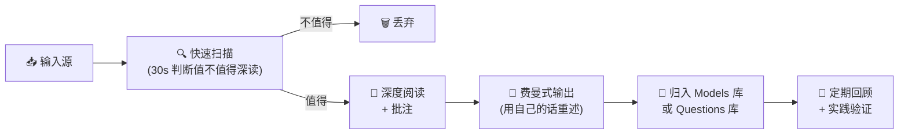

# 🧬 人生最佳实践｜身体养护 × 信息管理 × 博主筛选 × 情绪进化

> **四大核心领域的循证最佳实践，构建可执行的个人操作系统底层协议。**
> 

---

# 一、人体身体养护清洁最佳实践

<aside>
🎯

**核心原则**：身体是所有系统的硬件层。养护的本质不是"美容"，而是**延长硬件寿命、保持峰值性能**。21 岁是生理资本的窗口期——此阶段每一分投入的 ROI 最高。

</aside>

## 1.1 皮肤护理（男性极简协议）

### 基础三步（每日必做）

| **步骤** | **早晨** | **晚间** |
| --- | --- | --- |
| **清洁** | 温和氨基酸洁面（水温 25-30°C），重点 T 区 | 洁面乳充分起泡后按压式涂抹，清水冲净 |
| **保湿** | 轻薄保湿乳/啫喱（含烟酰胺或透明质酸） | 稍厚质地的面霜（含神经酰胺修复屏障） |
| **防晒** | SPF30+ 广谱防晒（出门前 15 min），阴天也涂 | 不需要 |

### 进阶护理（每周）

- **去角质**：每周 1-2 次，水杨酸（BHA）适合油性皮肤，温和物理磨砂备选
- **面膜**：保湿面膜每周 1-2 次即可，不需要天天敷
- **剃须**：先热敷软化毛发 → 顺着毛发方向刮 → 须后水收敛

### 关键原则

- **不要过度清洁**：一天洗脸不超过 2 次，过度会破坏皮脂膜
- **皮肤 pH 值约 4.5-6.0**（弱酸性），选择温和不破坏酸碱平衡的产品
- **防晒 > 一切护肤品**：紫外线是皮肤老化的第一因素（光老化占 80%+）
- **少即是多**：男性护肤 3-4 步足够，瓶瓶罐罐不等于效果

## 1.2 口腔卫生

- **刷牙**：每天 2 次，每次 2 分钟，使用含氟牙膏
- **牙线/冲牙器**：每天至少 1 次（比刷牙更重要——牙刷只清洁 60% 的牙齿表面）
- **洁牙**：每 6-12 个月一次专业洁牙（口腔炎症 → 全身慢性炎症）
- **TMJ 保护**：日常有意识放松咬肌，上下牙不接触；训练时使用牙套

## 1.3 身体清洁与养护

### 洗浴协议

- **水温**：温水（37-40°C），不要过热（热水破坏皮脂膜 + 精子质量）
- **频率**：每天 1 次，不需要每次都用沐浴露全身搓洗（重点区域：腋下、腹股沟、脚）
- **顺序**：先洗头 → 冲掉洗发水 → 洗脸 → 洗身体（避免洗发水残留堵塞面部毛孔）
- **洗后**：3 分钟内涂身体乳锁水（尤其秋冬）

### 私处护理

- 每天清水清洗外部即可，不需要特殊洗液
- 穿透气棉质内裤，避免久坐闷热
- 避免笔记本电脑长期放大腿上（温度影响精子）

### 头发与头皮

- 洗发频率因人而异：油性 1-2 天/次，干性 2-3 天/次
- 不要用指甲抓头皮，用指腹按摩
- 关注脱发早期信号：发际线后移、洗头掉发明显增多 → 尽早干预（效果远好于晚期）

## 1.4 睡眠环境卫生

- **床品更换**：***枕套每周 1 次（直接接触面部），床单被套每 2 周***
- **卧室**：温度 18-20°C、完全遮光、湿度 40-60%
- **枕头**：每 1-2 年更换（螨虫和细菌累积）

## 1.5 年度体检基线（21 岁起）

- [ ]  血液全套（血糖/胰岛素/血脂/ApoB/维生素 D/hs-CRP）
- [ ]  激素基线（睾酮/SHBG/DHEA-S）
- [ ]  身体组成（DEXA 扫描）
- [ ]  口腔检查 + 洁牙
- [ ]  皮肤痣自检（ABCDE 规则）

---

# 二、信息输入来源管理

<aside>
📡

**核心原则**：你的认知质量 = 信息输入质量 × 处理深度。**信息饮食（Information Diet）** 和食物饮食一样——垃圾进，垃圾出。在注意力稀缺时代，管理输入源是元技能。

</aside>

## 2.1 信息源分层模型

| **层级** | **类型** | **特征** | **示例** | **时间占比** |
| --- | --- | --- | --- | --- |
| **L1 一手源** | 原始论文 / 教科书 / 原典 | 未经中间人解读，信息密度最高 | 学术论文、经典著作、官方数据 | 40%+ |
| **L2 高质量二手** | 深度解读者 / 实践者输出 | 有独立思考、有实践验证、引用一手源 | Naval、Dan Koe、Huberman 播客 | 30% |
| **L3 聚合与策展** | 新闻简报 / 精选推荐 | 帮你筛选信息但缺乏深度 | 优质 newsletter、行业周报 | 20% |
| **L4 噪音层** | 社交媒体信息流 / 热搜 | 情绪驱动、碎片化、半衰期极短 | 微博热搜、短视频推荐流 | ≤10% |

## 2.2 信息输入七大原则

1. **问题驱动输入**：先有问题，再找信息。
2. **上溯源头**：看到一个二手观点 → 追溯引用的一手来源 → 自己验证
3. **多源交叉验证**：任何重要结论至少 3 个独立来源确认
4. **半衰期优先**：优先摄入半衰期长的知识（基础科学、心理学、哲学、历史）
5. **输入-输出 1:1**：每消费 1 小时信息，至少产出 1 条笔记/卡片/输出
6. **定期断食**：每周 1 天信息断食（不刷任何 feed），让大脑进入发散模式
7. **纳瓦尔阅读法**：同时打开 10-20 本书，跳着读，只读当下最能解决问题的章节——不为"读完"而读

## 2.3 信息源管理 SOP

### 新源评估清单（加入前打分）

- [ ]  作者是否有**一手实践经验**（vs 纯搬运）？
- [ ]  内容是否引用可验证的数据/来源？
- [ ]  是否提供**可证伪**的具体主张（vs 模糊的正确废话）？
- [ ]  信息半衰期 > 1 年？
- [ ]  是否填补了你认知拼图中的**空缺**？

### 季度信息源审计

每 3 个月执行一次：

1. 列出所有活跃信息源（RSS/公众号/播客/推特关注）
2. 对每个源打分：**过去 3 个月，它是否改变了你的行为或认知？**
3. 无情删除得分为 0 的源
4. 主动寻找 2-3 个新的高质量源替补

### 信息处理工作流

---

# 三、自媒体博主关注筛选原则

<aside>
🔬

**核心原则**：你关注的人 = 你外包的思考者。**选错信息源比不学习更危险**——因为错误的框架会在你不知不觉中塑造你的判断。

</aside>

## 3.1 五维筛选框架

| **维度** | **高质量信号** | **红旗信号 🚩** |
| --- | --- | --- |
| **皮肤在场n（Skin in the Game）** | 自己在做这件事并承担后果；公开记录自己的失败 | 只教不做；从不提自己的失败案例 |
| **信息密度** | 每句话有信息增量；引用一手数据；给出可执行步骤 | 大量情绪渲染；重复常识；标题党 |
| **思维独立性** | 有自己的框架和独立观点；敢于逆主流 | 跟风热点；观点随大众摇摆；从不质疑自己 |
| **知行合一度** | 生活方式与所教内容一致；长期行为可追溯 | 教赚钱的人靠卖课赚钱；教健康的人明显不健康 |
| **长期一致性** | 核心理念 3-5 年未大幅矛盾；持续产出而非昙花一现 | 频繁转型蹭热点；半年换一个赛道 |

## 3.2 立即取关的 7 个信号

1. **恐惧营销**："不这样做你就完了" "再不行动就来不及了"
2. **虚假紧迫感**：永远在"限时" "最后 XX 名" "马上涨价"
3. **只卖焦虑不给解法**：问题描述 90%，解决方案 10%
4. **反智倾向**："学历无用" "读书没用" 等极端简化
5. **成功学包装**：晒车晒房晒收入截图作为内容核心
6. **信息茧房制造者**："只看我的就够了" "别人都是骗子"
7. **无法证伪**：所有建议都是"看情况"，永远不会出错也永远没有信息增量

## 3.3 值得长期关注的博主特征

- ✅ **有作品**：有可追溯的长期作品/产品/成果（不只是"教别人"）
- ✅ **讲底层逻辑**：教你钓鱼而非只给你鱼；讲原理而非只讲技巧
- ✅ **引用来源**：主动标注信息来源，方便你自行验证
- ✅ **承认无知**：公开说"这个我不懂" "我之前说错了"
- ✅ **跨领域连接**：能将不同领域的知识整合（整合者 Synthesizer 特征）
- ✅ **输出密度高**：10 分钟视频/2000 字文章中，你能提取 5+ 条可行动洞察

## 3.4 关注组合配置建议

| **类别** | **数量** | **功能** |
| --- | --- | --- |
| **思想源头型** | 3-5 人 | 提供底层框架和第一性原理（如 Naval、芒格、塔勒布） |
| **实践执行型** | 3-5 人 | 把理论转化为可执行步骤（如 Dan Koe、Ali Abdaal） |
| **行业前沿型** | 2-3 人 | 跟踪特定领域最新动态（如 AI、交易） |
| **反面教材型** | 1-2 人 | 刻意关注对立观点，防止信息茧房 |

> **总关注数控制**：所有平台加起来，深度关注不超过 **20 人**。超过这个数字，你的注意力会被稀释到无法深度消化任何人的内容。
> 

---

# 四、自我情绪维稳与幸福迭代进化原则

<aside>
🧘

**核心原则**：幸福不是目标的达成，而是一种**可训练的内在状态**。纳瓦尔说："幸福是缺席——缺席欲望、缺席遗憾、缺席焦虑。" 情绪维稳的本质是**升级你的操作系统，而不是改变外部环境**。

</aside>

## 4.1 情绪的底层机制

- **情绪 ≠ 事实**：情绪是进化遗留的信号系统，用于远古生存。现代环境下，大部分情绪信号是**误报**（如社交焦虑、对未来的恐惧）
- **情绪半衰期**：大多数强烈情绪的自然消退时间约 **90 秒**（Jill Bolte Taylor）。超过 90 秒仍然痛苦，是因为你在**用思维重新激活**它
- **默认模式网络（DMN）**：大脑闲置时会自动进入"反刍模式"——回忆过去的失败、担忧未来的风险。这是进化赋予的扫描机制，不是你的错，但你可以训练它

## 4.2 情绪维稳 SOP（日常协议）

### 🌅 晨间锚定（起床后 30 分钟内）

1. **不碰手机**：起床后至少 30-60 分钟不看任何信息流
2. **晨光暴露**：≥10 分钟户外光 → 皮质醇觉醒反应校准 → 全天情绪基线稳定
3. **生理叹息**（Physiological Sigh）：双吸一呼 × 3-5 次 → 快速激活副交感神经
4. **写下今日唯一意图**：一句话描述今天最重要的一件事

### 🔄 日间调节

- **情绪标签法**：当负面情绪出现时，用第三人称给它贴标签——"我注意到『焦虑』出现了" → 激活前额叶观察者视角，降低杏仁核激活约 50%（UCLA, Lieberman 2007）
- **90 秒规则**：感受到强烈情绪 → 暂停 → 观察身体感受（胸闷？手心出汗？）→ 等待 90 秒让化学信号自然消退 → 然后再做决策
- **环境切换**：情绪低谷时，物理移动身体——散步 10 分钟、换一个房间、做 20 个俯卧撑
- **社交连接**：催产素是皮质醇的天然拮抗剂。每周至少 1 次有质量的面对面社交

### 🌙 睡前复盘

- 写 3 件今天做得好的事（训练大脑的正向扫描能力）
- 如果今天有情绪波动，写下：**触发事件 → 身体反应 → 自动化思维 → 实际发生了什么** → 逐步建立"情绪数据库"，识别你的个人触发模式

## 4.3 幸福迭代四大原则

### 原则一：极简欲望法（Naval）

> 欲望是你和自己签的契约——"在得到它之前，我将一直不幸福。"
> 
- 同一时间只保留 **1 个**强烈欲望（你的 P0）
- 其余所有事物，保持"顺其自然"的心态
- 定期审计：你当前的欲望是**你自己的**，还是社交媒体/广告/同龄人植入的？

### 原则二：否定法（塔勒布 Via Negativa）

> 幸福更多通过**减去坏事**获得，而非**加上好事**。
> 
- 幸福 = 默认状态 - 有害因素
- 优先清单：
    1. 移除有毒关系
    2. 移除垃圾信息输入
    3. 移除垃圾食物
    4. 移除无意义的社交义务
    5. 移除睡眠干扰因素

### 原则三：嫉妒免疫（100% 交换测试）

> "我是否愿意和那个人 **100% 交换人生**？" 如果不愿意，就停止嫉妒。
> 
- 你不能只拿走别人的财富——你必须同时接受 TA 的年龄、疾病、家庭关系、童年阴影
- 社交媒体是嫉妒放大器 → 你看到的是精心策划的 highlight reel，不是完整人生

### 原则四：进化式幸福（复利思维）

- 幸福不是一个终点，而是一个**持续迭代的操作系统**
- 每月升级一次你的"幸福算法"：
    1. **回顾**：这个月哪些事情让我真正平静/快乐？（而非兴奋）
    2. **识别**：哪些是可重复的？哪些依赖外部条件？
    3. **优化**：增加可重复的内在快乐源，减少依赖外部条件的
    4. **实验**：下个月尝试 1 个新的幸福实践（冥想/日记/冷暴露/新社交）

## 4.4 冥想入门协议

<aside>
🧘

纳瓦尔的无为冥想法：每天坐 60 分钟，什么都不做。不控制呼吸，不念咒语。看着想法浮现、咆哮、因缺乏关注而自然消散。

</aside>

**新手入门版**（如果 60 分钟太难）：

| 阶段 | 时长 | 方法 | 持续 |
| --- | --- | --- | --- |
| Week 1-2 | 5 min/天 | 只关注呼吸，走神了拉回来 | 2 周 |
| Week 3-4 | 10 min/天 | 开放式觉察：观察一切感受，不判断 | 2 周 |
| Month 2 | 15-20 min/天 | 开始尝试"什么都不做"式冥想 | 4 周 |
| Month 3+ | 30-60 min/天 | 纳瓦尔无为法 | 长期 |

## 4.5 情绪风险管理

| **风险** | **早期信号** | **熔断机制** |
| --- | --- | --- |
| **信息过载** | 注意力涣散、决策疲劳、晚上脑子停不下来 | 立即信息断食 24h + 户外散步 1h |
| **社交比较螺旋** | 刷完手机后感觉自己"不够好" | 卸载触发 app 7 天 + 100% 交换测试 |
| **完美主义瘫痪** | 持续拖延、"还没准备好"、过度规划 | 5 分钟规则：只做 5 分钟，不承诺完成 |
| **孤立倾向** | 连续 5 天+ 无面对面社交、回避联系 | 强制执行：给一个朋友发消息约见面 |
| **心理耗竭** | 持续动力缺失 > 2 周、对一切失去兴趣 | 减少 50% 承诺 + 增加自然暴露 + 必要时寻求专业支持 |

---

## 元原则：最小有效剂量（MED）

<aside>
⚡

不要试图同时优化所有领域。按优先级排序：**睡眠 > 运动 > 饮食 > 信息管理 > 情绪训练**。先把一项做到 80 分，稳定 2-4 周后再优化下一项。每次只调一个变量。

</aside>

---

*基于循证科学 + Naval/塔勒布/Dan Koe 等思想框架构建 · 结合个人实践持续迭代 · 最后更新：2026-03-14*